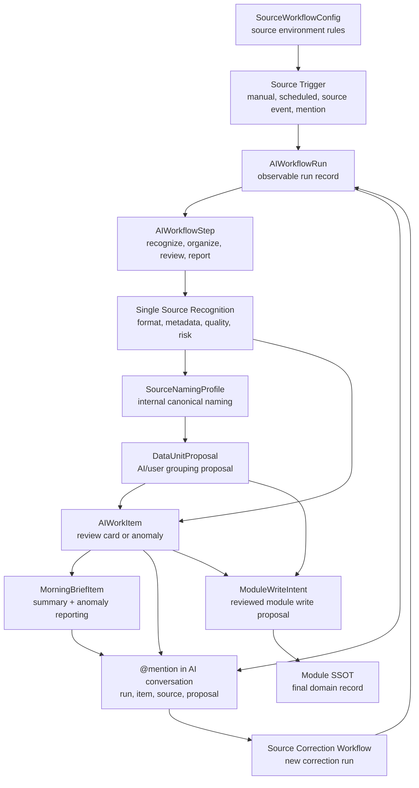

# AI Source Workflow Operating Layer

Date: 2026-06-06

Status: `DATTR-015_DONE`

Purpose: define the workflow operating layer behind AI Input so every source organization cycle is observable, correctable, auditable, and safe before module writes.

Related docs:

- `docs/architecture/source_input_surface_inventory.md`
- `docs/architecture/source_connection_input_adapter_contract.md`
- `docs/architecture/single_source_recognition_layer.md`
- `docs/architecture/composite_data_unit_layer.md`
- `docs/architecture/document_attribute_layer.md`
- `docs/product/P-PRD-002-next-stage-development-plan.md`
- `docs/tasks/task_backlog.md`

## 1. Core Position

The AI Input page is not only an import form and not only a data management UI.

It should become:

```txt
AI Source Workflow Console
```

The user mainly talks to AI. Sources enter governed workflows. AI recognizes, names, organizes, groups, and reports only the things that matter. Every run is traceable. The user can mention a run, work item, morning brief item, source, or DataUnit in conversation and correct the AI's interpretation.

This layer sits above SourceAsset recognition and DataUnit grouping:

```txt
Source environment setup
  -> source trigger
  -> source recognition
  -> source organization
  -> naming / metadata / quality / risk
  -> DataUnit proposal
  -> organizing result
  -> anomaly detection
  -> morning brief reporting
  -> user correction through AI conversation
  -> correction workflow run
```

Important rule:

```txt
AIWorkflowRun can propose, organize, explain, and request review.
AIWorkflowRun must not directly write final module SSOT records.
```

Final module writes still require `ModuleWriteIntent`, human approval where required, and target module service authorization.

## 2. Relationship With Source Layers

| Layer | Responsibility | Output |
|---|---|---|
| Input Adapter | Captures raw provider/file/message/link input | `RawSourceItem` |
| Source Asset Layer | Creates atomic source identity | `SourceAsset` |
| Single Source Recognition | Detects format, metadata, provenance, evidence, quality, risk | recognition profiles |
| Composite Data Unit Layer | Groups recognized sources into editable evidence units | `DataUnitProposal`, `DataUnit` |
| AI Source Workflow Operating Layer | Orchestrates runs, review items, correction, morning brief reporting | `AIWorkflowRun`, `AIWorkItem` |
| Module Service | Commits approved final domain data | Work/Research/etc. records |

The workflow layer does not replace DATTR-013 or DATTR-014. It makes those layers observable and repeatable.

## 3. Mermaid Overview



## 4. Three Workflow Families

### 4.1 Source Environment Workflow

This is the configuration for how a source should be handled.

Example:

```txt
LINE 商會核心幹部群
- 同步頻率：每日
- 來源範圍：最近 24 小時
- 預設模組：商會
- 風險等級：中
- 是否進早安簡報：是
- 異常條件：高風險、分類不確定、出現合作機會
```

Conceptual records:

- `SourceWorkflowConfig`
- `SourceConnection`
- `InputAdapter`
- `RiskPolicy`
- `MorningBriefRule`

This workflow usually changes source environment settings, not imported source content.

### 4.2 Source Organizing Workflow

This is the run that happens every time a source is processed.

Possible triggers:

- user manually imports a file, note, link, or message
- LINE daily sync
- Google Doc update
- RSS new article
- user mentions a source in AI conversation
- morning brief asks the user to resolve an anomaly
- system retry after a failed run

Every trigger should create an `AIWorkflowRun`.

Example:

```txt
Run: SRC-RUN-2026-00127
Source: LINE 商會核心幹部群
Trigger: daily sync
Status: completed_with_review_needed
Result:
- Added 34 message SourceAssets
- Detected 3 possible action items
- Suggested 1 DataUnit
- Found 1 high-risk personal data fragment
Needs review:
- Should "活動合作討論" be routed to Chamber or Work?
```

### 4.3 Source Correction Workflow

This workflow is triggered when the user corrects AI through conversation.

Example user instruction:

```txt
@SRC-RUN-2026-00127
這次商會訊息先不要歸到工作模組，請改成商會關係脈絡，並建立一個合作機會摘要。
```

System interpretation:

```txt
This is not a new source.
This is a correction to an existing organizing result.
```

Correction workflow:

```txt
Find referenced run / morning brief item / work item
  -> locate related SourceAssets / DataUnitProposal
  -> update classification, naming, module hint, or DataUnit membership proposal
  -> create a new correction AIWorkflowRun
  -> preserve old result and correction reason
```

Correction does not erase provenance. The original AI decision and the user's correction should both remain inspectable.

## 5. Core Records

### 5.1 AIWorkflowRun

`AIWorkflowRun` is the observable record for one AI workflow execution.

It is intentionally broader than `SourceWorkflowRun`, because future workflows may include source setup, module write proposals, morning brief generation, and correction runs.

Type proposal:

```ts
interface AIWorkflowRun {
  id: string
  workflowType:
    | "source_environment_setup"
    | "source_intake"
    | "source_recognition"
    | "source_organization"
    | "source_correction"
    | "data_unit_proposal"
    | "module_write_proposal"
    | "morning_brief_generation"
  triggerType:
    | "manual"
    | "scheduled"
    | "source_event"
    | "conversation_mention"
    | "morning_brief_followup"
    | "system_retry"
  status:
    | "queued"
    | "running"
    | "completed"
    | "completed_with_review_needed"
    | "failed"
    | "cancelled"
  title: string
  summary?: string
  sourceAssetIds?: string[]
  dataUnitIds?: string[]
  dataUnitProposalIds?: string[]
  moduleWriteIntentIds?: string[]
  morningBriefItemIds?: string[]
  startedAt?: string
  completedAt?: string
  createdBy: "user" | "ai" | "system"
  riskLevel?: "low" | "medium" | "high" | "critical"
  requiresReview?: boolean
  reviewReason?: string
  parentRunId?: string
  correctionOfRunId?: string
  metadata?: Record<string, unknown>
}
```

Design notes:

- `parentRunId` links retry, continuation, or child workflows.
- `correctionOfRunId` explicitly preserves correction lineage.
- Arrays like `sourceAssetIds` and `dataUnitProposalIds` are type proposals only; the eventual Prisma version may use join tables.

### 5.2 AIWorkflowStep

`AIWorkflowStep` is a step-level audit trail inside one run.

Suggested steps:

- `source_intake`
- `format_detection`
- `metadata_extraction`
- `quality_risk_review`
- `naming_inference`
- `grouping_inference`
- `data_unit_proposal`
- `anomaly_detection`
- `morning_brief_reporting`
- `conversation_correction`
- `module_write_intent_proposal`

The UI does not need to show every step by default. Step records support drilldown, debugging, and future QA.

### 5.3 AIWorkItem

`AIWorkItem` is the card the user actually sees.

`AIWorkflowRun` is the whole flow. `AIWorkItem` is one thing requiring attention, review, or action.

Type proposal:

```ts
interface AIWorkItem {
  id: string
  workflowRunId: string
  itemType:
    | "naming_suggestion"
    | "classification_suggestion"
    | "data_unit_proposal"
    | "risk_alert"
    | "missing_context"
    | "module_routing_question"
    | "source_quality_warning"
    | "correction_request"
    | "morning_brief_alert"
  status:
    | "open"
    | "accepted"
    | "edited"
    | "rejected"
    | "ignored"
    | "resolved"
  title: string
  description?: string
  aiExplanation?: string
  targetType:
    | "source_asset"
    | "source_workflow_run"
    | "data_unit"
    | "data_unit_proposal"
    | "module_write_intent"
    | "morning_brief_item"
  targetId: string
  suggestedActions?: string[]
  createdAt: string
  resolvedAt?: string
}
```

The AI Workbench should mainly display `AIWorkItem`, not raw low-level records.

### 5.4 MorningBriefItem Relation

Morning brief becomes an anomaly and summary reporting layer for source workflows.

It should report:

- uncertain classification
- high-risk source fragments
- important opportunities
- failed or partial workflows
- decisions required from the user
- important new source summaries from yesterday
- source workflow status anomalies

Example:

```txt
昨晚來源整理完成。

需要你注意 3 件事：

1. 商會核心幹部群出現一個可能合作機會，AI 不確定要歸到「商會」還是「工作」。
2. Google Doc「Personal OS 研究」新增 2 份文件，AI 建議建立研究資料組 RES-2026-004。
3. LINE 訊息中出現私人電話，已暫時從摘要中隱藏，等待你確認。
```

The morning brief item should be mentionable and should link back to the run and work item that generated it.

## 6. @mention Target Model

The AI Input conversation should support mentions beyond `SourceAsset`.

Mentionable targets:

| Target | Use case |
|---|---|
| `@SourceAsset` | Ask about or reclassify a source |
| `@DataUnit` | Ask about a composite evidence unit |
| `@DataUnitProposal` | Accept, split, merge, or reject grouping |
| `@AIWorkflowRun` | Correct or rerun a workflow result |
| `@AIWorkItem` | Resolve a specific review card |
| `@MorningBriefItem` | Follow up on a reported anomaly or summary |
| `@ModuleRecord` | Use a final Work/Research/etc. record as context |

When the user mentions a target, AI must classify the conversational intent:

- supplement context
- correct classification
- rerun workflow
- create or update DataUnit proposal
- propose module write
- mark a work item resolved
- ask for explanation

Mentions are not direct write permissions. A mention may trigger a correction workflow or proposal, but high-risk writes and public exposure still require review.

## 7. AI Import Page Workbench

The UI should avoid showing a complex workflow graph by default.

Recommended layout:

```txt
AI 匯入頁

Subpage navigation:
1. AI 對話
2. 參考脈絡
3. 同步設定
4. AI 工作台
```

The page should remain cowork-first and avoid rendering every source/workflow surface at once. Different purposes should be separated into subpage-like views.

Recommended views:

| View | Purpose | Contents |
|---|---|---|
| AI 對話 | Preserve the easiest entry into AI coworking | Quick prompts, cowork starter cards, conversation input, quick import |
| 參考脈絡 | Attach source context to the current conversation | Selected @context rows, source pool counts, quick reference choices, removable mentions |
| 同步設定 | Observe and configure how external sources connect and sync | Connector matrix for LINE, Drive, Docs, RSS, Telegram, Gmail, GitHub/Markdown, manual import; connection state, sync state, scope, cadence, last/next sync, module hint, risk, review condition |
| AI 工作台 | Observe workflow state and anomalies | Tables for workflow runs, review items, source environments, organizing results, and event log |

Design rules:

- The user should be able to start with intent before selecting sources.
- `參考脈絡` supports conversation and correction; it is not source sync, a final module write, or a module record.
- `同步設定` controls external connector status, sync health, intake scope, source environment rules, risk, and review conditions; it is not used to choose the current conversation references.
- `AI 工作台` should prefer table/list rows over nested cards.
- Mobile/tablet should use the same subpage navigation instead of a separate accordion IA.

### 7.0 同步設定：External Connector Status

`同步設定` should not feel like a resource folder manager. The first screen should answer:

- Which external sources are connected?
- Which sources still need setup or are only planned?
- Is each source idle, running, completed, failed, or completed with review needed?
- What scope is being synced?
- How often does it sync?
- When did it last sync, and when is the next run?
- What module hint, risk level, and review rule apply?

Recommended connector rows for the UI-only/BFF contract:

| Source | Connector state | Sync state | Main purpose |
|---|---|---|---|
| LINE 商會核心幹部群 | connected | review needed | Messaging source for Chamber relationship and cooperation context |
| Google Drive Personal OS 研究 | connected | completed | Cloud file source for Research material |
| Google Docs 專案文件 | connected | idle | Document update source for Work context |
| RSS 教育科技 | connected | completed | Feed source for Research and trend monitoring |
| Telegram 研究討論群 | needs setup | not configured | Future messaging adapter |
| Gmail 客戶信件 | planned | not configured | Future email/client thread adapter |
| GitHub Repo / Markdown | planned | not configured | Future repo file import/export |
| 手動匯入與本機檔案 | connected | idle | Manual upload/import source |

This remains UI-only until reviewed connector contracts and persistence exist. A row in `同步設定` is not permission to fetch private data, run a connector, write a module record, or expose public/client-visible output.

### 7.1 今日 Workflow

Shows today's runs:

```txt
LINE 商會核心幹部群
完成 · 34 則訊息 · 1 個需確認

Google Doc Personal OS 研究
完成 · 2 份文件更新 · 無異常

RSS 教育科技
部分完成 · 5 篇文章 · 2 篇高相關

手動匯入 CDR 文件
完成 · 已建立研究資料候選組
```

### 7.2 需要確認

Shows only uncertainty and risk:

```txt
[分類不確定]
「演藝經紀 AI 專案」應該歸到：
A. 工作
B. 商會
C. 公司
D. 研究

[風險提醒]
LINE 群組中出現私人電話，是否保留於摘要？
```

### 7.3 來源環境

Shows compact source rules:

```txt
LINE 商會核心幹部群
每日同步 · 進早安簡報 · 商會模組 · 中風險

Google Drive Personal OS 研究
手動同步 · 研究模組 · 低風險

RSS 教育科技
每日同步 · 只摘要高相關文章
```

### 7.4 整理結果

Shows AI outputs:

```txt
資料組合建議：
- RES-2026-004 教育科技資料治理研究包
- INT-2026-001 王小明訪談資料

來源命名：
- 6 個已自動命名
- 2 個需要確認

補充情境：
- 3 則已連到資料組
```

### 7.5 工作紀錄

Shows a recent audit log:

```txt
09:10 LINE 同步開始
09:11 建立 34 個 Message SourceAsset
09:12 AI 辨識 3 個行動項目
09:13 建議建立商會合作機會摘要
09:14 標記 1 個需確認項目
```

## 8. Review And Anomaly Rules

Create `AIWorkItem` review cards when:

- AI confidence is below the configured threshold.
- A source is high-risk or contains sensitive personal information.
- Module routing is ambiguous.
- A DataUnit proposal includes excluded, sensitive, or low-quality sources.
- A source fetch, adapter sync, extraction, OCR, transcription, or recognition step fails.
- A source has format mismatch, provenance conflict, or quality warning.
- A proposed output could become client-visible, public, financial, life-related, or company strategy data.
- A user correction conflicts with prior explicit user confirmation.

Risk behavior:

| Risk | Default behavior |
|---|---|
| low | AI may auto-name and create draft grouping proposals |
| medium | AI may propose and ask for review when confidence is uncertain |
| high | AI must create review items before module routing or sharing |
| critical | AI should block final write/public exposure until explicit approval |

## 9. Example Run

```txt
Run id: SRC-RUN-2026-00127
Workflow type: source_organization
Trigger type: scheduled
Status: completed_with_review_needed
Title: LINE 商會核心幹部群每日整理
Summary:
- Added 34 message SourceAssets.
- Detected 3 possible action items.
- Suggested 1 Chamber cooperation DataUnit.
- Found 1 high-risk personal phone number.

Work items:
- module_routing_question: should "活動合作討論" route to Chamber or Work?
- risk_alert: phone number hidden from summary pending review.

Morning brief:
- reports only these two review-worthy points.

User correction:
@SRC-RUN-2026-00127 先歸到商會，不要轉成工作任務。

Correction run:
- updates module hint to Chamber.
- creates cooperation opportunity summary proposal.
- preserves original Work routing suggestion as superseded, not deleted.
```

## 10. Implementation Boundary

For v0.1 planning:

- Do create architecture docs.
- Do add type proposals.
- Do prototype UI only with mock data when explicitly tasked.
- Do keep workflow run records as proposals until schema is approved.
- Do keep morning brief workflow output as mock/planning until runtime data exists.

Do not implement yet:

- real LINE / Telegram / Gmail / Drive runtime connectors
- real scheduled source sync
- real URL fetching
- real OCR/transcription
- real workflow persistence migration
- real module SSOT writes from AI work items
- full workflow graph UI
- automatic correction writes to final module records

## 11. How This Changes Task Order

The previous next task, `DATTR-015 Define Composite Data Unit schema proposal`, should move later because the schema needs to include workflow run and review surfaces.

Updated sequence:

1. `DATTR-015 Define AI Source Workflow Run Architecture`
2. `DATTR-016 Prototype AI Import Workbench UI`
3. `DATTR-017 Define Composite Data Unit schema proposal`

Rationale:

- DATTR-013 defines how sources become composite DataUnits.
- DATTR-014 defines how one source becomes recognizable and citable.
- DATTR-015 defines how AI workflows orchestrate, audit, report, and correct those processes.
- DATTR-016 can then prototype the AI Import page as a Workflow Workbench.
- DATTR-017 can translate SourceAsset, Recognition, DataUnit, and Workflow Run concepts into a coherent Prisma proposal.

## 12. Acceptance Criteria

This architecture is complete when the project can answer:

- What is an AI Source Workflow Console?
- What is the difference between source environment workflow, organizing workflow, and correction workflow?
- What is `AIWorkflowRun`?
- What is `AIWorkItem`?
- How does morning brief report workflow anomalies and summaries?
- What can the user mention with `@` in AI Input?
- How does a conversation correction create a new workflow run?
- How are old AI results preserved after correction?
- Why does workflow output not directly write module SSOT records?
- How should the AI Import Workbench show status without exposing every low-level data model?
- Why should UI prototype happen before Prisma schema proposal?
- Why should the schema proposal move from `DATTR-015` to `DATTR-017`?
