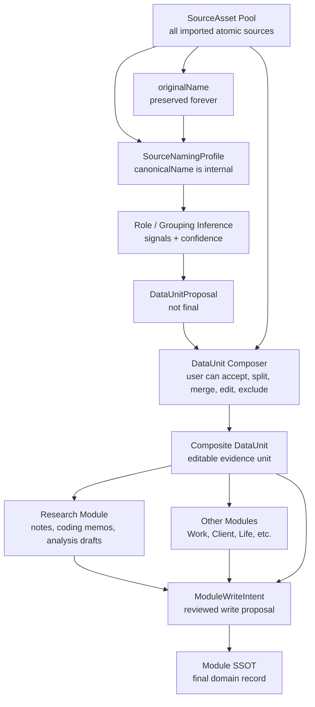

# Composite Data Unit Layer

Date: 2026-06-06

Status: `DATTR-013_DONE`

Purpose: establish the editable, AI-assisted, user-curated composite data layer between atomic `SourceAsset` records and final module records.

Related docs:

- `docs/architecture/document_attribute_layer.md`
- `docs/architecture/source_input_surface_inventory.md`
- `docs/architecture/single_source_recognition_layer.md`
- `docs/dev/D-PLAN-010-interface-data-governance-plan.md`
- `docs/tasks/task_backlog.md`

## 1. Core Position

Personal OS now has three distinct levels:

| Level | Meaning | Owner | Can be final module data? |
|---|---|---|---|
| `SourceAsset` | One atomic imported or authored source object | Source Asset Layer | No |
| `DataUnit` | One editable composite grouping of multiple source assets | Composite Data Unit Layer | No |
| Module record | Final domain record inside Work, Research, Self, Client, Finance, etc. | Module service | Yes |

Main rule:

```txt
SourceAsset is atomic.
DataUnit is composite.
Module record is final domain data.
```

`DataUnit` does not replace `SourceAsset`. It also does not replace Research, Work, Client, or any module-specific table. It gives the system a safe workspace where multiple source assets can be grouped, named, reviewed, annotated, and prepared before module writes.

## 2. Pipeline Placement

```txt
Input Surface
  -> SourceConnection / InputAdapter
  -> RawSourceItem
  -> SourceAsset
  -> SourceNamingProfile
  -> RoleInference / GroupingInference
  -> DataUnitProposal
  -> DataUnit Composer
  -> Composite DataUnit
  -> DataUnitAssetLink
  -> DataUnitAnnotation
  -> DataUnitModuleLink
  -> ModuleWriteIntent
  -> module service authorization
  -> module SSOT
```

The DataUnit layer sits after source identity is captured and before module-specific usage.

## 3. Dependency On Single Source Recognition

Composite DataUnit grouping should consume recognized sources, not raw imported sources directly.

DATTR-014 Single Source Recognition strengthens the atomic source layer before DataUnit naming/grouping:

- `SourceFormatDetection` helps avoid wrong format assumptions.
- `SourceDescriptiveMetadata` helps infer title, date, language, creator, and citation.
- `SourceProvenanceEvent` helps parent-child and derived-source reasoning.
- `SourceQualityProfile` helps AI decide whether a source is primary, derived, AI-generated, or user note.
- `SourceEvidenceSelector` allows `DataUnitAnnotation` to point to source fragments.
- `UrlSafetyCheck` and `MediaMetadataProfile` support risk-aware grouping.

AI should use recognition outputs as grouping signals, but DataUnit membership remains editable and governed by DATTR-013 confidence and approval boundaries.

## 4. Dependency On AI Source Workflow Operating Layer

Composite grouping should be orchestrated through the AI Source Workflow Operating Layer when it is part of an AI-assisted source run.

`AIWorkflowRun` records when grouping happened, why it was triggered, which sources were considered, which proposals were created, and whether review is required.

`AIWorkItem` is the user-facing card for grouping decisions:

- accept or partially accept a `DataUnitProposal`
- reject a proposed grouping
- resolve ambiguous module routing
- review high-risk source membership
- explain why an asset was selected, excluded, or kept as candidate

Conversation corrections should create a new correction run instead of silently overwriting the original proposal.

## 5. Mermaid Overview



## 6. SourceAsset Pool

The `SourceAsset pool` is the collection of all imported atomic sources.

A `SourceAsset` may:

- exist without belonging to any `DataUnit`
- belong to multiple `DataUnits`
- remain ungrouped forever
- be suggested for a grouping
- become a candidate in a proposal
- be selected into a unit
- be explicitly excluded from a unit
- be removed from a unit after prior selection

This is important because not every file in an import batch belongs to the same meaningful unit. For example, a LINE chat export may contain one relevant interview link, several unrelated messages, and a screenshot. The system should not force all of them into one `DataUnit`.

## 7. Source Naming Normalization Layer

Purpose: preserve the original imported name while creating an internal, AI-readable canonical name.

The system must not force external file renaming. Internal naming supports grouping and reasoning; external renaming is a separate explicit user action.

| Concept | Meaning | Mutable? | Example |
|---|---|---|---|
| `originalName` | Name from the imported source | Never overwritten | `王小明訪談紀錄.md` |
| `canonicalName` | Personal OS internal standardized name | AI/user editable internally | `INT-2026-001__transcript__王小明訪談__2026-06-06__v1.md` |
| `displayName` | Name shown in UI | User preference | original or canonical |
| `aliasNames` | Other known names | Append-only unless user cleans aliases | old filename, imported platform title, AI title |
| `namingStatus` | Naming lifecycle state | Updated by AI/user decisions | `ai_suggested`, `user_confirmed` |

Naming statuses:

| Status | Meaning |
|---|---|
| `original_only` | Only original imported name exists |
| `ai_suggested` | AI suggested a canonical name |
| `ai_applied` | AI canonical name was applied internally |
| `user_confirmed` | User confirmed internal canonical naming |
| `user_overridden` | User changed the AI/system naming |
| `conflicted` | Multiple signals suggest incompatible names or unit membership |

## 8. Universal Naming Convention v0.1

Preferred canonical format:

```txt
[UnitKind]-[YYYY]-[Sequence]__[AssetRole]__[ShortTitle]__[Date]__[Version].[ext]
```

Examples:

```txt
INT-2026-001__participant_profile__王小明__2026-06-06__v1.md
INT-2026-001__raw_audio__王小明訪談__2026-06-06__v1.m4a
INT-2026-001__transcript__王小明訪談逐字稿__2026-06-06__v1.md
INT-2026-001__researcher_note__初步觀察__2026-06-06__v1.md
INT-2026-001__ai_coding__主題編碼__2026-06-06__v1.json
```

Supported simplified formats:

```txt
[UnitCode]__[AssetRole]__[ShortTitle].[ext]
INT-2026-001__transcript__王小明訪談.md

[UnitCode]_[Role].[ext]
INT-2026-001_transcript.md
INT-2026-001_audio.m4a
INT-2026-001_profile.md
```

The parser should accept imperfect early naming. The user should not be forced to follow the full canonical format on day one.

## 9. UnitKind Dictionary v0.1

| Unit kind | Prefix | Aliases |
|---|---|---|
| `interview` | `INT` | `interview`, `int`, `訪談`, `interview_data_unit` |
| `case_record` | `CASE` | `case`, `case_record`, `個案`, `個案資料` |
| `meeting_record` | `MEET` | `meeting`, `meet`, `會議`, `會議記錄` |
| `life_story_record` | `LIFE` | `life`, `life_story`, `生命故事`, `敘事` |
| `research_packet` | `RES` | `research`, `res`, `study`, `研究資料`, `研究包` |
| `client_packet` | `CLIENT` | `client`, `customer`, `客戶`, `客戶資料` |
| `learning_record` | `LEARN` | `learning`, `course`, `學習`, `課程紀錄` |
| `work_packet` | `WORK` | `work`, `project`, `deliverable`, `工作`, `專案` |
| `generic_bundle` | `GEN` | `generic`, `bundle`, `misc`, `一般`, `資料包` |

## 10. Role Dictionary v0.1

| Dictionary key | Role | Aliases |
|---|---|---|
| profile | `participant_profile` | `profile`, `participant`, `participant_profile`, `user_profile`, `background`, `使用者資料`, `受訪者資料`, `個案資料` |
| transcript | `transcript` | `transcript`, `transcription`, `interview_transcript`, `逐字稿`, `訪談逐字稿`, `訪談紀錄` |
| audio | `raw_audio` | `audio`, `recording`, `voice`, `m4a`, `mp3`, `錄音`, `音檔`, `訪談錄音` |
| note | `researcher_note` | `note`, `memo`, `researcher_note`, `observation`, `研究者筆記`, `初步觀察`, `備忘錄` |
| coding | `ai_coding` | `coding`, `codebook`, `ai_coding`, `thematic_coding`, `主題編碼`, `編碼結果`, `AI分析` |
| consent | `consent_document` | `consent`, `agreement`, `同意書`, `研究同意`, `授權書` |
| summary | `ai_summary` | `summary`, `ai_summary`, `摘要`, `AI摘要`, `訪談摘要` |
| reference | `reference` | `reference`, `paper`, `article`, `literature`, `參考資料`, `文獻`, `論文` |
| context | `context_material` | `context`, `material`, `background_material`, `情境資料`, `背景資料`, `補充資料` |
| questionnaire | `questionnaire_result` | `questionnaire`, `scale`, `survey`, `assessment`, `問卷`, `量表`, `測驗結果` |

## 11. SourceAsset Type vs DataUnit Role

These are separate dimensions:

| Question | Field family | Examples |
|---|---|---|
| What format or source object is this? | `SourceAsset.assetKind`, `format`, `mimeType` | document, audio, image, video, dataset, message, link |
| What does it do inside this unit? | `DataUnitAssetLink.role` | participant profile, raw audio, transcript, consent document, AI coding |

Same source type can play many roles:

| SourceAsset type | Possible DataUnit roles |
|---|---|
| document | participant profile, transcript, researcher note, consent document, reference |
| audio | raw audio, meeting recording, life story recording |
| image | observation evidence, receipt, consent photo, context material |
| dataset | AI coding, questionnaire result, analysis table |
| message | meeting note, participant context, consent confirmation |

## 12. Role And Grouping Inference

Inference should preserve signals, confidence, and explanation.

Signal types:

| Signal type | Meaning |
|---|---|
| `original_filename` | Raw imported filename or platform title |
| `filename_pattern` | Parsed naming convention or alias match |
| `file_extension` | Extension hints role or format |
| `mime_type` | MIME classification |
| `frontmatter_metadata` | Markdown/YAML metadata |
| `folder_path` | Parent folder or import path |
| `import_batch` | Imported together |
| `content_signature` | Content-specific pattern, e.g. transcript timestamps |
| `ai_semantic_guess` | AI semantic inference from content |
| `user_override` | Explicit user correction |

Signal priority:

1. explicit user selection
2. template slot placement
3. frontmatter metadata
4. filename pattern
5. folder/path pattern
6. import batch
7. content signature
8. AI semantic guess
9. timestamp proximity

Each signal should preserve:

- `signalType`
- `matchedValue`
- `proposedCanonicalName`
- `proposedUnitCode`
- `proposedUnitKind`
- `proposedAssetRole`
- `confidence`
- `explanation`
- `createdAt`

## 13. AI-assisted Naming And Grouping

AI should have enough authority to reduce manual work, but not enough to overwrite source truth or bypass governance.

AI may automatically:

- generate internal `canonicalName`
- infer `AssetRole`
- infer `UnitKind`
- infer `UnitCode`
- detect naming, role, and grouping patterns
- detect grouping candidates
- create `DataUnitProposal`
- create a draft `DataUnit` in low-risk conditions
- create `auto_selected` `DataUnitAssetLink` records in low-risk, high-confidence conditions
- detect naming conflicts
- generate rename suggestions
- suggest missing slots
- propose templates
- propose merge/split operations

AI must not:

- overwrite `originalName`
- rename external files without explicit user action
- delete `SourceAssets`
- directly write final module SSOT records
- turn AI coding into final research conclusions
- publish or export private material without confirmation
- ignore user overrides
- force all related files into a `DataUnit`
- auto-select high-risk personal, financial, client, legal, health, or sensitive records without confirmation
- bypass `ModuleWriteIntent`

## 14. AI Auto Action Level

| Level | Meaning |
|---|---|
| `suggest_only` | AI only creates suggestions |
| `auto_name` | AI can create internal canonical names |
| `auto_group_draft` | AI can create proposal or draft DataUnit |
| `auto_select_low_risk` | AI can create DataUnitAssetLink when confidence is high and risk is low |
| `require_confirmation` | User confirmation required before action |

Default behavior:

- Low-risk research files may allow `auto_name` and `auto_group_draft`.
- Auto-selected links must be marked `auto_selected` or `ai_selected`.
- High-risk materials always require confirmation.

Confidence thresholds:

| Confidence | Allowed behavior |
|---:|---|
| `>= 0.90` | AI may `auto_name` and `auto_group_draft` |
| `>= 0.85` | AI may `auto_select_low_risk` if risk allows |
| `>= 0.80` | AI may create `DataUnitProposal` |
| `>= 0.70` | AI may mark as `candidate` |
| `< 0.60` | Keep in SourceAsset pool only |

Even when confidence is high, high-risk records require confirmation.

## 15. DataUnit

`DataUnit` is an editable composite evidence unit.

Fields to consider:

- `id`
- `kind`
- `code`
- `title`
- `description`
- `status`
- `templateId`
- `createdAt`
- `updatedAt`
- `createdBy`
- `primaryModule`
- `privacyLevel`
- `riskLevel`
- `provenanceNote`

Status values:

- `draft`
- `ready`
- `in_review`
- `active`
- `archived`

Kind values:

- `interview`
- `case_record`
- `meeting_record`
- `research_packet`
- `learning_record`
- `client_packet`
- `life_story_record`
- `work_packet`
- `generic_bundle`

## 16. DataUnit Template And Slots

Templates define suggested slots, not mandatory hard structure.

Interview template example:

| Role | Requirement | Notes |
|---|---|---|
| `participant_profile` | `recommended` | Useful for context |
| `consent_document` | `required_by_policy` or `recommended` | Depends on research governance |
| `raw_audio` | `optional` or `recommended` | If interview was recorded |
| `transcript` | `recommended` | Primary analysis material |
| `researcher_note` | `optional` | Field observation |
| `ai_summary` | `optional` | Draft helper |
| `ai_coding` | `optional` | Draft coding aid |
| `reference` | `optional` | Related literature |

Slot requirement values:

- `required_by_policy`
- `recommended`
- `optional`
- `not_needed`

Slot state:

- `filled`
- `missing`
- `partially_filled`
- `not_needed`

Template slots are separate from actual selected assets. The template says what might be useful; `DataUnitAssetLink` says what is actually in the unit.

## 17. DataUnitProposal

`DataUnitProposal` means:

> The system thinks these SourceAssets may form one meaningful composite unit.

It is not final.

Statuses:

- `draft`
- `suggested`
- `accepted`
- `partially_accepted`
- `rejected`

A proposal should contain:

- proposed kind
- proposed title
- proposed data unit code
- proposed assets
- proposed roles
- confidence
- explanation
- signals

When the user accepts a proposal, create a formal `DataUnit`. When the user partially accepts, only selected assets become `DataUnitAssetLink` records.

## 18. DataUnitAssetLink

`DataUnitAssetLink` defines how a `SourceAsset` participates in a `DataUnit`.

Fields to consider:

- `dataUnitId`
- `sourceAssetId`
- `role`
- `membershipStatus`
- `titleOverride`
- `order`
- `isPrimary`
- `includeInAIContext`
- `includeInEmbedding`
- `includeInExport`
- `addedAt`
- `addedBy`
- `removedAt`
- `removedBy`
- `suggestedBy`
- `confidence`
- `reason`
- `note`

Membership statuses:

| Status | Meaning |
|---|---|
| `selected` | Generic selected state |
| `user_selected` | User explicitly selected it |
| `ai_selected` | AI selected it with provenance |
| `auto_selected` | Deterministic/system rules selected it |
| `candidate` | Possibly related but not selected |
| `suggested` | AI suggested it |
| `excluded` | Explicitly excluded |
| `removed` | Previously selected, later removed |

## 19. DataUnit Annotation

A `DataUnit` may contain annotations. Annotations are not raw `SourceAssets` unless intentionally exported as assets.

Annotation kinds:

- `researcher_note`
- `ai_summary`
- `coding`
- `interpretation`
- `question`
- `memo`
- `decision`
- `module_note`

Safety rule:

- AI summaries and AI coding results are draft annotations, proposal artifacts, or evidence aids.
- They must not automatically become final research conclusions.
- They must preserve evidence refs, source refs, model/process metadata when available, and human confirmation status.

## 20. DataUnitModuleLink

`DataUnitModuleLink` connects a composite unit to module usage without making it a module record.

Relations:

- `imported_to_module`
- `used_as_evidence`
- `created_from_module`
- `annotated_in_module`

Module usage still goes through `ModuleWriteIntent` before final SSOT writes.

## 21. Parent-child Provenance

Derived artifacts should keep their chain.

Example:

```txt
interview-audio.m4a
  -> transcript.md
  -> ai-summary.md
  -> ai-coding-result.json
```

The design must preserve:

- original source
- derived artifact
- extraction method
- timestamp
- AI model or process, if applicable
- confidence
- human confirmation status

This can be modeled through:

- `SourceAssetLink`
- `AssetExtraction`
- `DataUnitAnnotation.evidenceRefs`
- future `DerivedAssetLink` proposal in `DATTR-017`
- transformation/governance records

## 22. DataUnit Composer

The composer is the user-facing state model for reviewing and editing composite units.

It should show:

- SourceAsset pool
- DataUnitProposal list
- suggested groups
- original name
- canonical name
- display name
- inferred UnitCode
- inferred UnitKind
- inferred AssetRole
- confidence score
- AI explanation
- rename suggestion
- grouping suggestion
- membership status
- whether asset is `ai_selected`, `auto_selected`, or `user_selected`
- template slots
- missing recommended slots
- not-needed slots
- candidate assets
- excluded assets
- audit trail / recent changes

User actions:

- create empty DataUnit
- create DataUnit from template
- accept AI naming
- reject AI naming
- edit canonicalName
- preserve originalName display
- change role
- change UnitCode
- merge proposals
- split proposals
- accept proposal
- partially accept proposal
- reject proposal
- add SourceAsset to DataUnit
- remove SourceAsset from DataUnit
- mark SourceAsset as excluded
- restore removed SourceAsset
- change `auto_selected` to `user_selected`
- mark slot as `not_needed`
- add researcher note
- add module-scoped annotation
- import DataUnit to Research Module

## 23. Research Module Usage

Research Module should be able to import or reference a `DataUnit`.

Example:

```txt
Interview DataUnit: INT-2026-001
```

Selected assets:

| Asset | Role | Membership |
|---|---|---|
| `participant-profile.md` | `participant_profile` | `user_selected` or `auto_selected` |
| `interview-audio.m4a` | `raw_audio` | `candidate` or `selected` |
| `interview-transcript.md` | `transcript` | `selected` |
| `researcher-note.md` | `researcher_note` | `user_selected` |
| `ai-coding-result.json` | `ai_coding` | `ai_selected` or `suggested` |

Candidate assets:

- `related-line-message.txt`
- `related-email-thread`
- `meeting-note.md`

Excluded assets:

| Asset | Reason |
|---|---|
| `unrelated-line-chat.txt` | Not directly related to this interview |

Missing recommended slots:

- `consent_document`
- `ai_summary`

Not-needed slots:

- `raw_video`

Research Module can add:

- module-scoped researcher notes
- interpretation memos
- research questions
- coding memos
- evidence tags
- analysis drafts

These must preserve provenance and must not overwrite raw `SourceAssets`.

## 24. Why DataUnit Should Not Include Every Source

Automatic over-grouping creates false provenance. Files imported together are not always semantically related.

Examples:

- A batch folder may contain unrelated notes.
- A LINE thread may include unrelated personal conversation.
- A meeting recording may mention multiple projects.
- An AI coding JSON may be derived from an older transcript version.

Therefore the system should support:

- ungrouped pool assets
- candidates
- suggestions
- selected assets
- excluded assets
- removed assets
- multiple membership across DataUnits

## 25. Why Canonical Naming Must Not Rename External Files

Internal canonical naming helps AI and the UI reason about assets. External file renaming changes user-owned storage and may break links, sync paths, citations, or collaborators' expectations.

Rules:

- `originalName` must never be overwritten.
- `canonicalName` is internal unless user explicitly exports or renames.
- external rename is a separate action with explicit confirmation.
- repo file rename, Google Drive rename, and local file rename each need provider-specific audit trails.

## 26. TypeScript Type Proposal

`src/types/ingestion.ts` contains the DATTR-013 type proposal. These are proposal-only types and do not imply runtime persistence.

Core proposed types:

- `DataUnitKind`
- `DataUnitStatus`
- `DataUnitAssetRole`
- `DataUnitAssetMembershipStatus`
- `DataUnitSlotRequirement`
- `SourceNamingStatus`
- `NamingSignalType`
- `AIAutoActionLevel`
- `SourceNamingProfile`
- `NamingInferenceSignal`
- `SourceRenameSuggestion`
- `DataUnit`
- `DataUnitTemplate`
- `DataUnitTemplateSlot`
- `DataUnitSlotState`
- `DataUnitProposal`
- `DataUnitProposalAsset`
- `DataUnitAssetLink`
- `DataUnitModuleLink`
- `DataUnitAnnotation`

## 27. Acceptance Checklist

This task is complete when Personal OS can answer:

- What is a `SourceAsset`?
- What is the `SourceAsset pool`?
- What is `SourceNamingProfile`?
- Why preserve `originalName`?
- What is `canonicalName`?
- How does AI infer UnitCode, UnitKind, and AssetRole?
- What is the universal naming convention?
- What is the difference between SourceAsset type and DataUnit role?
- What is a `DataUnit`?
- What is a `DataUnitProposal`?
- What is a `DataUnitTemplate`?
- What is a `DataUnitAssetLink`?
- What are `selected`, `user_selected`, `ai_selected`, `auto_selected`, `candidate`, `suggested`, `excluded`, and `removed`?
- How can AI auto-name and auto-group while preserving user control?
- When must user confirmation be required?
- How does the DataUnit Composer work?
- How does an Interview DataUnit work?
- How can Research Module add researcher notes without polluting raw sources?
- How are AI summaries and AI coding stored safely?
- How is parent-child provenance preserved?
- Why should DataUnit not automatically include every source file?
- Why should internal canonical naming not automatically rename external files?
- How does this prepare for `DATTR-017` schema proposal?

## 28. DATTR-017 Preparation

`DATTR-017` should translate this architecture, DATTR-014 Single Source Recognition, and DATTR-015 AI Source Workflow Operating Layer into a Prisma schema proposal without applying production migration.

Expected schema-proposal areas:

- `SourceNamingProfile`
- `NamingInferenceSignal`
- `SourceRenameSuggestion`
- `DataUnit`
- `DataUnitTemplate`
- `DataUnitTemplateSlot`
- `DataUnitSlotState`
- `DataUnitProposal`
- `DataUnitProposalAsset`
- `DataUnitAssetLink`
- `DataUnitAnnotation`
- `DataUnitModuleLink`
- optional derived asset / provenance relation
- indexes for `sourceAssetId`, `dataUnitId`, `code`, `kind`, `membershipStatus`, `role`, `createdAt`
- DATTR-014 recognition models such as format detection, provenance events, evidence selectors, and quality profiles
- migration impact analysis
- seed/mock fixture strategy
