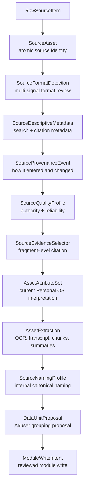
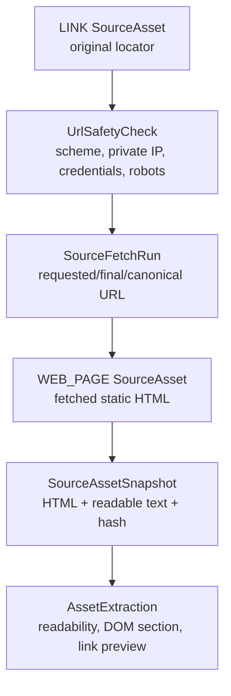

# Single Source Recognition Layer

Date: 2026-06-06

Status: `DATTR-014_DONE`

Purpose: optimize the recognition layer for one atomic `SourceAsset` before AI-assisted naming, grouping, DataUnit proposals, or module workflows.

Related docs:

- `docs/architecture/document_attribute_layer.md`
- `docs/architecture/source_input_surface_inventory.md`
- `docs/architecture/composite_data_unit_layer.md`
- `docs/tasks/task_backlog.md`

## 1. Purpose

The Source Asset Layer already treats each incoming object as an atomic `SourceAsset`. That is necessary, but not sufficient.

A useful source should not only be known as:

```txt
this is a document
```

It should become:

```txt
this is a verified, described, traceable, risk-aware, evidence-addressable, AI-usable source asset
```

Single Source Recognition strengthens the atomic layer so DataUnit grouping and module workflows are based on better source identity, format detection, metadata, provenance, quality, and evidence selectors.

## 2. Placement In Personal OS

```txt
RawSourceItem
  -> SourceAsset
  -> SourceFormatDetection
  -> SourceDescriptiveMetadata
  -> SourceProvenanceEvent
  -> SourceQualityProfile
  -> SourceEvidenceSelector
  -> UrlSafetyCheck / MediaMetadataProfile / SourceFairProfile when applicable
  -> AssetAttributeSet
  -> AssetExtraction
  -> SourceNamingProfile
  -> DataUnitProposal
  -> ModuleWriteIntent
```

Not every source needs every sub-layer. A URL needs `UrlSafetyCheck`; an image/video/audio source needs `MediaMetadataProfile`; a research artifact benefits from `SourceFairProfile`.

## 3. Relationship With SourceAsset And AssetAttributeSet

| Layer | Question answered | Examples |
|---|---|---|
| `SourceAsset` | What atomic source object is this? | uploaded file, URL, message, Drive doc, audio |
| Single Source Recognition | How reliable, traceable, searchable, addressable, and safe is this source? | detected MIME, citation metadata, provenance, quality, evidence selectors |
| `AssetAttributeSet` | How should Personal OS treat it right now? | reference, actionable, evidence, deliverable, inbox, todo, risk level |

Design rule:

- `SourceAsset` remains the atomic identity record.
- Recognition enriches `SourceAsset`; it does not replace source identity.
- `AssetAttributeSet` remains interpretation/workflow state, not low-level recognition metadata.

## 4. Relationship With Composite Data Unit Layer

DATTR-013 Composite Data Unit grouping depends on recognized single sources.

Composite grouping should use:

- `SourceFormatDetection` to avoid wrong format assumptions.
- `SourceDescriptiveMetadata` to infer title, date, language, creator, and citation.
- `SourceProvenanceEvent` to reason about parent-child and derived-source relationships.
- `SourceQualityProfile` to distinguish primary source, derived source, AI-generated artifact, and user note.
- `SourceEvidenceSelector` to let annotations cite source fragments.
- `UrlSafetyCheck` and `MediaMetadataProfile` to support risk-aware grouping.

Example:

```txt
Imported source:
  assetKind: DOCUMENT
  format: MARKDOWN
  originalName: 王小明訪談紀錄.md

Recognition:
  detectedMimeType: text/markdown
  language: zh-TW
  title: 王小明訪談紀錄
  authorityLevel: derived_source or user_note
  provenance: uploaded/imported/classified
  evidence selectors: heading_path, text_position

Then DATTR-013 can infer:
  canonicalName: INT-2026-001__transcript__王小明訪談__2026-06-06__v1.md
  inferredAssetRole: transcript
  DataUnitProposal: INT-2026-001
```

## 5. Mermaid Overview



## 6. URL-specific Flow



Design rule:

- A `LINK` is not fetched immediately by default.
- `LINK` preserves the original URL and capture context.
- Fetched static HTML becomes a separate `WEB_PAGE` asset.
- Requested URL, final URL, canonical URL, and prior snapshots must be preserved separately.

## 7. SourceFormatDetection

Purpose: avoid trusting extension or declared MIME type blindly.

Why this matters:

- `.pdf` may not be a real PDF.
- Browser-provided MIME may be wrong.
- Uploaded files may have misleading extensions.
- `.md` may contain HTML.
- `.json` may be malformed.
- Remote `Content-Type` may be inaccurate.

Signals to compare:

- declared MIME type
- detected MIME type
- file extension
- file signature
- magic bytes
- server MIME
- browser MIME
- content sniffing result
- AI guess, if applicable

Type proposal:

```ts
type SourceFormatDetector =
  | "browser"
  | "server_mime"
  | "file_signature"
  | "magic_bytes"
  | "apache_tika"
  | "content_sniffing"
  | "ai_guess"

interface SourceFormatDetection {
  id: string
  sourceAssetId: string
  declaredMimeType?: string
  detectedMimeType?: string
  fileExtension?: string
  fileSignature?: string
  detector: SourceFormatDetector
  confidence: number
  mismatchDetected: boolean
  warning?: string
  createdAt: string
}
```

Design rule:

`SourceAsset.format` should eventually come from reviewed format detection, not from filename extension or upload metadata alone.

## 8. SourceDescriptiveMetadata

Purpose: capture descriptive metadata for search, citation, grouping, and reuse.

Fields to consider:

- title
- creator
- contributor
- publisher
- createdDate
- modifiedDate
- capturedDate
- language
- description
- subjectTags
- rights
- license
- identifier
- relatedIdentifiers
- sourceCitation

Type proposal:

```ts
interface SourceDescriptiveMetadata {
  id: string
  sourceAssetId: string
  title?: string
  creator?: string[]
  contributor?: string[]
  publisher?: string
  createdDate?: string
  modifiedDate?: string
  capturedDate?: string
  language?: string
  description?: string
  subjectTags?: string[]
  rights?: string
  license?: string
  identifier?: string
  relatedIdentifiers?: string[]
  sourceCitation?: string
  createdAt: string
  updatedAt: string
}
```

Design rule:

This supports Research Module citation, AI retrieval, and DataUnit grouping. It does not replace `SourceAsset` identity.

## 9. SourceProvenanceEvent

Purpose: track how a source entered the system and what happened to it.

Example event types:

- created
- imported
- uploaded
- fetched
- snapshotted
- extracted
- transcribed
- classified
- renamed_internal
- linked
- unlinked
- archived
- deleted_external_detected

Type proposal:

```ts
type SourceProvenanceEventType =
  | "created"
  | "imported"
  | "uploaded"
  | "fetched"
  | "snapshotted"
  | "extracted"
  | "transcribed"
  | "classified"
  | "renamed_internal"
  | "linked"
  | "unlinked"
  | "archived"
  | "deleted_external_detected"

type SourceProvenanceActorType =
  | "user"
  | "system"
  | "ai"
  | "external_provider"

interface SourceProvenanceEvent {
  id: string
  sourceAssetId: string
  eventType: SourceProvenanceEventType
  actorType: SourceProvenanceActorType
  actorId?: string
  sourceProvider?: string
  method?: string
  inputAssetIds?: string[]
  outputAssetIds?: string[]
  timestamp: string
  metadata?: Record<string, unknown>
}
```

Examples:

```txt
Audio uploaded:
  eventType: uploaded

Audio transcribed:
  eventType: transcribed
  inputAssetIds: [audio asset id]
  outputAssetIds: [transcript asset id]

Web URL fetched:
  eventType: fetched
  metadata: requestedUrl, finalUrl, httpStatus, contentHash
```

Design rule:

Parent-child provenance should not rely only on `parentAssetId`. Events describe what happened, when, by whom, and why.

## 10. SourceEvidenceSelector

Purpose: make sources addressable at fragment level.

The system should be able to point to:

- a paragraph in a document
- a heading path in Markdown
- a page range in a PDF
- a timestamp range in audio/video
- a bounding box in an image
- a JSON pointer in structured data
- a spreadsheet cell range
- a DOM selector in HTML

Type proposal:

```ts
type SourceEvidenceSelectorType =
  | "text_quote"
  | "text_position"
  | "page_range"
  | "time_range"
  | "bounding_box"
  | "json_pointer"
  | "spreadsheet_range"
  | "dom_selector"
  | "heading_path"

interface SourceEvidenceSelector {
  id: string
  sourceAssetId: string
  snapshotId?: string
  selectorType: SourceEvidenceSelectorType
  exactText?: string
  prefix?: string
  suffix?: string
  startOffset?: number
  endOffset?: number
  pageNumber?: number
  startPage?: number
  endPage?: number
  startTimeMs?: number
  endTimeMs?: number
  boundingBox?: Record<string, unknown>
  jsonPointer?: string
  sheetName?: string
  cellRange?: string
  domSelector?: string
  headingPath?: string[]
  contentHash?: string
  createdAt: string
}
```

Design rule:

AI should not only cite an entire source. It should cite the relevant fragment.

## 11. SourceQualityProfile

Purpose: distinguish original sources, derived sources, AI-generated artifacts, user notes, and third-party materials.

Type proposal:

```ts
type SourceAuthorityLevel =
  | "primary_source"
  | "derived_source"
  | "third_party_source"
  | "ai_generated"
  | "user_note"
  | "unknown"

type SourceReliabilityLevel = "high" | "medium" | "low" | "unknown"
type SourceFreshnessState = "current" | "stale" | "unknown"
type SourceCompletenessState = "complete" | "partial" | "fragment" | "unknown"
type SourceVerificationState = "unverified" | "system_verified" | "user_verified" | "conflicted"

interface SourceQualityProfile {
  id: string
  sourceAssetId: string
  authorityLevel: SourceAuthorityLevel
  reliability: SourceReliabilityLevel
  freshness: SourceFreshnessState
  completeness: SourceCompletenessState
  verificationState: SourceVerificationState
  riskNotes?: string
  confidence?: number
  createdAt: string
  updatedAt: string
}
```

Examples:

| Source | Authority | Reliability | Verification |
|---|---|---|---|
| Raw interview audio | `primary_source` | `high` | `system_verified` or `user_verified` |
| AI transcript | `derived_source` | `medium` | `unverified` or `user_verified` |
| AI summary | `ai_generated` | `low` or `medium` | `unverified` |
| Researcher note | `user_note` | `medium` | `user_verified` |

Design rule:

`SourceQualityProfile` is not a truth engine. It is a decision aid for users and AI.

## 12. UrlSafetyCheck

Purpose: prevent unsafe URL fetching.

Flow:

```txt
LINK SourceAsset
  -> UrlSafetyCheck
  -> SourceFetchRun
  -> WEB_PAGE SourceAsset
  -> SourceAssetSnapshot
  -> AssetExtraction
```

Type proposal:

```ts
type UrlSafetyStatus =
  | "safe_to_fetch"
  | "manual_review_required"
  | "blocked"

interface UrlSafetyCheck {
  id: string
  sourceAssetId: string
  rawUrl: string
  normalizedUrl?: string
  scheme: "http" | "https" | "file" | "ftp" | "other"
  isPrivateIp?: boolean
  isLocalhost?: boolean
  hasCredentialsInUrl?: boolean
  redirectCount?: number
  finalUrl?: string
  robotsPolicyStatus?:
    | "allowed"
    | "disallowed"
    | "unknown"
    | "not_checked"
  safetyStatus: UrlSafetyStatus
  reason?: string
  checkedAt: string
}
```

Design rules:

- Do not fetch localhost/private IP URLs by default.
- Do not fetch authenticated, paywalled, token-bearing, or private URLs by default.
- Preserve requested URL, final URL, and canonical URL separately.
- Static HTML fetch comes before rendered browser fetch.
- Do not silently overwrite previous snapshots.

## 13. MediaMetadataProfile

Purpose: identify sensitive or important metadata in images, video, and audio.

Signals:

- EXIF metadata
- GPS location
- device info
- C2PA / content credential signal
- AI-generated media signal
- privacy action

Type proposal:

```ts
type MediaPrivacyAction =
  | "keep"
  | "strip_sensitive"
  | "strip_all"
  | "manual_review"

interface MediaMetadataProfile {
  id: string
  sourceAssetId: string
  hasExif?: boolean
  hasGpsLocation?: boolean
  hasDeviceInfo?: boolean
  hasC2paManifest?: boolean
  c2paVerified?: boolean
  aiGeneratedSignal?: boolean
  privacyAction: MediaPrivacyAction
  extractedAt: string
}
```

Design rules:

- Images with GPS metadata require review or stripping.
- Screenshots may contain secrets and should be risk-classified.
- Meeting recordings and interview audio should preserve consent-related metadata when available.
- AI-generated media should not be treated as primary evidence without review.

## 14. SourceFairProfile

Purpose: lightweight FAIR-inspired source profile.

Personal OS interpretation:

- Findable: can this source be searched, categorized, and cited?
- Accessible: does the system know how to read it and whether permission is valid?
- Interoperable: does it have standard metadata, format, or schema?
- Reusable: does it have provenance, license, version, and risk information?

Type proposal:

```ts
interface SourceFairProfile {
  id: string
  sourceAssetId: string
  findable: boolean
  accessible: boolean
  interoperable: boolean
  reusable: boolean
  hasPersistentId: boolean
  hasDescriptiveMetadata: boolean
  hasLicenseOrRights: boolean
  hasProvenance: boolean
  hasMachineReadableFormat: boolean
  createdAt: string
  updatedAt: string
}
```

Design rule:

This should be practical, not academic. It helps Personal OS decide whether a source is ready for search, citation, AI retrieval, or reuse.

## 15. Support For AI-assisted Naming And Grouping

Single Source Recognition improves DATTR-013 because:

- format detection gives AI safer file type assumptions
- descriptive metadata gives title, creator, date, language, and citation hints
- provenance events reveal source chains and derived artifacts
- quality profiles prevent AI from treating all sources as equally reliable
- evidence selectors give fragment-level support for naming, grouping, and annotations
- URL safety and media metadata reduce high-risk auto-selection

AI may use recognition outputs to suggest names and groups, but it must still obey DATTR-013 confidence thresholds and human-approval boundaries.

## 16. Support For AI Source Workflow Runs

Single Source Recognition should be observable through the AI Source Workflow Operating Layer.

Recognition outputs can create workflow steps and review cards:

- format mismatch creates `AIWorkflowStep` warning metadata and may create a `source_quality_warning` work item.
- URL safety issues create a `risk_alert` work item before fetch.
- uncertain source role or module hint creates a `classification_suggestion` or `module_routing_question`.
- successful recognition can feed `SourceNamingProfile`, `DataUnitProposal`, and morning brief summaries.

Conversation corrections should create a new correction run rather than editing recognition provenance silently.

## 17. Support For Research Evidence And Citation

Research Module benefits from:

- descriptive metadata for source citations
- evidence selectors for paragraph/page/timecode/DOM/range pointers
- quality profile for primary vs derived vs AI-generated source distinction
- provenance events for transcript and coding derivation chains
- FAIR profile for source readiness and reuse decisions

AI-generated summaries and coding should be stored as draft annotations or derived artifacts. They are not final research conclusions.

## 18. Module Write Boundary

Single Source Recognition does not write module SSOT records.

It may produce:

- richer source identity
- source warnings
- evidence selectors
- quality profiles
- safety checks
- metadata for AI retrieval
- inputs to `SourceNamingProfile`
- inputs to `DataUnitProposal`
- inputs to `ModuleWriteIntent`

Final module writes still require:

```txt
ModuleWriteIntent
  -> requireUser()
  -> module service authorization
  -> module SSOT
```

## 19. DATTR-017 Preparation

`DATTR-017` should translate DATTR-013, DATTR-014, and DATTR-015 into Prisma model proposals.

Schema proposal should include:

- `SourceFormatDetection`
- `SourceDescriptiveMetadata`
- `SourceProvenanceEvent`
- `SourceEvidenceSelector`
- `SourceQualityProfile`
- `UrlSafetyCheck`
- `MediaMetadataProfile`
- `SourceFairProfile`
- DATTR-013 DataUnit models
- DATTR-015 AIWorkflowRun and AIWorkItem models
- indexes for `sourceAssetId`, `createdAt`, `selectorType`, `eventType`, `authorityLevel`, `verificationState`, `safetyStatus`
- migration impact analysis
- seed/mock fixture strategy
- retention and privacy policy notes

No production migration should be created until the schema proposal is reviewed.

## 20. Acceptance Checklist

This task is complete when Personal OS can answer:

- What is the difference between `SourceAsset` and `AssetAttributeSet`?
- Why is file extension not enough for source recognition?
- What is `SourceFormatDetection`?
- How are declared MIME type and detected MIME type handled?
- What is `SourceDescriptiveMetadata`?
- How does descriptive metadata help search, citation, and AI grouping?
- What is `SourceProvenanceEvent`?
- How does the system know how a source entered and changed?
- What is `SourceEvidenceSelector`?
- How can the system point to paragraph, page, time range, image region, spreadsheet range, DOM selector, heading path, or JSON pointer?
- What is `SourceQualityProfile`?
- How does the system distinguish primary sources, derived sources, AI-generated sources, and user notes?
- What is `UrlSafetyCheck`?
- Why should a `LINK` not be fetched immediately?
- How does the system preserve both `LINK` and `WEB_PAGE`?
- What is `MediaMetadataProfile`?
- How does the system handle EXIF, GPS, device info, C2PA, and AI-generated media signals?
- What is `SourceFairProfile`?
- How does this layer prepare for AI-assisted naming and Composite DataUnit grouping?
- How does this layer support Research Module evidence and citation?
- Why should this layer not directly write into module SSOT?
- How does this task prepare Composite Data Unit schema proposal for `DATTR-017`?
