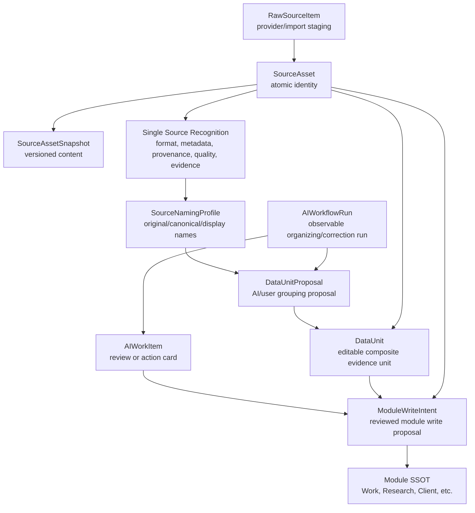

# DATTR-017 Source Workflow Persistence Schema Proposal

Date: 2026-06-07

Status: `DATTR-017_PROPOSAL_ONLY`

Purpose: translate the Source Asset, Single Source Recognition, Composite DataUnit, and AI Source Workflow architecture into a reviewed Prisma/PostgreSQL schema proposal before any production migration.

This document does not change `prisma/schema.prisma` and does not add a migration. It is the contract that should be reviewed before `DATTR-024` persists AI Input formal-mode data to Supabase.

## 1. Scope

This proposal covers:

- source intake staging
- atomic `SourceAsset`
- snapshots and extraction outputs
- source recognition profiles
- evidence selectors
- internal source naming
- composite `DataUnit`
- DataUnit proposals and asset membership
- AI workflow runs, steps, and work items
- module write intents
- minimal source workflow configuration

It intentionally does not implement:

- real LINE / Telegram / Gmail / Drive connectors
- URL fetching runtime
- OCR, transcription, embedding, or C2PA verification runtime
- automatic module writes
- production migration deployment
- external file rename or silent repo/database sync

## 2. Current Schema Fit

Existing schema patterns to preserve:

| Area | Existing decision |
|---|---|
| ID strategy | `String @id @default(dbgenerated("gen_random_uuid()")) @db.Uuid` |
| PostgreSQL extension | `pgcrypto` required by baseline migration |
| Enum strategy | Prisma uppercase enum values are canonical for v0.1 |
| Table naming | `@@map("snake_case_table")` |
| Field naming | camelCase in Prisma, `@map("snake_case")` in DB |
| Ownership | user-scoped data should relate to `Profile` through `ownerProfileId` or equivalent |
| Authorization | app-layer `requireUser()` and service checks remain the boundary |

The new source workflow models should follow these conventions.

## 3. Placement



## 4. Proposed Model Groups

### 4.1 Source Intake And Asset Identity

Core tables:

- `SourceConnection`
- `RawSourceItem`
- `SourceAsset`
- `SourceAssetSnapshot`
- `SourceAssetLink`
- `AssetAttributeSet`
- `AssetExtraction`
- `NormalizedContent`

Design notes:

- `RawSourceItem` is an intake/staging record. It preserves provider payload hints and dedupe metadata.
- `SourceAsset` is the canonical atomic source identity.
- `SourceAssetSnapshot` stores versioned content references or extracted snapshot payload metadata.
- `SourceAssetLink` models parent-child or derived relationships such as audio -> transcript -> AI summary.
- `AssetAttributeSet` stores current Personal OS interpretation/workflow state.
- `AssetExtraction` records extraction jobs and outputs, but does not become final module data.
- `NormalizedContent` is text/chunk/transcript/readability output for AI and search.

Recommended Prisma shape:

```prisma
model SourceConnection {
  id             String   @id @default(dbgenerated("gen_random_uuid()")) @db.Uuid
  ownerProfileId String   @map("owner_profile_id") @db.Uuid
  provider       SourceProvider
  displayName    String   @map("display_name")
  status         SourceConnectionStatus @default(DISCONNECTED)
  syncCursor     String?  @map("sync_cursor")
  scope          Json     @default("{}")
  settings       Json     @default("{}")
  lastSyncedAt   DateTime? @map("last_synced_at")
  createdAt      DateTime @default(now()) @map("created_at")
  updatedAt      DateTime @updatedAt @map("updated_at")

  owner Profile @relation(fields: [ownerProfileId], references: [id], onDelete: Cascade)
  rawItems RawSourceItem[]
  assets SourceAsset[]

  @@index([ownerProfileId, provider])
  @@map("source_connections")
}

model RawSourceItem {
  id                 String   @id @default(dbgenerated("gen_random_uuid()")) @db.Uuid
  ownerProfileId     String   @map("owner_profile_id") @db.Uuid
  sourceConnectionId String?  @map("source_connection_id") @db.Uuid
  sourceType         RawSourceType @map("source_type")
  externalId         String?  @map("external_id")
  title              String?
  previewText        String?  @map("preview_text")
  rawText            String?  @map("raw_text")
  mediaUrl           String?  @map("media_url")
  mimeType           String?  @map("mime_type")
  authorName         String?  @map("author_name")
  senderId           String?  @map("sender_id")
  conversationId     String?  @map("conversation_id")
  contentHash        String?  @map("content_hash")
  providerPayload    Json     @default("{}") @map("provider_payload")
  processingStatus   ProcessingStatus @default(UNPROCESSED) @map("processing_status")
  capturedAt         DateTime @default(now()) @map("captured_at")
  importedAt         DateTime @default(now()) @map("imported_at")
  createdAt          DateTime @default(now()) @map("created_at")

  owner Profile @relation(fields: [ownerProfileId], references: [id], onDelete: Cascade)
  sourceConnection SourceConnection? @relation(fields: [sourceConnectionId], references: [id], onDelete: SetNull)
  sourceAssets SourceAsset[]

  @@index([ownerProfileId, sourceType, importedAt])
  @@index([sourceConnectionId, externalId])
  @@index([contentHash])
  @@map("raw_source_items")
}

model SourceAsset {
  id                 String   @id @default(dbgenerated("gen_random_uuid()")) @db.Uuid
  ownerProfileId     String   @map("owner_profile_id") @db.Uuid
  sourceConnectionId String?  @map("source_connection_id") @db.Uuid
  rawSourceItemId     String?  @map("raw_source_item_id") @db.Uuid
  title              String?
  assetKind          SourceAssetKind @map("asset_kind")
  format             SourceAssetFormat
  storageMode        SourceStorageMode @map("storage_mode")
  sourceProvider     SourceProvider? @map("source_provider")
  sourceType         String?  @map("source_type")
  externalId         String?  @map("external_id")
  externalUrl        String?  @map("external_url")
  sourcePath         String?  @map("source_path")
  mimeType           String?  @map("mime_type")
  fileExtension      String?  @map("file_extension")
  sizeBytes          BigInt?  @map("size_bytes")
  durationMs         Int?     @map("duration_ms")
  width              Int?
  height             Int?
  thumbnailUrl       String?  @map("thumbnail_url")
  canonicalUrl       String?  @map("canonical_url")
  contentHash        String?  @map("content_hash")
  currentSnapshotId  String?  @map("current_snapshot_id") @db.Uuid
  privacyLevel       PrivacyLevel @default(PRIVATE) @map("privacy_level")
  riskLevel          RiskLevel @default(LOW) @map("risk_level")
  createdAt          DateTime @default(now()) @map("created_at")
  updatedAt          DateTime @updatedAt @map("updated_at")

  owner Profile @relation(fields: [ownerProfileId], references: [id], onDelete: Cascade)
  sourceConnection SourceConnection? @relation(fields: [sourceConnectionId], references: [id], onDelete: SetNull)
  rawSourceItem RawSourceItem? @relation(fields: [rawSourceItemId], references: [id], onDelete: SetNull)

  @@index([ownerProfileId, assetKind, createdAt])
  @@index([sourceConnectionId, externalId])
  @@index([contentHash])
  @@index([canonicalUrl])
  @@map("source_assets")
}
```

### 4.2 Single Source Recognition

Core tables:

- `SourceFormatDetection`
- `SourceDescriptiveMetadata`
- `SourceProvenanceEvent`
- `SourceEvidenceSelector`
- `SourceQualityProfile`
- `UrlSafetyCheck`
- `MediaMetadataProfile`
- `SourceFairProfile`

Design notes:

- Store multiple `SourceFormatDetection` rows per asset because different detectors may disagree.
- `SourceDescriptiveMetadata`, `SourceQualityProfile`, `MediaMetadataProfile`, and `SourceFairProfile` are likely one current row per asset in v0.1.
- `SourceProvenanceEvent` should be append-only.
- `SourceEvidenceSelector` should reference `SourceAssetSnapshot` when a selector depends on a specific content version.

Recommended indexes:

| Table | Index |
|---|---|
| `source_format_detections` | `[sourceAssetId, createdAt]`, `[sourceAssetId, mismatchDetected]` |
| `source_provenance_events` | `[sourceAssetId, timestamp]`, `[eventType, timestamp]` |
| `source_evidence_selectors` | `[sourceAssetId, selectorType]`, `[snapshotId, selectorType]` |
| `url_safety_checks` | `[sourceAssetId, checkedAt]`, `[safetyStatus]` |
| `source_quality_profiles` | `[sourceAssetId]`, `[authorityLevel, reliability]` |

### 4.3 Naming And Composite DataUnit

Core tables:

- `SourceNamingProfile`
- `NamingInferenceSignal`
- `SourceRenameSuggestion`
- `DataUnit`
- `DataUnitTemplate`
- `DataUnitTemplateSlot`
- `DataUnitSlotState`
- `DataUnitProposal`
- `DataUnitProposalAsset`
- `DataUnitAssetLink`
- `DataUnitAnnotation`
- `DataUnitModuleLink`

Design notes:

- `SourceNamingProfile.originalName` is immutable by policy.
- `canonicalName` is internal and must not rename external files.
- `DataUnit` belongs to the owner profile and has a stable `code`.
- `DataUnitProposal` is not final. It becomes a `DataUnit` only after user acceptance or a low-risk auto-draft rule.
- `DataUnitAssetLink` allows a single `SourceAsset` to appear in multiple DataUnits.
- `DataUnitAnnotation` should be separate from `SourceAsset` unless intentionally exported as a new asset.

Recommended uniqueness and indexes:

| Table | Constraint / index |
|---|---|
| `source_naming_profiles` | unique `[sourceAssetId]`; index `[canonicalName]`, `[inferredUnitCode]` |
| `data_units` | unique `[ownerProfileId, code]`; index `[kind, status]`, `[primaryModule]` |
| `data_unit_asset_links` | index `[dataUnitId, membershipStatus]`, `[sourceAssetId, role]` |
| `data_unit_proposals` | index `[ownerProfileId, status, createdAt]`, `[proposedDataUnitCode]` |
| `data_unit_annotations` | index `[dataUnitId, kind, createdAt]`, `[sourceAssetId]` |
| `data_unit_module_links` | index `[moduleKey, moduleRecordId]`, `[dataUnitId, relation]` |

### 4.4 AI Source Workflow

Core tables:

- `SourceWorkflowConfig`
- `AIWorkflowRun`
- `AIWorkflowStep`
- `AIWorkItem`
- `AIMentionTarget` or mention-target view model

Design notes:

- `AIWorkflowRun` is the observable run record.
- `AIWorkflowStep` is the drilldown audit trail.
- `AIWorkItem` is the review card shown in the UI.
- Mention targets may not need a physical table in v0.1; they can be BFF view models built from `SourceAsset`, `DataUnit`, `DataUnitProposal`, `AIWorkflowRun`, `AIWorkItem`, and module records.
- Correction workflows should use `parentRunId` and `correctionOfRunId`, not overwrite the old run.

Recommended indexes:

| Table | Index |
|---|---|
| `source_workflow_configs` | `[ownerProfileId, sourceConnectionId]`, `[enabled]` |
| `ai_workflow_runs` | `[ownerProfileId, status, createdAt]`, `[workflowType, triggerType]`, `[parentRunId]`, `[correctionOfRunId]` |
| `ai_workflow_steps` | `[workflowRunId, stepOrder]`, `[status]` |
| `ai_work_items` | `[ownerProfileId, status, createdAt]`, `[workflowRunId]`, `[targetType, targetId]`, `[riskLevel]` |

### 4.5 Module Write Intent

Core table:

- `ModuleWriteIntent`

Design notes:

- This is the controlled boundary between source/data workflows and final module writes.
- It should store proposal payload, target module, target action, risk level, approval status, source references, and resulting module record link after commit.
- High-risk modules require explicit approval before commit.
- Final writes still happen through module services such as Work service, Research service, Client Portal service, Finance service, etc.

Recommended indexes:

| Table | Index |
|---|---|
| `module_write_intents` | `[ownerProfileId, status, createdAt]`, `[targetModuleKey, status]`, `[sourceAssetId]`, `[dataUnitId]`, `[aiWorkflowRunId]` |

## 5. Enum Families

Use Prisma uppercase enum values, mapped to snake_case enum types.

Suggested new enum families:

- `SourceProvider`
- `SourceConnectionStatus`
- `RawSourceType`
- `ProcessingStatus`
- `SourceAssetKind`
- `SourceAssetFormat`
- `SourceStorageMode`
- `PrivacyLevel`
- `RiskLevel`
- `AssetInterpretationKind`
- `AssetWorkflowState`
- `AssetReviewState`
- `SourceFormatDetector`
- `SourceProvenanceEventType`
- `SourceProvenanceActorType`
- `SourceEvidenceSelectorType`
- `SourceAuthorityLevel`
- `SourceReliabilityLevel`
- `SourceVerificationState`
- `UrlSafetyStatus`
- `MediaPrivacyAction`
- `SourceNamingStatus`
- `NamingSignalType`
- `DataUnitKind`
- `DataUnitStatus`
- `DataUnitAssetRole`
- `DataUnitAssetMembershipStatus`
- `DataUnitProposalStatus`
- `AIWorkflowType`
- `AIWorkflowTriggerType`
- `AIWorkflowStatus`
- `AIWorkflowStepType`
- `AIWorkflowStepStatus`
- `AIWorkItemType`
- `AIWorkItemStatus`
- `AIWorkflowTargetType`
- `ModuleWriteIntentStatus`
- `ApprovalStatus`

Enum caution:

- Avoid enum sprawl in the first migration if a value set is still highly fluid.
- Stable governance/risk/status values should be enums.
- Provider-specific message/file subtypes may remain strings or JSON metadata until adapters are reviewed.

## 6. Migration Strategy

Recommended phased migrations:

### Migration A: Core Source Registry

Create:

- `SourceConnection`
- `RawSourceItem`
- `SourceAsset`
- `SourceAssetSnapshot`
- `SourceAssetLink`
- `AssetAttributeSet`
- `AssetExtraction`
- `NormalizedContent`
- `SourceEvidenceSelector`

Reason: formal AI Input mode needs these before it can replace mock source pool data.

### Migration B: Recognition And Naming

Create:

- `SourceFormatDetection`
- `SourceDescriptiveMetadata`
- `SourceProvenanceEvent`
- `SourceQualityProfile`
- `UrlSafetyCheck`
- `MediaMetadataProfile`
- `SourceFairProfile`
- `SourceNamingProfile`
- `NamingInferenceSignal`
- `SourceRenameSuggestion`

Reason: grouping and AI workflows should consume recognized sources, not raw imports.

### Migration C: Composite DataUnit

Create:

- `DataUnit`
- `DataUnitTemplate`
- `DataUnitTemplateSlot`
- `DataUnitSlotState`
- `DataUnitProposal`
- `DataUnitProposalAsset`
- `DataUnitAssetLink`
- `DataUnitAnnotation`
- `DataUnitModuleLink`

Reason: Research and Work workflows need editable evidence units before final module writes.

### Migration D: Workflow And Write Intent

Create:

- `SourceWorkflowConfig`
- `AIWorkflowRun`
- `AIWorkflowStep`
- `AIWorkItem`
- `ModuleWriteIntent`

Reason: `/ai-input` formal mode needs workflow observability, review cards, correction, and module write proposals.

Do not deploy all four migrations to remote Supabase without reviewing table count, index cost, seed strategy, and rollback plan.

## 7. Seed And Fixture Strategy

Seed should stay conservative:

- Do not seed fake source pools in formal mode by default.
- Seed only minimal `DataUnitTemplate` rows if useful for UI, such as interview, research packet, meeting record, and work packet templates.
- Seed optional `SourceWorkflowConfig` examples only in demo mode, not production mode.
- Do not backfill current mock AI Input data into Supabase automatically.
- Any import from mock/demo state should be an explicit audited action.

Suggested initial seed rows:

| Fixture | Reason |
|---|---|
| Interview DataUnit template | Research-oriented grouping |
| Research packet template | Literature/source grouping |
| Meeting record template | Work/Chamber meeting intake |
| Work packet template | Project material grouping |

## 8. BFF Contract For DATTR-024

After schema approval, implement through BFF/service boundaries:

```txt
Server Component loader
  -> requireUser()
  -> source workflow service
  -> Prisma
  -> mapper/view model
  -> AI Input formal UI
```

Suggested loader/action surface:

| Function | Purpose |
|---|---|
| `listSourceConnections()` | Load formal sync settings rows |
| `listSourceAssetsForAIInput()` | Load source pool and context candidates |
| `createManualSourceAsset(input)` | Persist user-entered source without mock fallback |
| `createUrlSourceAsset(input)` | Persist LINK asset and URL safety pending state |
| `listAIWorkflowRuns()` | Load workbench today's runs |
| `listAIWorkItems()` | Load review cards |
| `resolveAIWorkItem(id, input)` | Accept/edit/reject review cards |
| `createDataUnitProposal(input)` | Create proposal from selected assets |
| `acceptDataUnitProposal(id, input)` | Create DataUnit and links through service checks |
| `createModuleWriteIntent(input)` | Propose module write without final commit |

Client Components must receive UI-safe view models only.

### 8.1 DATTR-010 Adapter Contract Alignment

DATTR-010 is now complete in `docs/architecture/source_connection_input_adapter_contract.md`.

The first BFF persistence slice should align with that contract by preserving:

- adapter manifest key and provider
- source connection scope and consent state
- sync mode and sync cursor
- dedupe keys and provider identity refs
- adapter run status, lifecycle stage, cursor before/after, and error summary
- deletion/unsend/revocation events as provenance or tombstone records
- attachment refs as graph candidates rather than flattened text
- AI workflow run/work item refs for review and correction

This does not mean provider runtime is ready. OAuth, webhooks, polling, URL fetching, file storage, clipboard, OCR/transcription, and media capture still need DATTR-011 security/privacy/retention review and provider-specific implementation tasks.

## 9. Security And Governance Rules

- Every row with owner-specific data should include `ownerProfileId` unless it is a shared global template.
- External provider payloads should be stored in JSON only when needed and should avoid secrets/tokens.
- URLs with private IP, localhost, credentials, tokens, private/authenticated/paywalled content, or robots disallow state should not be fetched by default.
- Media GPS/EXIF privacy policy must be enforced before public/client-visible output.
- `AIWorkflowRun`, `AIWorkItem`, `DataUnitProposal`, and `ModuleWriteIntent` outputs are proposals, not final writes.
- Finance, Life, Client Portal, Company Strategy, Auth/Permission, public output, and external agent sharing require human approval for final writes/exposure.
- Internal notes and private source assets must not be exposed through `/client/[token]`.

## 10. Open Questions Before Migration

1. Should `RawSourceItem` be retained forever or archived after `SourceAsset` creation?
2. Should large content snapshots live in DB, object storage, repo files, or hybrid storage?
3. Should `SourceDescriptiveMetadata` be one current row or versioned rows?
4. Which enum families should be hardened now versus left as strings?
5. Should `AIMentionTarget` be persisted or built as a BFF search/view model?
6. What is the production retention policy for message sources and deleted/unsent provider events?
7. Which Supabase storage bucket strategy should hold uploaded media and snapshots?
8. Should DataUnit templates be global or per-owner editable?
9. Which source workflow records should appear in Morning Brief v0.1?
10. How should service-layer authorization map source assets to module permissions?

## 11. Recommended Next Task

Do not jump directly to runtime connectors.

Recommended sequence:

1. `DATTR-010` — Define SourceConnection / InputAdapter contract. Status: `DONE`.
2. `DATTR-011` — Define source intake security, privacy, and retention policy.
3. Review this DATTR-017 schema proposal with DATTR-010 alignment.
4. Split Migration A-D into explicit DB tasks.
5. Implement `DATTR-024` for formal AI Input Source Workflow BFF persistence after schema, security, and connectivity are ready.

## 12. DATTR-017 Completion Criteria

This proposal is complete when:

- The proposed persistence model groups are named.
- The relationship between SourceAsset, Recognition, DataUnit, AIWorkflowRun, AIWorkItem, and ModuleWriteIntent is clear.
- Index and uniqueness recommendations are documented.
- Migration phases are split.
- Seed/fixture strategy is documented.
- DATTR-024 BFF surface is outlined.
- Safety rules and open questions are recorded.
- No Prisma schema, migration, connector runtime, or module SSOT write is added in this pass.
