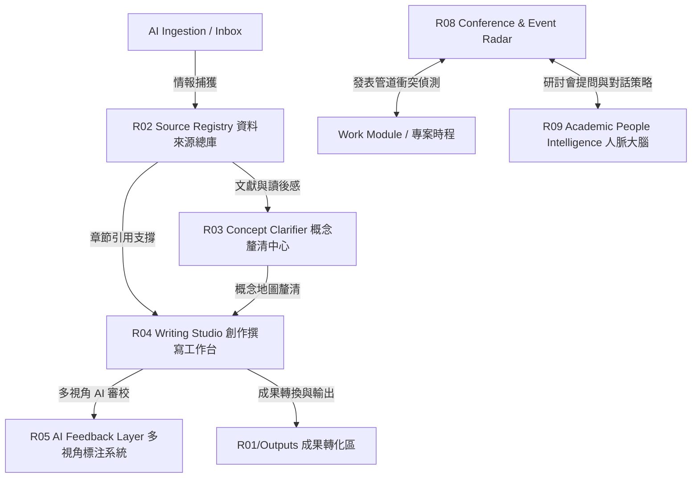

# Research Intelligence Workspace (研究智能工作空間) — 設計與開發計畫

## 1. 核心定位升級：從「學術工具」到「研究情報與創作中心」

學術研究模組從原本單純的「想法、人脈、發表節奏並行的學術原生工作台」，正式升級為 **「研究情報整理、概念釐清、論文創作、研討會參與策略」四合一的 Research Intelligence Workspace**。

這套 Workspace 不僅是用來收藏文獻的抽屜，更是一個能夠與 Personal OS 的工作 (Work)、擷取 (Ingestion) 雙向打通，具備前額葉皮質卸載與認知負荷釋放特性的高智能研究副駕駛 (Research Co-pilot)。



---

## 2. 核心架構與九大子模組

### R01 Research Threads 研究議題管理
每個 Thread 代表一個長期的學術研究命題與容器，對齊使用者的多個主要研究主軸，不以短期的 KPI 加壓，而是提供孕育直覺的空間。

### R02 Source Registry 資料來源總庫
將所有文獻（論文 PDF、書籍、網路文章）、會議記錄（錄音或文字）、工作坊紀錄、實體訪談及個人觀察筆記統一為 `ResearchSource`。使資料可以被 AI 從 **論文面、作者面、地區與機構面** 三個維度進行深度理解與多維檢索。

### R03 Concept Clarifier 概念釐清中心
提供概念卡片、定義比較、作者觀點對齊、我的理解 vs 歷史文獻定義。AI 會主動提醒容易混淆的鄰近概念，避免在研究脈絡中產生偏差。

### R04 Writing Studio 創作撰寫工作台
研究寫作的原生工作台。支援論文、Proposal、Poster、會議簡報的章節式創作。提供 **Outline（架構）**、**Evidence（證據支撐）**、**Argument（論證鏈檢查）**、**Reviewer（審稿人回饋）** 四大寫作模式。

### R05 AI Feedback Layer 多視角標注系統
保存每一次 AI 審校與標注的完整運行記錄 (`AIFeedbackRun`)，包含優勢、劣勢、待釐清問題、修改建議與行動項目。

### R06 Research Issue Manager 多研究議題管理
多個研究議題（學術長期專案）的綜覽，紀錄目前的研究問題、主要文獻支撐、最近新增情報與待釐清點。

### R07 Scheduled Research Digest 定期研究整理
每週/雙週或月度自動聚合 digest。列出本週新增情報、概念進展、待解答的學術問題與下週的具體寫作建議。

### R08 Conference & Event Radar 研討會與活動追蹤
追蹤 CFP、研討會、workshop。由 AI 自動演算 **Fit Score (適配度)**，提出 Suggested Participation Mode (參與策略：投稿/發表 poster/提問 networking) 與 Deadline Risk (發表衝突偵測)。

### R09 Academic People Intelligence 主席與研究者背景分析
人脈大腦。記錄研究者、作者、研討會主席 (Chair)、Session Chair 及 Keynote Speaker。由 AI 產生 **主席背景分析與提問對話角度**，協助使用者帶著最清晰的研究身份出席社交。

---

## 3. 資料庫欄位定義 (TypeScript Models v2)

```typescript
// ─── R01: Research Thread 核心主軸 ──────────────────────────────────────
export type ResearchThreadStatus = "exploring" | "active" | "writing" | "published" | "paused";

export interface ResearchThread {
  id: string;
  title: string;
  description?: string;
  status: ResearchThreadStatus;
  keywords: string[];
  disciplines: string[];          // 例如: "AI Governance", "ESG", "HCI"
  regions: string[];              // 例如: "亞太", "歐盟", "北美"
  methodType?: "qualitative" | "quantitative" | "design_research" | "mixed";
  mainResearchQuestion?: string;
  workLinkage?: string;           // 記錄與工作專案 (Work) 的跨界對齊說明
  createdAt: string;
  updatedAt: string;
}

// ─── R02: Source Registry 資料來源總庫 ──────────────────────────────────
export type ResearchSourceType =
  | "paper"
  | "book"
  | "article"
  | "conference_record"
  | "workshop_record"
  | "meeting_record"
  | "audio_transcript"
  | "institution_report"
  | "dataset"
  | "website"
  | "personal_note";

export interface ResearchSource {
  id: string;
  threadId: string;
  title: string;
  sourceType: ResearchSourceType;
  authors?: string[];
  year?: number;
  doi?: string;
  url?: string;
  institution?: string;           // 發布機構 (例如: MIT, NUS)
  region?: string;                // 地區脈絡
  country?: string;
  language?: string;
  abstract?: string;
  summary?: string;               // AI 自動摘要
  originalText?: string;
  fileUrl?: string;
  sourceReliability?: "primary" | "secondary" | "informal" | "personal_observation";
  createdAt: string;
  updatedAt: string;
}

// ─── R03: Concept Clarifier 概念釐清 ────────────────────────────────────
export interface ResearchConcept {
  id: string;
  threadId: string;
  name: string;
  aliases?: string[];
  definition?: string;
  relatedSources: string[];       // 關聯文獻 IDs
  relatedAuthors: string[];       // 關聯學者 IDs
  relatedInstitutions?: string[];
  competingDefinitions?: {
    sourceId: string;
    author?: string;
    definition: string;
    note?: string;
  }[];
  myCurrentUnderstanding?: string; // 我目前的理解
  aiClarification?: string;       // AI 釐清與架構建議
  confusionPoints?: string[];     // 易混淆點提示
  createdAt: string;
  updatedAt: string;
}

// ─── R04: Writing Studio 論文創作 ──────────────────────────────────────
export interface ResearchWritingProject {
  id: string;
  threadId: string;
  title: string;
  writingType: "paper" | "conference_paper" | "proposal" | "essay" | "poster" | "presentation";
  status: "idea" | "outline" | "drafting" | "reviewing" | "submitted";
  targetVenueId?: string;
  researchQuestion?: string;
  thesisStatement?: string;       // 核心論點
  createdAt: string;
  updatedAt: string;
}

export interface ResearchWritingSection {
  id: string;
  projectId: string;
  title: string;
  order: number;
  body: string;
  linkedSourceIds?: string[];     // 引用文獻
  aiNotes?: string[];             // AI 針對本段落的推論標註
}

// ─── R05: AI Feedback Layer 多視角標注 ─────────────────────────────────
export type ReviewPerspective =
  | "method_reviewer"
  | "theory_reviewer"
  | "domain_expert"
  | "critical_reviewer"
  | "friendly_mentor"
  | "conference_chair"
  | "journal_editor";

export interface AIFeedbackRun {
  id: string;
  threadId: string;
  writingProjectId?: string;
  sourceId?: string;
  inputType: "paper_draft" | "outline" | "source" | "concept_note" | "proposal";
  perspective: ReviewPerspective;
  summary: string;
  strengths: string[];            // 優勢
  weaknesses: string[];           // 缺口與弱點
  questions: string[];            // 審稿人可能提出的質疑
  suggestions: string[];          // 修改建議
  actionItems: string[];          // 下一步具體修改任務
  createdAt: string;
}

// ─── R07: Scheduled Research Digest 定期整理 ─────────────────────────────
export interface ResearchDigest {
  id: string;
  threadId: string;
  scheduleType: "weekly" | "biweekly" | "monthly";
  title: string;
  newSources: string[];           // 新增文獻與材料
  keyFindings: string[];          // 本週核心進展與發現
  openQuestions: string[];        // 待釐清的開放問題
  recommendedReadings: string[];  // 建議閱讀文獻
  writingSuggestions: string[];   // 下步寫作與修改建議
  generatedAt: string;
}

// ─── R08: Conference & Event Radar 研討會雷達 ──────────────────────────
export interface ResearchEvent {
  id: string;
  name: string;
  eventType: "conference" | "workshop" | "seminar" | "summer_school" | "webinar";
  field: string[];
  location?: string;
  country?: string;
  isOnline?: boolean;
  startDate?: string;
  endDate?: string;
  submissionDeadline?: string;    // CFP 截止日期
  registrationDeadline?: string;
  url?: string;
  cfpText?: string;
  relatedThreadIds?: string[];
  fitScore?: number;              // 適配度分數 (1-100)
  aiFitReason?: string;           // 適配原因解析
  suggestedParticipationMode?: "submit_paper" | "submit_poster" | "attend" | "ask_question" | "networking";
  createdAt: string;
  updatedAt: string;
}

// ─── R09: Academic People Intelligence 人脈背景大腦 ───────────────────────
export interface AcademicPerson {
  id: string;
  name: string;
  role?: "author" | "chair" | "session_chair" | "keynote" | "editor" | "reviewer";
  affiliation?: string;
  country?: string;
  profileUrl?: string;
  researchAreas?: string[];
  importantWorks?: string[];
  relatedEvents?: string[];
  backgroundSummary?: string;
  relevanceToMyResearch?: string;
  conversationAngles?: string[];  // 推薦提問與社交破冰角度
  createdAt: string;
  updatedAt: string;
}
```

---

## 4. 模組頁面架構與整合路由

研究模組升級後，其內部的頁面與功能將按以下路由結構組織：

```txt
/research
  ├── (Root Dashboard)                    # 研究工作台首頁 (主軸卡片、倒數計時與 AI 發表衝突警告)
  │
  ├── /threads
  │     └── /[threadId]                   # 單一研究主軸沙盒 (Overview, Sources, Concepts, Writing, Events)
  │
  ├── /events
  │     ├── (Event Radar)                 # 研討會雷達、CFP 日曆與適配度分析
  │     └── /[eventId]                    # 研討會分析頁 (含主席與 Session Chair 背景解讀)
  │
  ├── /people
  │     └── (Academic Person CRM)         # 同領域學者、潛在審稿人、論文共同作者交往備忘錄
  │
  └── /digests
        └── (Digest Registry)             # 定期研究情報簡報與整理記錄
```

### 研究主軸詳情頁 (`/research/[threadId]`) 升級 Tabs 設計：
1. **Overview (概覽)**：顯示研究大綱、關鍵科學問題、已收集情報總數、寫作狀態、下個關鍵里程碑。
2. **Sources (情報總庫)**：收納並展示論文、網路剪報、工作坊筆記、會議錄音轉文字，支援多維篩選。
3. **Concepts (概念釐清)**：呈現目前釐清的概念定義比較表、易混淆提醒、以及個人理解的演進記錄。
4. **Writing (論文寫作)**：進入 Writing Studio，支援章節式寫作，左側撰寫、右側顯示 AI 審核 feedback 與引用文獻庫。
5. **AI Feedback (多角標註)**：記錄該主軸下歷次 AI Reviewer Perspective 運算結果。
6. **Events & People (學術關係)**：查看適配該主軸的 CFP 研討會以及相關學界人脈網絡。

---

## 5. 漸進式開發路徑與階段規劃

### Phase 1：資料模型、高保真 UI 與跨模組雙向打通 (當前進度)
* 建立 `src/types/research.ts` (升級至 v2) 與 Mock 數據。
* 實作學術研究主頁（倒數日曆、AI 發表衝突警示）。
* 實作學術詳情沙盒頁（多 Tab 框架、靈感沙盒、文獻材料、人脈）。
* 實現**跨模組雙向連結 (Bilateral Sync)**：將 linked 靈感自動轉化並 Pin 於 Work 專案的 `NoteTimeline`，保障工作與學術證據無縫融合。

### Phase 2：情報採集與情報多維視角拆解 (R02 Source Registry)
* 在 Ingestion 模組中新增 "Send to Research Thread" 動作，將 Inbox 擷取的 LINE 討論或剪報一鍵歸入 Research Sources。
* AI 自動為 Source 提取論文面、作者面、地區/機構面標籤，並自動產生 200 字學術摘要。

### Phase 3：概念釐清中心與 Writing Studio (R03 & R04)
* 實作概念釐清卡片組件，展示 Competing Definitions 定義比較。
* 實作 Writing Studio 的 Outline & Evidence Mode，在編輯區寫作時，AI 自動比對右側 Material 庫並高亮顯示「推論鏈缺乏證據」或「概念定義不一致」的段落。

### Phase 4：Reviewer Mode & Event Radar (R05 & R08 & R09)
* 實作 "Ask Reviewer" 面板。使用者可選擇 "Method Reviewer"、"Critical Reviewer"、"Journal Editor" 等視角，生成高保真 AI Feedback Card，並可一鍵轉化為寫作任務。
* 實作研討會雷達與 fit-score 卡片。結合 Academic Person Background Analysis 引擎，自動生成破冰提問建議。

### Phase 5：Digest 生成與真實 AI API 整合
* 串接真實的 LLM API (GPT-4o / Claude 3.5 Sonnet)，藉由傳遞 thread 脈絡實現真正的智能概念釐清與多視角審稿。
* 實作每週 / 每月 Digest PDF/Markdown 生成與下載。
