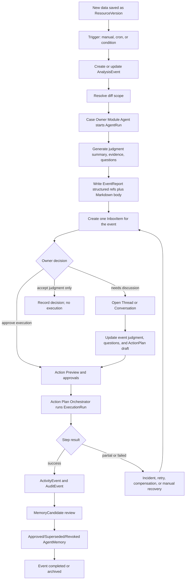
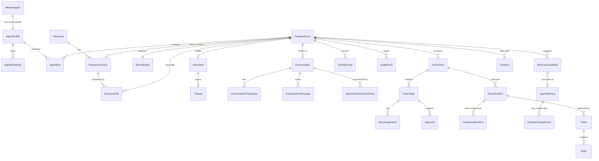
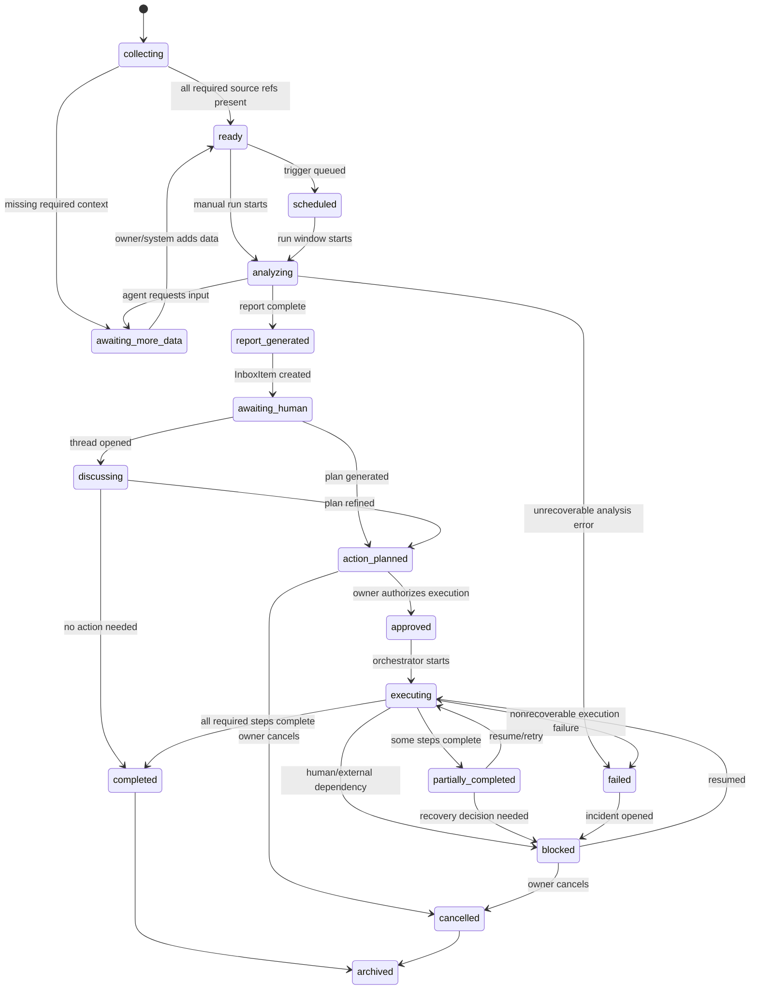
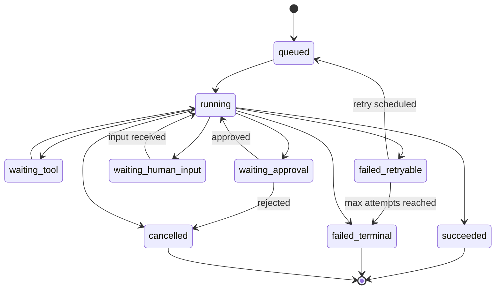
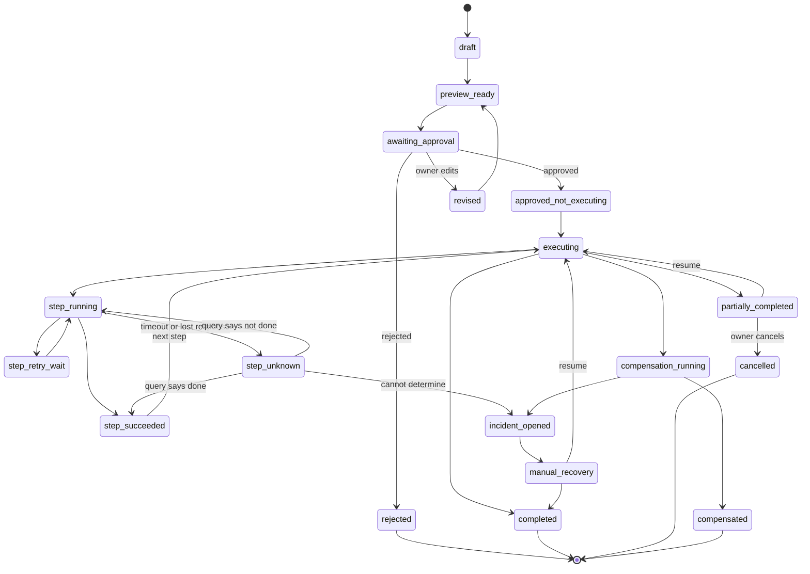
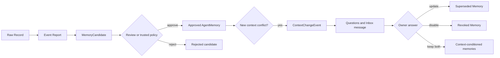
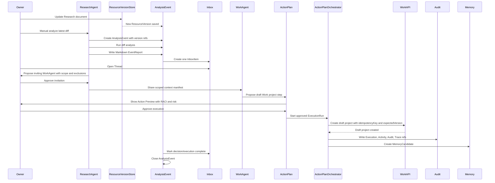

# Human-AI Event Operating Model

**Document ID:** `RES-011`
**Subtitle:** Analysis Events, Persistent Module Agents, Conversations, Inbox Decisions, Action Plans, RACI, Execution, Records and Memory
**Last updated:** 2026-07-14
**Status:** Research and architecture design
**Runtime implementation:** None in this task
**Database schema implementation:** None in this task
**Supersedes or extends:** Extends `RES-010_cross-module-human-ai-agent-operating-model-research.md`; does not delete or replace it.

---

## 1. Purpose

This document answers a more fundamental question than "which tabs should each module have":

> After data enters Personal OS, how does the system use versions, diffs, persistent module agents, analysis events, Inbox decisions, conversations, action plans, human approval, cross-module API execution, records, audit, and memory to create a traceable, controllable, recoverable Human-AI collaboration loop?

This document becomes a shared basis for future UI, data model proposals, Agent Runtime, Workflow Orchestration, permission policy, audit, memory, and acceptance criteria.

This is a research and design artifact only. It must not be interpreted as approval to modify runtime code, apply a Prisma migration, create external agent endpoints, enable autonomous writes, expose private data, or register agents externally.

## 2. Owner Decisions

The following are confirmed product decisions, not open questions.

| Area | Confirmed decision |
|---|---|
| Save before analysis | New data is saved first. The system does not automatically analyze every new item by default. |
| Analysis triggers | Manual trigger, cron schedule, and condition-based automatic analysis must all be supported. |
| Schedule management | All agent schedules belong in a unified settings or AI Operations surface. |
| Diff-based analysis | Agents should default to analyzing only the difference between the last successfully analyzed version and the latest version. |
| Version mental model | Versioning should borrow a Git-like mental model but support documents, database objects, email, meeting notes, and structured fields. |
| Main unit | `AnalysisEvent` is the main processing unit, not a single file. |
| Event contents | One event may include multiple files, links, data versions, diffs, and agent runs. |
| Event outputs | One event generally creates one event report, one Inbox item, zero-to-many conversations or threads, and zero-to-many action plans. |
| Event report | Detailed reports are stored as Markdown and can be classified into AI or Docs, but Markdown is not the only source of truth. |
| Inbox shape | An Inbox item behaves like a complete message to a human: context, analysis process, outcome, evidence, files, links, and required decisions. |
| Thread behavior | The owner can execute suggestions directly or open a thread with AI; the thread can update judgments, open questions, action plans, and pending information. |
| One message per event | One data item should not independently create one notification; the analysis event creates the message and report. |
| Judgment vs execution | Accepting an AI judgment and authorizing execution are separate states. |
| Action preview | Execution requires a complete action preview before the owner approves risky or final actions. |
| External communication | Outbound messages and emails should allow owner editing before send. |
| High-risk action approval | Dangerous, irreversible, cross-permission, or private-data actions require human approval. |
| Automation baseline | Tags and draft tasks can be automatic; duplicate-file deletion and payment creation cannot be automatic; customer email requires preview/edit/approval by default; Finance classification can be automatic; Life private sharing requires per-use owner approval. |
| Permission dimensions | Permission is evaluated by action, target, data scope, recipient, risk, context, reversibility, and trust, not only by API name. |
| Persistent module agents | Every module has one persistent `ModuleAgent` with independent role, permission, data scope, schedule, working memory, cost profile, and task queue. |
| Agent run | A concrete analysis or action attempt is an `AgentRun`. |
| Shared runtime | Agents may share one underlying runtime, but each `AgentProfile` remains independent. |
| Agent tab content | The Agent tab must show current work, recent tasks, running/waiting work, next schedule, interactions with other agents, judgment summaries, working hypotheses, open questions, next steps, issue conversations, model, tokens, and cost. |
| No hidden reasoning storage | The system stores user-verifiable judgment summaries, assumptions, evidence, and open questions. It does not store or display hidden chain-of-thought. |
| Public multi-agent discussion | AI Input or Conversation Hub is the shared multi-agent discussion area. |
| Invite flow | A primary Module Agent may propose inviting another agent, but must ask the owner first and disclose the reason, shared data, excluded data, and expected expertise. |
| Invited agent scope | Invited agents advise within an explicit least-privilege context. They do not receive the whole module data scope and do not become primary by default. |
| RACI | Every action step has RACI. Each step should have exactly one Accountable party. Case Owner Agent is not the same as Action Plan Orchestrator. |
| Handoff | Module responsibility transfer requires an explicit handoff or new case. The system must not silently change the primary agent. |
| Rejection learning | Rejection asks for a reason, records context-conditioned preference or decision rules, and does not generalize one rejection into permanent memory. |
| Context change | When a new context differs from memory, create a Context Change Event, compare old/new context, produce Markdown, notify Inbox, ask questions, then update, add, or disable memory based on owner answers. |

## 3. Scope And Non-scope

In scope:

- Event-level operating model from saved data to event closure.
- Domain model proposal, state machines, UI information architecture, permission/risk model, failure/recovery model, and backlog.
- Research alignment with current repository docs and code.
- External official or primary references for scheduling, agent handoffs, Git-style versions, RACI, workflow retry/recovery, tracing, audit, and agent interoperability.
- First vertical slice design for a Research document version update that can later become a mock or DB-backed proof.

Out of scope:

- Runtime code changes.
- Formal Prisma schema changes or migrations.
- Enabling agent execution beyond current dry-run/proposal contracts.
- External agent registration, public agent directory, direct external-agent DB access, or cross-organization collaboration.
- Automatic final writes to high-risk modules.
- Treating Markdown reports, chat transcripts, or raw activity records as approved long-term memory.

## 4. Terminology

| Term | Definition | Boundary |
|---|---|---|
| `Resource` | A logical thing the system can reason about: file, URL, document, email, meeting note, project row, task, tag relation, or structured record. | Stable identity, current pointer, and module ownership. |
| `ResourceVersion` | Immutable version snapshot or normalized representation of a resource. | Hash-addressed or version-ID-addressed; never overwritten. |
| `ResourceDiff` | Machine-readable and human-readable comparison between two versions. | Can be stored for audit or computed on demand, depending on cost and risk. |
| `AnalysisEvent` | Main case unit for analysis. It groups versions, diffs, triggers, agent runs, report, Inbox item, conversations, action plans, and execution outcomes. | Event lifecycle owner; not the same as an agent run or message. |
| `AgentRun` | One concrete invocation of a module agent or invited specialist for analysis, classification, drafting, or tool/action preparation. | Runtime attempt and trace container. |
| `InboxItem` | One human-facing message about an event, decision, incident, or summary. | Owner attention and decision surface. |
| `Thread` | Owner-facing discussion anchored to an Inbox item or event. | Can update event judgment/action plan, but does not execute by itself. |
| `Conversation` | General multi-participant message space, including public multi-agent conversations in AI Input/Conversation Hub. | Full transcript is stored once; modules store summaries/links. |
| `ActionPlan` | Proposed sequence of action steps with goal, risk, RACI, approvals, execution preview, and compensation strategy. | Business plan; not the same as execution history. |
| `ActionStep` | One step in an action plan. | Has RACI, tool/API, input, expected output, idempotency, expected version, retry, and compensation. |
| `ExecutionRun` | Concrete attempt to execute an approved action plan or step. | Technical execution state and results. |
| `ActivityEvent` | User-readable event history. | Product-facing record. |
| `AuditEvent` | Append-only security/debug/compliance event. | Higher-fidelity immutable evidence. |
| `MemoryCandidate` | Proposed durable memory derived from event/report/records. | Requires review or policy-based approval. |
| `AgentMemory` | Approved, scoped, contextual memory. | Must include evidence, owner agent, validity, and revocation/supersession path. |
| `Trace` / `Span` | Observability record for workflow, agent, model call, tool call, approval, and external API. | Debug/evaluation plane, not product memory. |

## 5. Current-state Audit

### 5.1 Local Code And PRD Fit

Current reusable assets:

| Existing artifact | Reusable concept | Gap for this model |
|---|---|---|
| `SCH-001_agent-team-os-schema-proposal.md` | Proposed `AgentProfile`, `AgentRun`, `AgentApprovalRequest`, `AgentMessage`. | Needs richer schedule, data scope, cost, version refs, run trace, event linkage, and memory pipeline fields. |
| `ARC-032_internal-multi-agent-task-message-bus-contract.md` | Internal task/message bus, participants, messages, proposal-only states, audit mapping. | Needs event-level conversation/interaction summaries, owner-approved invite manifest, per-step RACI, and execution linkage. |
| `ARC-029_agent-operation-dry-run-contract.md` | Protected owner-only dry-run operation contract and 10-module command catalog. | Needs future execution states and approval-preview boundary while keeping current `allowedModes: ["dry_run"]`. |
| `DBS-006_operating-audit-event-schema-contract.md` | Append-only `OperatingAuditEvent` envelope with actor/action/target/result/risk/approval/proof/before/after/retention. | Needs trace/span, idempotency, outbox, DLQ, execution/compensation, and memory candidate refs. |
| `RES-007_source-triggered-thinking-node-pipeline-and-action-fanout-research.md` | Saved-first Source Workflow, manual/scheduled analysis, Inbox item, action intent, owner review. | AI Input-specific; needs cross-module generalized `AnalysisEvent`. |
| `ARC-008_ai-source-workflow-layer.md` | `AIWorkflowRun`, `AIWorkflowStep`, `AIWorkItem`, `ModuleWriteIntent`, no final module write without approval. | Workflow run is not the same as event; needs event/report/Inbox/action-plan split. |
| `ARC-012_frontend-operating-surface.md` | Module operating surface, Agent workspace, Records/Audit, settings/boundaries. | Needs precise page IA for event detail, action preview, schedule center, incident/recovery, cost dashboard. |
| `ARC-030_module-resource-index-bff-contract.md` | Cross-module resource index BFF, resource rows, audit refs. | Needs version/diff contract and event resource linkage. |
| `src/components/layout/module-operating-shell.tsx` | Existing shell tabs and mock agent/records surfaces. | UI is mock/projection-only; lacks event/run/action/audit model. |
| `src/lib/workflow/types.ts` | `AgentMessage`, `WorkflowRule`, `TraceGroup`, `requiresApproval`, mock workflow agent IDs. | Prototype-only, no persistent event/action/permission model. |
| `src/app/(dashboard)/inbox/page.tsx` | Existing Inbox review states for ingestion proposals. | Current Inbox is item/proposal-level, not event-level one-message-per-event. |
| `src/types/ingestion.ts` | `AIWorkflowRun`, trigger types, source connections, workflow steps. | Good vocabulary but lacks event lifecycle and cross-module action plan. |
| `src/lib/contracts/operating-audit-event.contract.ts` | Static audit contract enums and fields. | No persisted audit storage or trace/outbox linkage yet. |
| `src/lib/actions/research-threads.ts` | Existing Research thread persistence path. | Thread is Research-specific; needs event-scoped generic thread/conversation boundary. |

Naming conflicts and concept drift:

- `AIWorkflowRun`, `AgentRun`, and future `ExecutionRun` must remain separate.
- Current `/inbox` "processing/review/confirmed" states should not become `AnalysisEvent` states.
- `Thread` and `Conversation` should be distinct: `Thread` is event/Inbox decision dialogue; `Conversation` is general multi-agent or hub discussion.
- `ActionIntent` from AI Input can evolve into or map to `ActionPlan` and `ActionStep`, but should not bypass owner approval.
- `Records` tab should aggregate `ActivityEvent` and safe projections, not expose raw audit or trace by default.

### 5.2 Research Round 1: Local Fit

Selected pattern:

- Keep `AnalysisEvent` as the cross-module case object.
- Reuse `AgentProfile`/`AgentRun` vocabulary from `SCH-001`.
- Reuse `ARC-032` bus concepts for multi-agent conversation and proposal-only collaboration.
- Reuse `ARC-029` dry-run operation catalog for future action preview and execution contract.
- Reuse `DBS-006` as the append-only audit envelope.
- Reuse `RES-007` saved-first/manual-or-scheduled analysis principle.

Rejected local alternatives:

- Do not treat `/inbox` proposal state as the global event lifecycle.
- Do not make each file upload or source item produce its own Inbox notification.
- Do not copy full public conversation transcripts into every module.
- Do not use `ModuleOperatingShell` mock rows as evidence of real Agent runtime.
- Do not add schema or runtime execution before architecture, permission, and acceptance contracts are split.

### 5.3 Research Round 2: Comparable Architecture

External source conclusions:

| Source | Applicable pattern |
|---|---|
| OpenAI Codex scheduled tasks manual | Schedules should have active/paused/completed run visibility, prompt/context durability, local/worktree isolation choices, first-run review, and a Scheduled view that acts as an attention inbox. Source: `https://learn.chatgpt.com/docs/automations` via local Codex manual. |
| OpenAI Agents SDK orchestration docs | Multi-agent design should choose between handoffs, where a specialist takes over, and "agents as tools", where the manager keeps final ownership. This supports the Case Owner vs Invited Agent distinction. Source: `https://developers.openai.com/api/docs/guides/agents/orchestration`. |
| OpenAI Agents SDK guardrails and approvals | Risky tool calls can pause with approval interruptions and resume from stored state; this maps to Action Preview, Approval, and resumable ExecutionRun. Source: `https://developers.openai.com/api/docs/guides/agents/guardrails-approvals`. |
| OpenAI Agents SDK tracing | Runs can emit structured traces for model calls, tool calls, handoffs, guardrails, and custom spans; this maps to Trace/Span fields. Source: `https://developers.openai.com/api/docs/guides/agents/integrations-observability#tracing`. |
| OpenAI Codex memories manual | Memory is useful recall but not the only source for rules; generated memories are delayed, redacted, and controllable per task. This supports explicit MemoryCandidate review rather than automatic memory promotion. Source: `https://learn.chatgpt.com/docs/customization/memories` via local Codex manual. |
| Git data model | Objects are immutable, content-addressed by hash, and commits carry parent pointers; this informs ResourceVersion and restore references. Source: `https://git-scm.com/docs/gitdatamodel`. |
| Git diff | Diff compares trees, blobs, commits, index, or filesystem paths; this supports treating diff as an endpoint comparison, not an event itself. Source: `https://git-scm.com/docs/git-diff`. |
| PMI RACI | A RACI chart clarifies Responsible, Accountable, Consulted, and Informed roles and serves communication planning. Source: `https://www.pmi.org/learning/library/best-practices-managing-people-quality-management-7012`. |
| Temporal retry policies | Activities retry by default with exponential backoff; workflows are not retried by default because they replay deterministic history. This supports retrying action steps/activities, not blindly restarting a whole event. Source: `https://docs.temporal.io/encyclopedia/retry-policies`. |
| Temporal saga guidance | Saga combines compensation with saved progress so workflows can continue or recover after failure. Source: `https://temporal.io/blog/saga-pattern-made-easy`. |
| Temporal pause/resume pattern | Permanent business failures can pause, accept correction via a signal, and resume without re-executing completed steps. Source: `https://temporal.io/blog/keep-business-processes-moving`. |
| AWS retry with backoff | Backoff is for transient errors; non-transient errors should fail fast or circuit-break; retry requires idempotency. Source: `https://docs.aws.amazon.com/prescriptive-guidance/latest/cloud-design-patterns/retry-backoff.html`. |
| AWS transactional outbox | Outbox solves dual-write inconsistency between database updates and event/message notification. Source: `https://docs.aws.amazon.com/prescriptive-guidance/latest/cloud-design-patterns/transactional-outbox.html`. |
| AWS SQS DLQ | Dead-letter queues isolate messages that fail after configured receives for debugging and redrive. Source: `https://docs.aws.amazon.com/AWSSimpleQueueService/latest/SQSDeveloperGuide/sqs-dead-letter-queues.html`. |
| Azure Saga and Compensating Transaction | Distributed operations split into local transactions; some steps are compensable, retryable, or irreversible pivot points; compensation is business-specific and may need human review. Sources: `https://learn.microsoft.com/en-us/azure/architecture/patterns/saga`, `https://learn.microsoft.com/en-us/azure/architecture/patterns/compensating-transaction`. |
| Azure Circuit Breaker | Stop repeatedly calling a likely-failing remote service after threshold failures; allow recovery before retrying. Source: `https://learn.microsoft.com/en-us/azure/architecture/patterns/circuit-breaker`. |
| Azure Event Sourcing | Event data should not be updated; corrections are compensating events. Source: `https://learn.microsoft.com/en-us/azure/architecture/patterns/event-sourcing`. |
| OpenTelemetry traces | A tracer creates spans for operations, and traces can be exported for debugging/development or observability backends. Source: `https://opentelemetry.io/docs/concepts/signals/traces/`. |
| A2A Protocol | A2A defines agent-to-agent tasks, messages, artifacts, task state, agent discovery, security, and authorization scoping. This informs future conversation/agent-card boundaries without enabling external collaboration. Source: `https://a2a-protocol.org/latest/specification/`. |
| OWASP Logging Cheat Sheet | Application logging should be consistent and useful for security and operational use cases. Source: `https://cheatsheetseries.owasp.org/cheatsheets/Logging_Cheat_Sheet.html`. |

### 5.4 Research Round 3: Risk, Auth, Privacy, And Failure Boundaries

Selected boundaries:

- Life private data is never shared across modules by default. Every cross-module sharing use requires owner approval and a shared context manifest.
- Research data may be shared to Work when task-relevant and scoped.
- External email/customer communication can be drafted by agents, but default send requires preview, edit, and approval.
- Payment creation, duplicate deletion, external permissions, and public output are L3/high-risk unless separately trusted.
- API timeout must be treated as unknown, not failure. Query or idempotency lookup must decide whether retry is safe.
- Stale versions use optimistic concurrency: execution needs `expectedVersion`.
- Long-term memory must pass through MemoryCandidate review and may be superseded or revoked.
- Partial success creates Incident plus recovery choices; the event remains recoverable, not silently completed.

Rejected risk shortcuts:

- Do not decide risk only from action name.
- Do not assume all operations are rollbackable.
- Do not retry non-idempotent external operations without lookup.
- Do not let an invited agent inherit the primary agent's module scope.
- Do not treat a human's one-time rejection as a permanent rule.

## 6. Operating Principles

1. Save before analysis.
2. Analyze events, not isolated files.
3. Use diffs by default, with explicit full reanalysis policy.
4. Separate event lifecycle, agent run lifecycle, Inbox status, conversation status, action plan status, and execution status.
5. Keep user-facing records understandable and audit events precise.
6. Store verifiable judgment summaries, evidence, assumptions, and open questions; do not store hidden chain-of-thought.
7. Put human approval between judgment acceptance and side-effect execution.
8. Make every action step independently previewable, risk-rated, version-checked, idempotency-keyed, and auditable.
9. Use RACI per action step; orchestrators execute sequence, they do not become business Accountable by default.
10. Prefer forward recovery and human decision over blind rollback when compensation is ambiguous or high-impact.
11. Make memory explicit, scoped, contextual, evidence-backed, and revocable.
12. Keep external registration disabled until endpoint, auth, trust, permission, public-safety, rollback, observability, and human approval are complete.

## 7. End-to-End Flow



## 8. Domain Model

### 8.1 Domain Model Diagram



### 8.2 Object Responsibilities

| Object | Responsibility | Main fields | Relationships | Record class | Mutation rule |
|---|---|---|---|---|---|
| `ModuleAgent` | Stable logical module agent identity. | `id`, `moduleKey`, `label`, `currentProfileId`, `lifecycle`, `externalRegisterable=false`. | One current `AgentProfile`; many runs through profile. | Current-state projection plus stable identity. | Profile pointer can change through audited event; identity stable. |
| `AgentProfile` | Role, instructions, capability, permission, schedule defaults, model/cost, data scope. | `id`, `agentId`, `version`, `role`, `capabilities`, `dataScopes`, `permissionPolicyRef`, `modelPolicy`, `costBudget`, `memoryScope`, `status`. | Owns schedules and runs. | Versioned config record. | New profile version for material changes; do not overwrite prior config. |
| `AgentSchedule` | Scheduled or conditional run config. | `id`, `agentProfileId`, `triggerKind`, `cron`, `timezone`, `condition`, `inputScope`, `diffScope`, `pausedAt`, `lastRunAt`, `nextRunAt`, `costBudget`. | Creates `AgentRun` and `AnalysisEvent`. | Current-state schedule projection plus schedule-change audit. | Editable with audit; run history immutable. |
| `AgentRun` | One concrete analysis/classification/draft/tool-prep attempt. | `id`, `agentProfileVersionId`, `analysisEventId`, `triggerRef`, `status`, `startedAt`, `completedAt`, `model`, `inputRefs`, `outputRefs`, `tokenUsage`, `cost`, `traceId`, `error`. | Belongs to event; may create messages/actions/reports. | Immutable run record after completion. | Append status events; final output refs stable. |
| `Resource` | Logical resource identity and current version pointer. | `id`, `moduleKey`, `resourceType`, `ownerScope`, `currentVersionId`, `lastSuccessfullyAnalyzedVersionId`, `tags`, `visibility`. | Has versions and events. | Current-state projection. | Current pointer can change; versions are immutable. |
| `ResourceVersion` | Immutable resource snapshot/normalized version. | `id`, `resourceId`, `parentVersionId`, `contentHash`, `source`, `createdBy`, `createdAt`, `changeSummary`, `storageRef`, `restoreRef`. | Parent chain; diff endpoints. | Immutable record. | Never overwrite. Restore creates new version. |
| `ResourceDiff` | Machine/human comparison between versions. | `id`, `resourceId`, `fromVersionId`, `toVersionId`, `diffKind`, `machineDiffRef`, `humanDiffRef`, `summary`, `createdAt`. | Used by event and reports. | Immutable generated artifact. | Recompute creates new diff record/version. |
| `AnalysisEvent` | Main case unit. | `id`, `eventType`, `caseOwnerAgentId`, `trigger`, `status`, `sourceVersionRefs`, `diffRefs`, `risk`, `importance`, `openedAt`, `closedAt`, `currentJudgmentRef`, `traceId`. | Owns report, Inbox, runs, conversations, action plans, records, memory candidates. | Current-state event projection plus append-only activity/audit. | Status updates allowed through events; facts/history append-only. |
| `EventReport` | Structured report reference plus Markdown body. | `id`, `analysisEventId`, `markdownPath`, `frontMatter`, `structuredSummary`, `sourceRefs`, `generatedByRunId`, `version`, `status`. | One primary report per event, optional revisions. | Versioned artifact. | New version for edits/regeneration. |
| `Conversation` | Full multi-participant conversation transcript. | `id`, `kind`, `analysisEventId`, `primaryAgentId`, `status`, `summary`, `createdAt`, `closedAt`. | Participants, messages, summaries. | Current-state projection plus immutable messages. | Status/summary mutable with audit; messages append-only. |
| `ConversationParticipant` | Participant role/scope in conversation. | `conversationId`, `participantType`, `agentId/userId`, `role`, `scope`, `joinedAt`, `leftAt`. | Conversation membership. | Event-like membership record. | Join/leave append events; scope changes create new row. |
| `ConversationMessage` | One message or attachment pointer. | `id`, `conversationId`, `author`, `body`, `attachmentRefs`, `sourceRefs`, `createdAt`, `redactionState`. | Belongs to conversation. | Immutable record with redaction metadata. | No overwrite except redaction/tombstone metadata. |
| `AgentInteractionSummary` | Agent-specific reflection after public conversation. | `id`, `conversationId`, `agentId`, `analysisEventId`, `summary`, `followUpActions`, `sourceMessageRefs`. | Stored in module agent context. | Versioned summary artifact. | New summary version when revised. |
| `InboxItem` | Human-facing event message or incident message. | `id`, `analysisEventId`, `subject`, `senderAgentId`, `caseOwnerAgentId`, `importance`, `risk`, `requiredDecision`, `status`, `dueAt`, `threadId`, `actionPreviewRef`. | One primary event message; can link thread/action. | Current-state attention projection. | Status mutable; source event immutable. |
| `Thread` | Event/Inbox discussion with owner and AI. | `id`, `inboxItemId`, `analysisEventId`, `status`, `participants`, `summary`, `lastMessageAt`, `resolution`. | May reference conversation messages and update action plan. | Current-state projection plus messages. | Messages append-only; summary/status mutable with audit. |
| `ActionPlan` | Proposed business plan. | `id`, `analysisEventId`, `goal`, `caseOwnerAgentId`, `orchestratorId`, `status`, `riskLevel`, `previewRef`, `requiredApprovals`, `version`. | Has steps and executions. | Versioned current plan. | Owner edits create new plan version. |
| `ActionStep` | Executable unit. | `id`, `actionPlanId`, `sequence`, `title`, `moduleKey`, `apiOrTool`, `input`, `expectedOutput`, `idempotencyKey`, `expectedVersion`, `retryPolicy`, `compensation`, `timeout`, `status`. | Has RACI, approvals, execution attempts. | Versioned plan step plus execution events. | Plan edits create new step version; executions append. |
| `RaciAssignment` | Responsibility mapping per step. | `actionStepId`, `role`, `actorRef`, `reason`. | Attached to step. | Plan metadata. | Editable only via new plan version. |
| `Approval` | Human or policy approval decision. | `id`, `targetType`, `targetId`, `approvalKind`, `requestedBy`, `decidedBy`, `decision`, `reason`, `scope`, `expiresAt`, `decidedAt`. | Blocks execution/invite/sharing. | Immutable decision record. | No overwrite; corrections create new approval. |
| `ExecutionRun` | Technical execution attempt. | `id`, `actionPlanId`, `actionStepId`, `status`, `attempt`, `idempotencyKey`, `expectedVersion`, `startedAt`, `completedAt`, `apiResultRef`, `traceId`, `error`. | Has trace, audit, compensation. | Immutable attempt record after completion. | Append new attempt; do not rewrite result. |
| `CompensationRun` | Attempt to compensate a completed step. | `id`, `executionRunId`, `compensationKind`, `status`, `input`, `result`, `traceId`, `error`. | Linked to execution and incident. | Immutable attempt record. | Append only. |
| `ActivityEvent` | Human-readable event timeline. | `id`, `analysisEventId`, `actor`, `verb`, `target`, `summary`, `createdAt`, `visibility`. | Records across modules. | Append-only record. | Append only; redaction/tombstone if needed. |
| `AuditEvent` | Security/debug/compliance detail. | `id`, `actor`, `agent`, `model`, `promptPolicyVersion`, `tool`, `inputRef`, `beforeRef`, `afterRef`, `permissionDecision`, `approvalId`, `apiResultRef`, `tokenUsage`, `cost`, `traceId`, `timestamp`. | Cross-links all high-risk actions. | Append-only immutable record. | Append only; compensating audit for corrections. |
| `MemoryCandidate` | Proposed memory from event/report/record. | `id`, `sourceEventId`, `ownerAgentId`, `scope`, `candidateText`, `evidenceRefs`, `confidence`, `contextCondition`, `status`, `reviewedBy`. | May become AgentMemory. | Reviewable current-state proposal. | Status mutable; decision append-audited. |
| `AgentMemory` | Approved durable memory. | `id`, `ownerAgentId`, `scope`, `content`, `evidenceRefs`, `confidence`, `contextCondition`, `validFrom`, `validUntil`, `supersedes`, `revokedAt`. | Read by future runs. | Current-state memory plus version lineage. | Do not overwrite; supersede/revoke. |
| `ContextChangeEvent` | Handles conflict between old memory and new situation. | `id`, `memoryId`, `sourceEventId`, `oldContextRef`, `newContextRef`, `comparisonReportRef`, `questionRefs`, `status`. | May create Inbox item and memory update. | Append-only event with current status. | Append status changes; no silent memory overwrite. |
| `Incident` | Failure/recovery case. | `id`, `analysisEventId`, `executionRunId`, `severity`, `category`, `status`, `owner`, `recoveryOptions`, `reportRef`, `inboxItemId`. | Raises messages and recovery actions. | Current-state projection plus audit. | Status mutable; incident history append-only. |
| `Trace` / `Span` | Observability graph. | `traceId`, `spanId`, `parentSpanId`, `name`, `kind`, `start`, `end`, `attributes`, `status`, `links`. | Links agent/run/tool/approval/execution. | Append-only telemetry. | No product edits; retention controlled. |

### 8.3 TypeScript Interface Sketch

```ts
type EventStatus =
  | "collecting"
  | "ready"
  | "scheduled"
  | "analyzing"
  | "awaiting_more_data"
  | "report_generated"
  | "awaiting_human"
  | "discussing"
  | "action_planned"
  | "approved"
  | "executing"
  | "partially_completed"
  | "completed"
  | "blocked"
  | "failed"
  | "cancelled"
  | "archived";

interface ResourceVersionDraft {
  resourceId: string;
  parentVersionId?: string;
  contentHash: string;
  source:
    | "upload"
    | "manual_edit"
    | "connector"
    | "api"
    | "agent_output"
    | "restore";
  createdBy: { type: "human" | "agent" | "system"; id: string };
  changeSummary: string;
  storageRef: string;
  restoreRef?: string;
}

interface AnalysisEventDraft {
  eventType: string;
  caseOwnerAgentId: string;
  trigger: {
    kind: "manual" | "cron" | "condition" | "system_retry";
    scheduleId?: string;
    reason: string;
  };
  sourceVersionRefs: Array<{
    resourceId: string;
    fromVersionId?: string;
    toVersionId: string;
  }>;
  diffScope: "last_success_to_latest" | "full_resource" | "selected_versions";
  reanalysisPolicy: "diff_only" | "full_if_conflict" | "full_manual_only";
}

interface ActionStepPreview {
  actionStepId: string;
  title: string;
  moduleKey: string;
  apiOrTool: string;
  inputRef: string;
  expectedOutput: string;
  riskLevel: "L0" | "L1" | "L2" | "L3";
  idempotencyKey: string;
  expectedVersion?: string;
  raci: {
    responsible: string[];
    accountable: string;
    consulted: string[];
    informed: string[];
  };
  requiredApprovals: string[];
  retryPolicy: RetryPolicy;
  compensation?: CompensationPolicy;
}
```

## 9. State Machines

### 9.1 Analysis Event State Machine



Rule: `AnalysisEvent.status` summarizes case progress only. It must not duplicate detailed `AgentRun.status`, `InboxItem.status`, `Thread.status`, `ActionPlan.status`, or `ExecutionRun.status`.

### 9.2 Agent Run State Machine



### 9.3 Action Plan And Execution State Machine



## 10. Version And Diff Model

### 10.1 Resource Version Fields

| Field | Meaning |
|---|---|
| `versionId` | Stable version ID. Prefer sortable generated ID plus content hash; content hash alone is not enough for metadata-only changes. |
| `parentVersionId` | Prior version pointer; merge-like resources may support multiple parents later. |
| `contentHash` | Hash of normalized content plus selected metadata. Used for duplicate detection and integrity. |
| `source` | Upload, connector, manual edit, API, agent output, restore, migration, or import. |
| `createdBy` | Human, agent, system, connector, or migration actor reference. |
| `changeSummary` | Human-readable description of change. |
| `machineDiffRef` | JSON patch, AST diff, row diff, relation diff, or extraction diff. |
| `humanDiffRef` | Markdown summary, visual diff, side-by-side text, or attachment. |
| `lastSuccessfullyAnalyzedVersionId` | Pointer on `Resource` or module-specific projection; updated only after event completion. |
| `reanalysisPolicy` | Diff-only, full on conflict, full on owner request, full on schema/extractor change. |
| `conflictDetection` | Compare `expectedVersion` with current version before execution. |
| `expectedVersion` | Version required for an action step to execute safely. |
| `restoreRef` | Link to source version if rollback/restore creates a new version. Restore is a new event, not erasure. |

### 10.2 Diff Strategy By Data Type

| Data type | Machine-readable diff | Human-readable diff | Notes |
|---|---|---|---|
| Markdown/text | Line/paragraph diff, heading path, semantic chunk refs. | Unified or side-by-side Markdown summary. | Use Git-style endpoint comparison. |
| PDF/upload file | Content hash, extracted text diff, page-range diff, metadata diff, OCR version diff. | Page summary, changed excerpts, page thumbnails later. | Store extraction version; binary hash change alone is insufficient. |
| Structured data | JSON Patch, field-level before/after, relation changes, row version. | Field table grouped by domain concept. | Include schema version and mapper version. |
| Project status | State transition record with actor, previous state, next state, reason. | Timeline entry and decision summary. | Status transitions may be constrained by workflow rules. |
| Email | Header diff, body diff, attachment diff, recipient diff, thread-ID diff. | Message summary, changed recipients, risk flags. | Sending email is L3 unless trusted automation exists. |
| Meeting notes | Transcript segment diff, agenda/topic diff, action item diff. | Topic summary and extracted action changes. | Preserve speaker/time refs if available. |
| Relations/tags | Add/remove relation ops, tag set diff. | Added/removed tag/relation list. | Tagging can be L1 automatic if policy allows. |

### 10.3 Rollback And Restore

Rollback is not assumed. For internal reversible resources, "restore version X" creates a new `ResourceVersion` whose `restoreRef` points to X. For external side effects, use compensation only if there is a domain-specific opposite operation and the owner approves when risk is ambiguous.

### 10.4 Event Report Markdown Contract And Example

Markdown event reports are readable artifacts for review, evidence packaging, and later AI/Docs classification. They are not the only source of truth. Structured lifecycle, approval, execution, audit, trace, and memory state remains in database records or future structured stores.

Required front matter:

| Field | Meaning |
|---|---|
| `event_id` | Stable `AnalysisEvent` ID. |
| `event_type` | Research update, source analysis, incident, context change, etc. |
| `status` | Reported event status at report generation time. |
| `case_owner_agent` | Primary module agent. |
| `trigger` | Manual, cron, condition, retry, or system. |
| `source_versions` | Resource/version refs used in analysis. |
| `related_files` | File refs, not raw file bodies. |
| `related_links` | URLs or internal route refs. |
| `related_conversations` | Conversation/thread IDs. |
| `related_actions` | ActionPlan/ActionStep/Execution refs. |
| `started_at` / `completed_at` | Event or report timing. |
| `tags` | Event/report classification tags. |

Example:

```markdown
---
event_id: evt_research_20260714_001
event_type: research_document_version_update
status: awaiting_human
case_owner_agent: ResearchAgent
trigger:
  kind: manual
  requested_by: owner
  reason: "Review changes since last successful analysis"
source_versions:
  - resource_id: res_research_note_42
    from_version_id: ver_20260710_01
    to_version_id: ver_20260714_02
related_files:
  - resource_id: res_research_note_42
    label: "Market map notes"
related_links:
  - label: "Event Detail"
    href: "/events/evt_research_20260714_001"
related_conversations:
  - thread_id: thr_evt_001
related_actions:
  - action_plan_id: ap_evt_001
started_at: "2026-07-14T14:21:00+08:00"
completed_at: "2026-07-14T14:27:00+08:00"
tags:
  - research
  - work-draft-candidate
---

# Research Document Version Update

## Context Summary

The Research source changed since the last successful analysis. The current event compares `ver_20260710_01` to `ver_20260714_02`.

## Trigger Reason

The owner manually requested a diff analysis to decide whether the finding should become Work planning material.

## Version Diff

- Added: competitor pricing notes.
- Changed: target customer segment from "small teams" to "owner-run operators".
- Removed: stale integration assumption.

## Analysis Process

The ResearchAgent reviewed the structured diff, citation refs, and previous accepted memory. This section stores a user-verifiable process summary, not hidden chain-of-thought.

## Agent Judgment Summary

The change is meaningful enough to propose a draft Work project, but customer outreach is not recommended yet.

## Evidence And Sources

- `res_research_note_42#ver_20260714_02`
- `diff_research_note_42_20260710_20260714`

## User Decisions

- Pending: approve or reject invitation to WorkAgent.

## Execution Content

No execution has been authorized.

## Execution Result

Not applicable.

## Open Questions

1. Should this become a Work project or stay as Research tracking?
2. Is any Life/private context relevant? If yes, ask before sharing.

## Follow-up

Prepare ActionPlan preview only if the owner approves inviting WorkAgent.

## Memory Candidates

- Candidate: "Research market-map updates for owner-run operators may indicate Work planning opportunities."
- Scope: ResearchAgent and WorkAgent only if owner approves sharing.
```

## 11. Schedule And Trigger Model

### 11.1 Trigger Types

| Trigger | Description | Required controls |
|---|---|---|
| Manual Trigger | Owner presses Analyze or starts a module agent run. | Input scope, diff scope, model/cost preview. |
| Cron Schedule | Time-based run for an agent profile. | Timezone, last/next run, pause/resume, missed run policy. |
| Event Trigger | Connector/source/module emits a saved-version event. | Debounce/batch window, duplicate trigger suppression, condition policy. |
| Condition Trigger | Rule evaluates true, such as risk threshold or document changed materially. | Rule version, evidence, cost cap, concurrency policy. |
| System Retry | Retry after transient error or incident recovery. | Idempotency key, retry policy, attempt limit, trace linkage. |

### 11.2 Agent Schedule Center

The global Agent Schedule Center should show:

- Agent and module.
- Schedule name and trigger kind.
- Cron/RRULE or condition summary.
- Timezone.
- Last run and next run.
- Current status: active, paused, blocked, failed, missing credentials, budget exhausted.
- Input scope and diff scope.
- Reanalysis policy.
- Debounce/batch window.
- Duplicate suppression key.
- Concurrent run policy: skip, queue, merge, cancel previous, or allow parallel.
- Missed run policy: skip, run once, catch up capped, or ask owner.
- Cost budget and model selection.
- Recent run results and attention items.
- Edit/pause/resume controls gated by permission.

Borrowed interaction patterns from Codex Scheduled tasks:

- A single Scheduled/AI Operations view acts as an attention inbox for runs with findings.
- Schedules can be standalone/independent or attached to an ongoing thread/case.
- First few runs should be reviewed before trusting cadence.
- The schedule prompt/config must be durable and shareable.
- Local project or isolated worktree distinction maps to Personal OS "same event context" vs "new event" execution isolation.

## 12. Agent Model

### 12.1 Persistent Module Agent

Each module owns one persistent `ModuleAgent` identity:

| Module | Agent | Baseline data scope |
|---|---|---|
| Work | `WorkAgent` | Projects, tasks, notes, deliverables, client-visible flags. |
| Research | `ResearchAgent` | Research issues, source refs, evidence, citations, task-relevant source packets. |
| AI Input | `IngestionAgent` | Source connections, capture envelopes, raw/source workflow items, proposals. |
| Workflow | `WorkflowAgent` | Rules, queues, action plans, orchestrator contracts. |
| Life | `LifeAgent` | Private life context, reflections, routines; no default cross-module sharing. |
| Finance | `FinanceAgent` | Finance classifications and budget reminders; payment creation blocked. |
| Chamber | `ChamberAgent` | Relationship and chamber CRM context. |
| Company | `CompanyAgent` | Strategy, planning, internal company context. |
| Client Portal | `ClientPortalAgent` | Public-safe client-visible output only. |
| Agent Team OS | `AgentCoordinator` | Agent registry, schedules, costs, permissions, traces. |

### 12.2 Agent Profile Fields

Agent profile must include:

- Stable identity, module key, version.
- Role and goals.
- Capabilities and tools.
- Allowed resource types and data scopes.
- Permission policy ref.
- Default model selection and fallback.
- Token/cost budget and budget period.
- Schedule defaults.
- Memory scope and memory access policy.
- Approval requirements.
- Observability policy.
- Registry status and `externalRegisterable=false`.

### 12.3 Case Owner Agent Versus Orchestrator

- Case Owner Agent owns the business interpretation and user-facing event judgment.
- Action Plan Orchestrator owns technical sequencing, waits, retries, compensation, and execution tracking.
- A Case Owner can ask an Orchestrator to run an approved plan.
- The Orchestrator does not become Accountable for the business outcome unless explicitly assigned in RACI.

## 13. Conversation And Invitation Model

### 13.1 Multi-Agent Invitation Sequence

```mermaid
sequenceDiagram
  participant Owner
  participant Primary as Primary Module Agent
  participant Inbox as Thread or Conversation
  participant Gate as Permission Gate
  participant Invited as Invited Module Agent

  Owner->>Primary: Discuss event or action plan
  Primary->>Owner: Propose inviting another agent with reason and scope
  Primary->>Owner: Show shared context manifest and data exclusion list
  Owner->>Gate: Approve or reject invitation
  Gate-->>Primary: Approval decision
  alt approved
    Primary->>Invited: Invite with least-privilege context
    Invited->>Inbox: Join as advisor or collaborator
    Invited->>Inbox: Provide bounded analysis
    Primary->>Owner: Synthesize; remains primary
    Invited->>Invited: Store agent-specific interaction summary and source link
  else rejected
    Primary->>Inbox: Record rejection reason and continue alone
  end
```

### 13.2 Invite Proposal Fields

| Field | Required content |
|---|---|
| `primaryAgentId` | Agent currently responsible for the event/thread. |
| `invitedAgentId` | Agent proposed as advisor/collaborator. |
| `inviteReason` | Why this agent is needed. |
| `expectedExpertise` | What the invited agent should contribute. |
| `sharedContextManifest` | Exact event, report, version, diff, message, and attachment refs shared. |
| `dataExclusionList` | Explicitly excluded modules/resources/fields, especially Life private data. |
| `participationScope` | Advisor, reviewer, drafter, validator, or collaborator. |
| `allowedActions` | Read, comment, propose, draft only; execution needs separate approval. |
| `expiresAt` | Invitation scope expiration. |
| `approvalId` | Owner approval record. |

### 13.3 Data Sharing Rules

- Life private data: default deny. Every share requires owner approval and an explicit scope.
- Research to Work: allowed when task-relevant, but only selected source refs and summaries should be shared.
- Finance to other modules: classification summaries may be shared if needed; payment data and sensitive account details require explicit approval.
- Client Portal/public output: only explicitly client-visible data can be shared.
- Invited agents never receive whole-module access by invitation alone.

## 14. Inbox And Thread Model

### 14.1 Inbox Item Contract

| Field | Meaning |
|---|---|
| `subject` | Human-readable event title. |
| `senderAgentId` | Agent that prepared the message. |
| `caseOwnerAgentId` | Agent responsible for event judgment. |
| `eventSummary` | Short context and result summary. |
| `importance` | Low, normal, high, urgent. |
| `risk` | L0-L3 plus specific risk dimensions. |
| `requiredDecision` | None, acknowledge, answer questions, approve plan, approve execution, approve sharing, recover incident. |
| `attachments` | Report, files, versions, diffs, previews. |
| `links` | Event detail, related conversations, module resources. |
| `suggestedActions` | Draft action plan or decision options. |
| `threadId` | Discussion thread, if opened. |
| `dueAt` | Decision or follow-up due date. |
| `status` | New, read, in_discussion, waiting_owner, approved, rejected, done, archived. |
| `actionPreviewRef` | Full preview if execution is proposed. |

### 14.2 Creation Rules

Create an Inbox item when:

- An analysis event produces a report requiring owner awareness or decision.
- An event is blocked on missing data.
- An action plan requires approval.
- An incident needs recovery.
- A context change requires memory review.
- A scheduled run finds meaningful changes above threshold.

Do not create an Inbox item when:

- A low-priority scheduled run finds no meaningful change; write to Records only.
- A retry succeeds without needing owner awareness; write Activity/Audit only.
- Multiple low-priority routine events can be merged into a daily/weekly summary.

One event should create one primary message. Thread updates and action results update or link back to the same primary message unless a separate incident or context-change message is warranted.

### 14.3 Thread Update Rules

Thread discussion can:

- Add owner answers to event context.
- Update open questions and judgment summary.
- Revise or split an action plan.
- Request an invited agent proposal.
- Mark that no action is required.
- Create memory candidates.

Thread discussion cannot:

- Execute actions without an approved action preview.
- Silently change Case Owner Agent.
- Share private Life data without approval.
- Promote memory without review/policy.

Thread can close when:

- Required owner decision is captured.
- Action plan is approved/rejected/cancelled.
- No action needed is recorded.
- Incident is resolved or moved to recovery queue.
- Follow-up is scheduled with a clear owner/agent.

## 15. Action Plan And RACI Model

### 15.1 Action Plan Contract

| Field | Required |
|---|---|
| `goal` | Business objective. |
| `caseOwnerAgentId` | Agent responsible for event interpretation. |
| `orchestratorId` | Technical executor/sequence manager. |
| `steps` | Ordered `ActionStep[]`. |
| `dependencies` | Prior steps, external prerequisites, owner inputs. |
| `raci` | Per-step assignments; one Accountable each. |
| `requiredApprovals` | Judgment, sharing, execution, external communication, high-risk module approval. |
| `riskLevel` | L0-L3 plus dimensions. |
| `preview` | Human-readable full preview. |
| `apiOrTool` | Module API/tool contract. |
| `input` | UI-safe input ref or redacted payload ref. |
| `expectedOutput` | Expected created/updated resource or external result. |
| `idempotencyKey` | Stable per step and target. |
| `expectedVersion` | Optimistic concurrency guard. |
| `retryPolicy` | Attempts, backoff, nonretryable errors. |
| `compensation` | Domain-specific compensation or "none/irreversible/manual". |
| `timeout` | Step-specific timeout and unknown-result handling. |
| `status` | Draft through complete/cancelled/incident. |

### 15.2 Cross-Module RACI Example

Scenario: Research finding creates Work project, Workflow schedule, and Finance budget reminder.

| Step | Action | Responsible | Accountable | Consulted | Informed | Risk |
|---|---|---|---|---|---|---|
| 1 | Summarize Research document changes | ResearchAgent | ResearchAgent | Owner | WorkAgent | L0 |
| 2 | Propose Work draft project | WorkAgent | ResearchAgent | Owner | WorkflowAgent | L1 |
| 3 | Create Work draft project via Work API | ActionPlanOrchestrator | Owner | WorkAgent | ResearchAgent | L1/L2 depending fields |
| 4 | Create Workflow follow-up schedule draft | WorkflowAgent | WorkAgent | Owner | ResearchAgent | L1 |
| 5 | Create Finance budget reminder draft | FinanceAgent | Owner | WorkAgent | ResearchAgent | L1/L2 |
| 6 | Modify payment data | Not allowed by default | Owner | FinanceAgent | ResearchAgent | L3 blocked |

Important: The Orchestrator can be Responsible for technical execution, but the Accountable role remains the business owner/agent/human assigned to that step.

### 15.3 Task Surfaces

| Surface | Purpose |
|---|---|
| Module Task Panel | Module-local action steps, drafts, pending approvals, and recent executions for one module. |
| Global AI Task Center | Cross-module queue of AgentRuns, ActionPlans, approvals, incidents, and schedules. |
| Waiting Approval Queue | Owner review of invites, data sharing, action preview, execution, external communication, memory. |
| Agent Run History | Agent-specific runs with model/token/cost/trace and outputs. |
| Action Execution History | Execution attempts and outcomes by plan/step. |
| Incident/Recovery Queue | Failures, unknown outcomes, compensation, manual recovery. |

## 16. Execution And Permission Model

### 16.1 Risk Levels

| Level | Baseline | Examples | Default approval |
|---|---|---|---|
| L0 | Read-only analysis. | Summarize, classify confidence, detect diff, draft report. | Automatic if source scope allowed. |
| L1 | Low-risk organization or drafts. | Add tag, classify document, create draft task, draft email. | Automatic or lightweight approval depending context. |
| L2 | Internal state change. | Change project status, update task fields, modify Finance classification. | Policy-based; may require approval by state/context. |
| L3 | External, irreversible, permission, private data, deletion, payment. | Send email, delete file, share Life data, create payment data, public client output. | Human approval by default; some trusted rules may be separately authorized. |

Risk dimensions:

- Action.
- Target.
- Data scope.
- Recipient.
- Reversibility.
- External impact.
- Financial impact.
- Privacy impact.
- Existing trusted automation.
- Confidence.
- Context.
- Expected version/staleness.

### 16.2 Initial Policy Matrix

| Owner-confirmed action | Initial policy | Risk notes |
|---|---|---|
| Add document tag | Auto allowed | L1 if internal and reversible. |
| Create draft task | Auto allowed | L1; no final external commitment. |
| Modify project status | Tiered | L2; approval depends on target state, client visibility, and confidence. |
| Delete duplicate file | Not automatic | L3; deletion/irreversible risk. |
| Send customer email | Agent may execute only after preview/edit/approval by default | L3 external communication. Trusted rules need explicit allowlist. |
| Modify Finance classification | Auto allowed | L2 but reversible/internal; payment and disclosure excluded. |
| Create payment data | Not automatic | L3 financial/legal impact. |
| Share Life private data to other module | Ask owner every time | L3 privacy. |
| Share Research data to Work | Allowed when task-relevant | L1/L2 depending content and recipient. |

Areas needing finer split:

- Project status transitions: draft -> active differs from active -> archived or client-visible.
- Finance classification: category correction differs from tax/contract/payment metadata.
- Email: internal owner digest differs from client/customer send.
- Research sharing: public source refs differ from private interview notes.
- File deletion: duplicate metadata flag differs from irreversible binary deletion.

## 17. Failure And Recovery Model

### 17.1 Failure Taxonomy

| Failure | Meaning | Default handling |
|---|---|---|
| Transient error | Temporary network/provider/throttle/service issue. | Retry with exponential backoff if idempotent. |
| Permanent error | Invalid request, unsupported operation, missing target. | Fail fast; create incident or ask owner. |
| Business rule error | Domain policy prevents action. | Pause event; ask owner or revise plan. |
| Permission error | Actor/agent lacks authorization. | Fail closed; approval or policy update required. |
| Human block | Waiting for owner decision/input. | Inbox item and queue state. |
| Timeout | Unknown whether external operation succeeded. | Query status before retry; do not assume failure. |
| Partial success | Some steps succeeded, later step failed. | Resume, compensate, or manual recovery. |
| Duplicate execution | Same step appears to have run twice. | Use idempotency lookup and audit. |
| Stale version | Current target changed since preview. | Stop and refresh diff/action preview. |
| Irreversible external action | Cannot rollback safely. | Require pre-validation and human approval; incident if failed. |

### 17.2 Failure Recovery Matrix

| Operation class | Safe retry? | Query before retry? | Compensable? | Irreversible? | Manual repair? |
|---|---|---|---|---|---|
| Read-only analysis | Yes | No | Not needed | No | Rare |
| Tag/classification write | Yes if idempotent key or set operation | Sometimes | Usually by remove/reclassify | No | If conflict |
| Draft task/project create | Yes with idempotency key | Yes on timeout | Usually delete/archive draft | No if draft internal | If duplicate/conflict |
| Project status change | Sometimes | Yes | Sometimes via compensating status | Maybe if client-visible | Often for high-risk states |
| Email draft creation | Yes | Yes | Delete/archive draft | No | If duplicate draft |
| External email send | No blind retry | Always | Usually not true compensation; follow-up correction only | Yes once sent | Yes |
| Duplicate file deletion | No | Always | Maybe restore if storage supports | Often | Yes |
| Finance classification | Yes if versioned | Sometimes | Reclassify | No | If reporting locked |
| Payment data creation | No | Always | Domain-specific only | High | Yes |
| Life data sharing | No automatic retry | Always | Revoke access maybe, but leak irreversible | Yes | Yes |

### 17.3 Required Recovery Mechanics

- Retry with exponential backoff and maximum attempts for transient idempotent steps.
- Circuit breaker when a service repeatedly fails.
- Idempotency key per step, target, expected version, and event.
- Optimistic concurrency using `expectedVersion`.
- Transactional outbox when state change and event/message publication must both happen.
- Dead-letter queue for steps/messages after repeated failure.
- Saga orchestration for multi-step cross-module operations.
- Compensation only where domain-specific reverse/mitigation exists.
- Manual recovery when impact is high, ambiguous, or irreversible.
- Incident Inbox message and Markdown report for blocked/partial/failure states.
- Trace ID and spans across event, agent run, approval, tool/API, execution, compensation.
- Resume from checkpoint rather than restart whole event when possible.

## 18. Records, Audit, And Memory Model

### 18.1 Activity Record

Activity records answer: "What happened?"

Fields:

- Time.
- Actor.
- Module.
- Event.
- Human-readable summary.
- Linked resource/action/report.
- Visibility.
- Outcome.

Activity records appear in module Records tabs and event timelines.

### 18.2 Audit Event

Audit events answer: "What exactly happened, under which authority, with which evidence?"

Required fields:

- Actor.
- Agent.
- Model.
- Prompt/policy version.
- Tool/API.
- Input reference.
- Before/after references.
- Permission decision.
- Approval reference.
- API result reference.
- Token usage.
- Cost.
- Trace ID and span ID.
- Timestamp.
- Retention and integrity class.

Audit events are append-only. Corrections are new audit events or compensating events.

### 18.3 Memory Pipeline



Memory fields:

- Scope: global, module, resource, project, person, client, situation, or agent.
- Owner Agent.
- Evidence refs.
- Confidence.
- Context condition.
- Valid from/until.
- Contradiction refs.
- Supersedes/superseded-by.
- Revoked reason.
- Source events and report refs.

Memory rules:

- No raw history becomes long-term memory automatically.
- Memory text must be concise, evidence-backed, and scoped.
- Sensitive/private memory requires tighter scope and review.
- Rejected memory is preserved as a review decision, not as active memory.
- When context changes, create a Context Change Event and ask rather than silently overwriting.

## 19. UI Surface Model

### 19.1 UI Surface Map

```mermaid
flowchart TD
  A["Module Agent Tab"] --> B["Agent runs, judgments, hypotheses, schedules, costs"]
  C["Module Records Tab"] --> D["Activity records, event timeline, audit-safe refs"]
  E["AI Input / Conversation Hub"] --> F["Public multi-agent conversations and source workflows"]
  G["Inbox"] --> H["Event messages, decisions, approvals, incidents"]
  I["Event Detail"] --> J["Versions, diffs, report, runs, actions, records"]
  K["Thread"] --> L["Owner discussion and event/action updates"]
  M["Action Plan Preview"] --> N["RACI, risk, input/output, approvals, execution preview"]
  O["Module Task Panel"] --> P["Module-local pending steps and executions"]
  Q["Global AI Operations"] --> R["All agent runs, schedules, queues, approvals"]
  S["Schedule Center"] --> T["Cron/condition/manual schedule management"]
  U["Agent Registry / Settings"] --> V["Profiles, capability, permission, memory, external registration"]
  W["Incident / Recovery Center"] --> X["Failures, partial success, compensation, manual recovery"]
  Y["Token / Model / Cost Dashboard"] --> Z["Usage, budgets, model mix, trace refs"]
```



### 19.2 Page Information Architecture

| Page | Main user question | Core data | Main actions | Empty/running states | Mock/prototype label | Permission/privacy |
|---|---|---|---|---|---|---|
| Module Agent Tab | What is this module's agent doing and why? | Current run, recent runs, schedule, judgment summary, hypotheses, open questions, issues, cost. | Start analysis, discuss issue, approve invite, open run/report. | No runs yet; analyzing; waiting owner; budget exhausted. | Show "Prototype" if using mock rows. | Only module-scoped data; Life private warnings. |
| Module Records Tab | What happened in this module? | Activity timeline, event links, safe audit refs, filters. | Filter, open event, export safe summary. | No records; loading; audit unavailable. | Mock rows must be labeled. | Raw audit hidden unless authorized. |
| AI Input / Conversation Hub | Which sources/conversations need AI processing? | Source workflows, multi-agent conversations, attachments, public discussion spaces. | Start conversation, attach sources, propose invite, create event. | No sources; processing; waiting. | Formal/mock switch. | No silent connector reads or private sharing. |
| Inbox | What needs my attention? | Inbox items, risk, decisions, due dates, action previews. | Open, approve/reject, discuss, snooze, archive. | Empty inbox; scheduled run found nothing; loading. | Mark prototype if event model not backed. | Sensitive items clearly labeled. |
| Event Detail | What happened in this event end-to-end? | Versions, diffs, runs, report, Inbox, conversations, action plans, records, audit refs. | Review report, open thread, approve plan, recover incident. | Collecting; analyzing; blocked; failed. | Mock event indicator. | No raw secrets or hidden reasoning. |
| Thread | What should we decide next? | Messages, event summary, open questions, plan revisions, shared refs. | Reply, ask AI, approve invite, revise plan, close thread. | No messages; AI typing/running; waiting owner. | Mock transcript labeled. | Data sharing manifest for invites. |
| Action Plan Preview | What will happen if I approve? | Step list, inputs, outputs, RACI, risk, permissions, expected versions, compensation. | Approve, reject, edit, request clarification. | Preview building; stale version; missing permission. | No execute mode label until implemented. | L3 explicit warnings and edit-before-send. |
| Module Task Panel | What module work is pending? | Module-local action steps, approvals, runs, failures. | Approve, open event, retry, assign. | No pending tasks; running step; blocked. | Mock if no persistence. | Module permission boundary. |
| Global AI Operations | What is AI doing across the system? | Agent runs, action plans, approvals, incidents, schedules. | Filter, pause, open, approve, cancel. | No runs; global outage; budget cap. | Read-only until execution approved. | Owner/admin only. |
| Schedule Center | What will agents run and when? | Schedules, cron/condition, last/next run, budgets, concurrency. | Create, pause, resume, edit, trigger now. | No schedules; paused; missed run. | Mock schedule rows labeled. | Schedule edits require owner/admin. |
| Agent Registry / Settings | Who are the agents and what can they do? | Agent profiles, capabilities, tools, scopes, memory, registry status. | Edit profile, view manifest, validate, disable capability. | No manifest; invalid manifest. | Registry-readiness labels. | `externalRegisterable=false` by default. |
| Incident / Recovery Center | What broke and how do we recover? | Incidents, failed executions, DLQ, compensation, manual steps. | Retry, query status, compensate, escalate, close. | No incidents; retrying; waiting human. | Prototype queue label. | High-risk recovery requires approval. |
| Token / Model / Cost Dashboard | What is AI costing and where? | Token usage, model, agent, event, schedule, budget. | Filter, export, cap budget, inspect trace. | No data; budget exceeded. | Cost estimates labeled. | Avoid exposing prompt/private payloads. |

## 20. Security And Privacy Boundaries

- `requireUser()` and service authorization remain mandatory for protected surfaces.
- Client Components must not import Prisma, provider secrets, database clients, raw adapter payloads, or raw proof packets.
- Route handlers must validate input, hide sensitive errors, enforce auth/authorization, and produce no-store responses for private data.
- Life private data is default-deny for cross-module sharing.
- External communication requires preview/edit/approval unless a later trusted rule is explicitly approved.
- Client Portal can only receive data explicitly marked client-visible.
- External agents never access the database directly; they receive scoped context packages only.
- Public agent directories, external registration, and cross-organization collaboration are `HUMAN_APPROVAL_REQUIRED`.
- Hidden chain-of-thought is not stored or displayed.
- Markdown reports may contain summaries and evidence links, but structured DB records remain the authoritative lifecycle, status, approval, execution, audit, and memory source.

## 21. Vertical Slice

### 21.1 First Vertical Slice Sequence



### 21.2 Happy Path

1. Research document receives a new version.
2. Version is saved with parent pointer and hash.
3. Owner manually starts diff analysis, or cron picks it up.
4. `ResearchAgent` creates `AnalysisEvent`.
5. `AgentRun` analyzes `lastSuccessfullyAnalyzedVersionId` to latest.
6. Event report Markdown and structured refs are created.
7. One Inbox item is created for the event.
8. Owner opens thread.
9. ResearchAgent proposes inviting WorkAgent, showing reason, shared data, excluded data, expected expertise.
10. Owner approves invitation.
11. WorkAgent joins as advisor and proposes a draft Work project.
12. Action Plan includes per-step RACI, input/output, risk, expected version, idempotency, retry, compensation.
13. Owner approves execution.
14. Work API creates draft project.
15. Execution, Activity, Audit, Trace, and MemoryCandidate are written.
16. Owner reviews or rejects memory candidate.
17. Event closes; resource last successfully analyzed version is updated.

### 21.3 Variations

| Variation | Expected behavior |
|---|---|
| Owner rejects invited agent | Store rejection reason; keep ResearchAgent primary; continue discussion or close with no cross-module plan. No WorkAgent access is granted. |
| Owner modifies Action Plan | Create new plan version; re-run risk/permission/version checks; prior preview remains audit history. |
| Work API temporarily fails | Retry with exponential backoff if idempotent and within max attempts; circuit-break after threshold; event status `blocked` or execution step retry-wait. |
| Work API succeeds but response is lost | Treat timeout/lost response as unknown; query by idempotency key before retry. Do not blindly create again. |
| Version updated by another flow | Expected version mismatch stops execution; regenerate diff/action preview. |
| Partial steps succeed | Mark event partially completed; show recovery options: resume, compensate, manual recovery, or cancel. |
| Owner cancels | Stop not-yet-started steps; compensate completed steps only where safe/approved; open incident if irreversible effects remain. |
| MemoryCandidate rejected | Store rejection decision and reason; do not create AgentMemory; future similar memory proposals should include the rejection context. |

## 22. Executable Backlog

Existing `EVENTOPS-001..015` and `EVENTOPS-020` are already used by `RES-010`. The rows below continue the same family with `EVENTOPS-021..040`.

### EVENTOPS-021

- **Title:** Create RES-011 Human-AI Event Operating Model research
- **Module:** Cross-module / Research
- **Goal:** Produce the event-centric research artifact requested by the owner.
- **Scope:** Domain model, versions/diffs, triggers/schedules, lifecycle, Inbox/Thread, conversation/invite, action/RACI, execution permission, failure/recovery, records/audit/memory, UI map, vertical slice, backlog.
- **Non-goals:** Runtime code, DB schema, UI implementation, external registration.
- **Dependencies:** `RES-009`, `RES-010`, `ARC-028`, `ARC-029`, `ARC-032`, `DBS-006`, `RES-007`.
- **Acceptance Criteria:** `RES-011` exists, is indexed, includes requested diagrams/tables, official citations, and backlog continuation.
- **Likely Files:** `docs/07_research-and-design/RES-011_human-ai-event-operating-model-research.md`, `MAN-001`, `PLN-060`, `PLN-061`, `RPT-007`, `ACC-002`, loop evidence, `tasks.md`.
- **Data/API Impact:** None.
- **Verification:** Markdown scans, targeted `git diff --check`, marker search, JSON parse.
- **Risks:** Large doc may overlap with RES-010; mitigate by positioning as event-centric extension.
- **Stop Conditions:** If runtime/schema changes are required, stop.

### EVENTOPS-022

- **Title:** Create ARC-033 Human-AI Event Domain Model contract
- **Module:** Architecture
- **Goal:** Convert RES-011 domain model into a formal architecture contract.
- **Scope:** Type/table proposals for all objects in section 8, immutable/current/event-only rules, lifecycle ownership.
- **Non-goals:** Prisma migration.
- **Dependencies:** `EVENTOPS-021`, `EVENTOPS-001`.
- **Acceptance Criteria:** `ARC-033` or next available `ARC` documents object boundaries and does not duplicate `SCH-001` incorrectly.
- **Likely Files:** `docs/02_architecture-and-rules/ARC-033_agent-operating-model-contract.md` or next available, `MAN-001`, `ACC-002`.
- **Data/API Impact:** Proposal only.
- **Verification:** Docs review, `git diff --check`.
- **Risks:** Schema sprawl; mitigate by separating proposal from migration.
- **Stop Conditions:** Ambiguous auth/data boundary.

### EVENTOPS-023

- **Title:** Resource Version and Diff contract
- **Module:** Cross-module Resources
- **Goal:** Define `Resource`, `ResourceVersion`, `ResourceDiff`, last-analyzed pointers, and diff strategy.
- **Scope:** Version fields, diff by data type, conflict detection, expected version, restore/rollback references.
- **Non-goals:** Storage implementation, file upload runtime.
- **Dependencies:** `EVENTOPS-022`.
- **Acceptance Criteria:** Formal ARC/DBS contract includes text, file, structured, email, meeting, relation/tag strategies.
- **Likely Files:** `ARC-030`, new `DBS-*` if needed, `ACC-002`.
- **Data/API Impact:** Future schema/API proposal.
- **Verification:** Docs review, source marker scan.
- **Risks:** Binary/PDF extraction complexity.
- **Stop Conditions:** Need to select storage provider or migration.

### EVENTOPS-024

- **Title:** Analysis Event lifecycle and Event Report contract
- **Module:** Cross-module Events
- **Goal:** Formalize event status, ownership, report front matter, and Markdown/DB split.
- **Scope:** `AnalysisEvent`, `EventReport`, lifecycle transitions, event report template.
- **Non-goals:** Runtime report generation.
- **Dependencies:** `EVENTOPS-022`, `EVENTOPS-023`.
- **Acceptance Criteria:** Contract prevents duplicate state conflicts across `AgentRun`, Inbox, Thread, ActionPlan, ExecutionRun.
- **Likely Files:** `ARC-033`, `docs/2_agent-input/templates/` or `docs/03_feature-reference/`.
- **Data/API Impact:** Future BFF contract.
- **Verification:** Docs review, example lint/marker scan.
- **Risks:** Event status too broad; mitigate by state ownership table.
- **Stop Conditions:** If an existing model must be renamed without migration plan.

### EVENTOPS-025

- **Title:** Inbox and Thread event-decision contract
- **Module:** Inbox
- **Goal:** Replace item-level notification assumptions with one-primary-message-per-event model.
- **Scope:** Inbox item fields, creation rules, summary rules, thread update/closure rules.
- **Non-goals:** `/inbox` UI rewrite.
- **Dependencies:** `EVENTOPS-024`, `RES-007`.
- **Acceptance Criteria:** Contract maps existing `/inbox` proposal states to future event Inbox without claiming implementation.
- **Likely Files:** `ARC-008`, new `ARC-*`, `ACC-002`.
- **Data/API Impact:** Future Inbox BFF.
- **Verification:** Docs review.
- **Risks:** Conflict with current mock Inbox.
- **Stop Conditions:** Owner needs to decide `/inbox` vs `/ai-input` IA consolidation.

### EVENTOPS-026

- **Title:** Agent Schedule Center contract
- **Module:** Agent Team OS / AI Operations
- **Goal:** Define global manual/cron/condition schedule management.
- **Scope:** Schedule fields, status, missed/concurrent policy, cost/model, input/diff scope, UI IA.
- **Non-goals:** Real scheduler runtime.
- **Dependencies:** `EVENTOPS-022`, `AGENT-018`.
- **Acceptance Criteria:** Contract borrows Codex scheduled-task patterns while preserving Personal OS permission/risk boundaries.
- **Likely Files:** `ARC-029`, `SCH-001`, `ACC-002`.
- **Data/API Impact:** Future schedule schema/API.
- **Verification:** Docs review.
- **Risks:** Cron runtime complexity.
- **Stop Conditions:** Need to enable background jobs.

### EVENTOPS-027

- **Title:** Multi-agent conversation and invite permission contract
- **Module:** Agent Team OS / Conversation Hub
- **Goal:** Define primary/invited agent model, context manifest, exclusion list, and owner approval.
- **Scope:** InviteProposal, InviteApproval, SharedContextManifest, DataExclusionList, summaries.
- **Non-goals:** Live multi-agent chat runtime.
- **Dependencies:** `EVENTOPS-022`, `EVENTOPS-025`, `ARC-032`.
- **Acceptance Criteria:** Life default-deny, Research-to-Work scoped sharing, invited-agent least privilege, primary remains responsible.
- **Likely Files:** `ARC-032`, `ARC-028`, `ACC-002`.
- **Data/API Impact:** Future BFF contract.
- **Verification:** Docs review, NANDA gate.
- **Risks:** Private data leakage.
- **Stop Conditions:** Any public/external collaboration activation.

### EVENTOPS-028

- **Title:** Action Plan and per-step RACI contract
- **Module:** Workflow / Cross-module
- **Goal:** Convert plan/step/RACI/execution preview into architecture.
- **Scope:** ActionPlan, ActionStep, RaciAssignment, preview, dependencies, owner edits.
- **Non-goals:** Execution runtime.
- **Dependencies:** `EVENTOPS-024`, `EVENTOPS-027`, `EVENTOPS-008`.
- **Acceptance Criteria:** Every step has one Accountable; Orchestrator not mis-modeled as business owner.
- **Likely Files:** `ARC-032`, `ARC-029`, `ACC-002`.
- **Data/API Impact:** Future action-plan schema/API.
- **Verification:** Docs review.
- **Risks:** RACI overcomplexity.
- **Stop Conditions:** High-risk module writes unclear.

### EVENTOPS-029

- **Title:** Execution approval and risk policy matrix contract
- **Module:** Auth / Permission / Agent Operations
- **Goal:** Turn owner automation rules into implementable risk policy.
- **Scope:** L0-L3, dimensions, policy matrix, trusted automation path, approval records.
- **Non-goals:** Runtime permission evaluator.
- **Dependencies:** `EVENTOPS-028`, `EVENTOPS-012`.
- **Acceptance Criteria:** Policy considers action, target, data scope, recipient, reversibility, external/financial/privacy impact, trust, confidence, and context.
- **Likely Files:** `ARC-029`, `AUT-*`, possible `src/lib/contracts/automation-permission-policy.contract.ts` later.
- **Data/API Impact:** Future contract.
- **Verification:** Docs/static contract check when code added.
- **Risks:** Under-classifying risk.
- **Stop Conditions:** Public output or Life data sharing ambiguity.

### EVENTOPS-030

- **Title:** Failure, retry, outbox, DLQ, saga, and recovery contract
- **Module:** Workflow / QA / DevOps
- **Goal:** Define recovery mechanics before execution runtime.
- **Scope:** Error taxonomy, retry/backoff, max attempts, circuit breaker, idempotency, expected version, outbox, DLQ, saga, compensation, manual recovery, incident report.
- **Non-goals:** Queue/workflow engine implementation.
- **Dependencies:** `EVENTOPS-028`, `EVENTOPS-029`.
- **Acceptance Criteria:** Contract states timeout is unknown, not failure; lists safe retry/query/compensate/irreversible/manual classes.
- **Likely Files:** `DBS-006`, `ARC-029`, new `ARC-*`.
- **Data/API Impact:** Future orchestration storage/API.
- **Verification:** Docs review.
- **Risks:** Incomplete compensation model.
- **Stop Conditions:** Need external queue/provider selection.

### EVENTOPS-031

- **Title:** Records, audit, tracing, and memory pipeline contract
- **Module:** Audit / Memory / Agent Team OS
- **Goal:** Split ActivityRecord, AuditEvent, Trace/Span, MemoryCandidate, AgentMemory.
- **Scope:** Append-only audit, human records, memory review, context change events, cost/tokens.
- **Non-goals:** Persisted audit/memory runtime.
- **Dependencies:** `EVENTOPS-024`, `EVENTOPS-030`, `DBS-006`.
- **Acceptance Criteria:** No raw history auto-promotes to memory; audit records include model/tool/policy/input/before/after/approval/result/token/cost/trace.
- **Likely Files:** `DBS-006`, new `ARC-*`, `ACC-002`.
- **Data/API Impact:** Future schema/API.
- **Verification:** Docs review.
- **Risks:** Memory pollution.
- **Stop Conditions:** Sensitive memory retention policy unresolved.

### EVENTOPS-032

- **Title:** Event UI surface map and first mock IA
- **Module:** UI / Cross-module
- **Goal:** Convert RES-011 UI surface model into implementable page contracts.
- **Scope:** Module Agent Tab, Records Tab, AI Input/Hub, Inbox, Event Detail, Thread, Action Plan Preview, Task Panel, AI Operations, Schedule Center, Registry, Incident Center, Cost Dashboard.
- **Non-goals:** Implement all pages.
- **Dependencies:** `EVENTOPS-024..031`, `RES-002`.
- **Acceptance Criteria:** Each page has data, actions, empty/running states, mock label, privacy hints.
- **Likely Files:** `ARC-012`, `ACC-002`, possible UI docs.
- **Data/API Impact:** Future BFF contracts.
- **Verification:** Docs review.
- **Risks:** UI too broad; split before runtime.
- **Stop Conditions:** Owner rejects IA.

### EVENTOPS-033

- **Title:** First vertical slice architecture contract
- **Module:** Research / Work / Workflow
- **Goal:** Narrow the RES-011 vertical slice into a buildable mock/contract plan.
- **Scope:** Research version update -> event -> report -> Inbox -> Thread -> invite WorkAgent -> ActionPlan/RACI -> preview -> approved mock Work API draft -> audit/memory.
- **Non-goals:** Real DB writes or Work runtime execution.
- **Dependencies:** `EVENTOPS-022..032`, `RESEARCH-002`.
- **Acceptance Criteria:** Happy path and eight variations have owner-visible pass/fail criteria.
- **Likely Files:** New `PLN-*` or `ARC-*`, `ACC-002`.
- **Data/API Impact:** Future mock/BFF.
- **Verification:** Docs review.
- **Risks:** Scope too large for one implementation loop.
- **Stop Conditions:** Work API write boundary unclear.

### EVENTOPS-034

- **Title:** Event Report Markdown template and checker
- **Module:** Docs / QA
- **Goal:** Create reusable report template plus static validation.
- **Scope:** Front matter, sections, required refs, no-hidden-reasoning rule, structured refs.
- **Non-goals:** Agent-generated reports.
- **Dependencies:** `EVENTOPS-024`.
- **Acceptance Criteria:** Template and checker prove required headings/fields in sample report.
- **Likely Files:** `docs/03_feature-reference/`, `scripts/check-event-report-template.mjs`, `package.json`.
- **Data/API Impact:** None.
- **Verification:** `node --check`, `pnpm event-report:check`.
- **Risks:** Checker too brittle.
- **Stop Conditions:** Template location conflicts with docs rules.

### EVENTOPS-035

- **Title:** Static TypeScript contracts for event model
- **Module:** Contracts
- **Goal:** Add compile-time-only interfaces for the event model.
- **Scope:** `AnalysisEvent`, `ResourceVersion`, `EventReport`, `InboxItem`, `Thread`, `ActionPlan`, `ExecutionRun`, `MemoryCandidate`, risk types.
- **Non-goals:** Runtime imports in UI, DB schema, Prisma.
- **Dependencies:** `EVENTOPS-022..031`.
- **Acceptance Criteria:** `pnpm exec tsc --noEmit --pretty false` passes; no runtime wiring.
- **Likely Files:** `src/lib/contracts/human-ai-event-operating-model.contract.ts`, checker script.
- **Data/API Impact:** Contract only.
- **Verification:** Typecheck, contract checker.
- **Risks:** Premature code contract before architecture settles.
- **Stop Conditions:** If schema fields remain ambiguous.

### EVENTOPS-036

- **Title:** Module Agent surface mock using event projections
- **Module:** UI / Module Shell
- **Goal:** Show Agent tab with real event-model questions using mock data.
- **Scope:** Current work, recent runs, queue, schedule, interactions, judgments, hypotheses, open questions, next steps, issues, model/token/cost.
- **Non-goals:** Real agent runtime.
- **Dependencies:** `EVENTOPS-032`, `MODSHELL-001`.
- **Acceptance Criteria:** One module tab renders event projections clearly labeled mock/prototype.
- **Likely Files:** `src/components/layout/module-operating-shell.tsx` or module page.
- **Data/API Impact:** Mock only.
- **Verification:** Typecheck, build, manual smoke.
- **Risks:** UI implies real autonomy.
- **Stop Conditions:** Missing mock/prototype labels.

### EVENTOPS-037

- **Title:** Inbox/Event detail mock vertical slice
- **Module:** Inbox / Event Detail
- **Goal:** Prove one event creates one Inbox message and one event detail view.
- **Scope:** Mock event list/detail, report link, version/diff refs, thread entry, action preview placeholder.
- **Non-goals:** Persistence.
- **Dependencies:** `EVENTOPS-025`, `EVENTOPS-032`.
- **Acceptance Criteria:** `/inbox` or safe prototype route shows event-level message not per-file spam.
- **Likely Files:** `src/app/(dashboard)/inbox/page.tsx`, mock data.
- **Data/API Impact:** Mock only.
- **Verification:** Typecheck, build, manual smoke.
- **Risks:** Conflicts with current `/inbox` state.
- **Stop Conditions:** Owner IA decision required for `/inbox` vs AI Input.

### EVENTOPS-038

- **Title:** Action Plan Preview mock and approval queue
- **Module:** Workflow / AI Operations
- **Goal:** Prove preview/edit/approve/reject model before execution.
- **Scope:** Mock ActionPlan with RACI, risk, expected version, idempotency, retry, compensation, approval decision.
- **Non-goals:** Real execution or API calls.
- **Dependencies:** `EVENTOPS-028`, `EVENTOPS-029`, `EVENTOPS-032`.
- **Acceptance Criteria:** Owner can see full preview and separate "accept judgment" from "authorize execution".
- **Likely Files:** `src/app/(dashboard)/agents/` or `workflow/`, mock contracts.
- **Data/API Impact:** Mock only.
- **Verification:** Typecheck, build, manual smoke.
- **Risks:** Button wording may imply real execution.
- **Stop Conditions:** Any real write path appears.

### EVENTOPS-039

- **Title:** Incident and recovery queue mock
- **Module:** Workflow / QA
- **Goal:** Prove timeout/unknown/partial success/retry/compensation UI.
- **Scope:** Mock incidents, query-before-retry states, DLQ-like queue, manual recovery choices.
- **Non-goals:** Queue runtime.
- **Dependencies:** `EVENTOPS-030`, `EVENTOPS-032`.
- **Acceptance Criteria:** UI distinguishes retryable, query-first, compensable, irreversible, and manual repair cases.
- **Likely Files:** `src/app/(dashboard)/agents/` or `workflow/`.
- **Data/API Impact:** Mock only.
- **Verification:** Typecheck, build, manual smoke.
- **Risks:** Overpromises recovery.
- **Stop Conditions:** Real queue/provider selection needed.

### EVENTOPS-040

- **Title:** Acceptance and QA gate for Human-AI Event Operating Model
- **Module:** Acceptance / QA
- **Goal:** Turn RES-011 into testable acceptance criteria.
- **Scope:** Event model acceptance, risk permission acceptance, memory acceptance, UI acceptance, no-runtime/schema guard.
- **Non-goals:** Runtime tests.
- **Dependencies:** `EVENTOPS-021`.
- **Acceptance Criteria:** `ACC-002` has a section for RES-011 and follow-up rows reference it.
- **Likely Files:** `ACC-002`, backlog/current sprint/completed log.
- **Data/API Impact:** None.
- **Verification:** Docs marker scan, `git diff --check`.
- **Risks:** Acceptance too broad.
- **Stop Conditions:** Runtime code needed to satisfy criteria.

## 23. Rejected Alternatives

| Alternative | Why rejected |
|---|---|
| Per-file notification | Creates notification spam and loses event-level context. |
| Analyze immediately on every save | Violates owner decision and raises cost/noise/privacy risk. |
| Treat Markdown report as SSOT | Markdown is useful for reading/classification, but lifecycle, approval, execution, audit, and memory need structured records. |
| One giant `AgentRun` object for everything | Blurs event, report, Inbox, conversation, plan, execution, and audit boundaries. |
| Store hidden reasoning | Not user-verifiable and not needed; store judgment summaries, assumptions, evidence, and open questions. |
| Let invited agents inherit module scope | Violates least privilege and Life/private boundaries. |
| Let Orchestrator be Accountable by default | Confuses technical execution with business accountability. |
| Retry all failures | Unsafe for non-idempotent, irreversible, external, or unknown-result operations. |
| Rollback all failures | Many external or concurrent changes cannot be rolled back safely. |
| Promote all activity to memory | Causes memory pollution and false permanence. |
| Direct external agent registration | Blocked until explicit endpoint/auth/trust/public-safety/rollback/human approval. |

## 24. Open Questions

These are not contradictions of owner decisions; they are implementation details to resolve later.

1. Which formal `ARC`/`DBS` document should own the final event model contract if `ARC-033` is already used by another pending task?
2. Should `ResourceDiff` be stored by default for all event reports, or stored only when expensive/relevant and otherwise recomputed?
3. What is the first storage location for Markdown event reports before formal persistence is approved?
4. Should `/inbox` become the primary event decision surface, or should AI Input/Conversation Hub own source event conversations with `/inbox` only as attention index?
5. Which module should host Global AI Operations: `/agents`, `/settings/ai-operations`, or a dedicated top-level route?
6. What is the exact safe mock vertical slice UI target: Research module, Inbox, or Agents page?
7. What is the first approved Work API action for draft project creation, and how does it differ from current DB-backed Work server actions?
8. How should retention differ between ActivityEvent, AuditEvent, Trace, ConversationMessage, EventReport, and AgentMemory?
9. Which memories can be auto-approved by trusted policy, if any, and under which scope?
10. What budget/cost limits should default module schedules use?

## 25. Verification

This research task should be verified by:

```bash
rg -n "RES-011|EVENTOPS-021|EVENTOPS-040" docs/00_manual-and-index/MAN-001_document-index.md docs/05_execution-plans/PLN-060_task-backlog.md docs/05_execution-plans/PLN-061_current-sprint.md docs/08_acceptance-and-qa/ACC-002_module-acceptance-criteria.md docs/06_audits-and-reports/RPT-007_completed-log.md tasks.md
rg -n "[ \t]+$" docs/07_research-and-design/RES-011_human-ai-event-operating-model-research.md docs/2_agent-input/generated/agent-loop/reports/personal-os-loop-193-20260714-human-ai-event-operating-model-research.md
node -e "JSON.parse(require('fs').readFileSync('docs/2_agent-input/generated/agent-loop/loop-state.json','utf8')); console.log('loop-state ok')"
git diff --check -- docs/07_research-and-design/RES-011_human-ai-event-operating-model-research.md docs/00_manual-and-index/MAN-001_document-index.md docs/05_execution-plans/PLN-060_task-backlog.md docs/05_execution-plans/PLN-061_current-sprint.md docs/06_audits-and-reports/RPT-007_completed-log.md docs/08_acceptance-and-qa/ACC-002_module-acceptance-criteria.md docs/2_agent-input/generated/agent-loop/loop-state.json tasks.md
```

No `pnpm exec tsc`, `pnpm db:validate`, `pnpm db:generate`, or `pnpm build` is required for this docs-only task unless later slices add TypeScript contracts or runtime code.

## 26. Next Loop Recommendation

Recommended next task: `EVENTOPS-022`, a formal `ARC` contract for the Human-AI Event Domain Model, unless the owner wants to resume the overdue launch-level review first.

If continuing event-model work, do not jump straight to UI. First formalize the model boundaries so later UI and schema work do not conflate `AnalysisEvent`, `AgentRun`, `InboxItem`, `Thread`, `Conversation`, `ActionPlan`, and `ExecutionRun`.

If continuing launch convergence instead, run the overdue launch-level review and keep `RES-011` as a ready architecture source for later event/model implementation.
