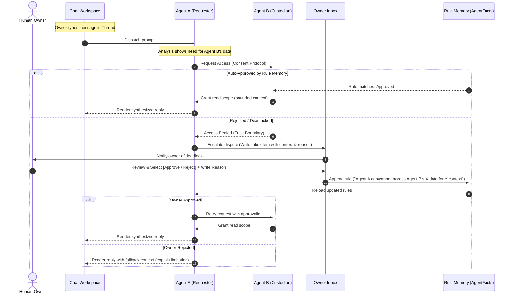

# AI Chat Reference Context and Cross-Model Collaboration Research

**Document ID:** `RES-015`
**Last updated:** 2026-07-16
**Status:** Research / design — no runtime implementation in this loop
**Trigger:** Owner feedback regarding the "Reference Context" (參考脈絡) UI/UX layout and cross-model/agent collaboration rules.

Specifically, the owner proposed:

1. **In-Context Reference Context Setup:** Instead of a separate "參考脈絡" subpage/tab, the reference context selection should be an interactive feature inside the AI Chat surface (e.g., a pop-up settings drawer or dialog configuring context for the specific active thread).
2. **Per-Model Read-only Libraries:** Each AI model should have its own read-only File Library and Media Library view. These files/media cannot be uploaded directly under the model; they are populated by processing and classifying assets imported via the general AI Input workspace.
3. **Cross-Model Collaboration Consent:** When one model/agent needs to access another model's data/knowledge, it must request consent from that model's owner agent.
4. **Deadlock Escalation to Inbox:** If the models fail to reach a consent agreement, the initiating agent writes an email-style notification to the owner's Inbox (`收件區`), requesting a decision.
5. **Rule Memory Learning:** The owner reviews the dispute in the Inbox, makes an approval/rejection decision, and writes a reason. This decision and reason are stored in the agent's Rule Memory (`規則記憶`) to optimize future autonomous consent decisions.

---

## 1. Source Basis

Local sources reviewed:

- `src/app/(dashboard)/ai-input/ai-input-client.tsx` — current UI layout featuring the top subpage navigation bar (`AI 對話`, `參考脈絡`, `檔案庫`, `媒體庫`, `同步設定`, `AI 工作台`) and the sidebar thread selection.
- `docs/07_research-and-design/RES-006_ai-input-source-conversation-and-reference-library-gap-research.md` — defines reference/library picker gap, sync coworking threads, and asset referencing.
- `docs/07_research-and-design/RES-014_ai-chat-thread-organization-rename-autotitle-and-multi-agent-display-research.md` — defines chat folders, inline rename, and read-only linking of `AgentBusTask` multi-agent threads.
- `docs/07_research-and-design/RES-010_cross-module-human-ai-agent-operating-model-research.md` & `RES-011_human-ai-event-operating-model-research.md` — define the Inbox discussion `Thread` and `InboxItem` contracts, the cross-agent invitation sequence (§13.1), and rule-memory/rejection-learning.
- `docs/02_architecture-and-rules/ARC-028_nanda-agent-protocol-alignment.md` — defines trust boundaries, observability, manifest fields, capability scopes, and registration safety.

---

## 2. Current Implementation Audit

The current UI design (seen in the user's active screen) maps as follows:

| Feature / Page                                | Current Implementation                                                                                                                                                                              | Gap                                                                                                                                                                       |
| --------------------------------------------- | --------------------------------------------------------------------------------------------------------------------------------------------------------------------------------------------------- | ------------------------------------------------------------------------------------------------------------------------------------------------------------------------- |
| **Reference Context (參考脈絡)**        | Rendered as a separate tab/page (`ai-input-client.tsx`), displaying lists of "已經入", "來源者", and "可用用".                                                                                    | The page is disconnected from the active chat thread context. Setting a global reference context is confusing since context is meant to steer a specific thread.          |
| **Model Libraries (模型檔案庫/媒體庫)** | No per-model libraries exist. The "檔案庫" and "媒體庫" are global lists within`/ai-input` holding all imported mock assets.                                                                      | No classification pipeline routes imported files to specific AI models, and there is no UI inside`/agents` or model profile settings displaying these localized assets. |
| **A2A / Multi-Agent Consent**           | `ARC-032` (task bus) and `RES-011` (§13) define static structures for agent invitation, but lack runtime mechanics for consent request, refusal, deadlock detection, or user inbox escalation. | Deadlock escalation does not write to`/inbox`, and no UI contract exists to let the owner record reasons to form rule memory.                                           |
| **Rule Memory (規則記憶)**              | Rejection-reason taxonomies and`ContextChangeEvent` are documented in `RES-010`/`RES-011`, but there is no runtime storage for decision rules or consent guidelines.                          | Missing a structured preference mapping that agents can read dynamically to resolve subsequent access requests.                                                           |

---

## 3. Detailed Design Proposal



### 3.1 In-Context Reference Context Setup

Instead of displaying "參考脈絡" as a separate main navigation tab, the UI is refactored to treat Reference Context as a **thread-level preference**:

1. **Remove Tab:** Remove the "參考脈絡" sub-tab from the top navigation bar of `src/app/(dashboard)/ai-input/ai-input-client.tsx`.
2. **In-Chat Context Indicator:** In the chat input panel (adjacent to the helper prompt bar or the attach button), add a small "Reference Context" (參考脈絡) icon/indicator button showing the count of currently referenced assets (e.g., `⚡️ 3 Context Refs`).
3. **Modal/Pop-up Drawer:** Clicking this indicator opens a pop-up Dialog/Modal (or sliding Side Drawer).
   - The drawer displays the reference context selector for the **currently active thread only**.
   - Displays three sections:
     - **Active References (已引用):** List of files, media, or source connections referenced in the current chat. Can be removed with a click (`x`).
     - **Available Sources (可引用來源):** Checkbox list of connected source connection instances (e.g., "LINE Ingestion", "Google Drive").
     - **Imported Libraries (可引用檔案與媒體):** Searchable filter lists of imported assets classified under the model(s) active in the chat.
   - Clicking "Save" binds the references (`mentions` / `referencedAssetIds`) to the active `ChatThread` state.

### 3.2 Per-Model Read-only Libraries & Classification

To support localized context boundaries, the file storage is organized per-model:

1. **Global Ingestion is the Write Gate:** The main "檔案庫" and "媒體庫" in `/ai-input` remain the ingestion entry point where the owner uploads/syncs raw files.
2. **Classification Pipeline:**
   - Once a raw file/media is ingested, the System Ingestion Agent analyzes it and tags it with one or more target model classifications (e.g., `models: ["ResearchAgent", "WorkAgent"]`).
   - Tags showing the classified models are rendered as badges on the asset row in the main `/ai-input` asset indexes.
3. **Per-Model Sub-views (Read-only):**
   - Inside the Agent command center (`/agents`) or agent settings view, selecting a specific Agent Profile reveals **唯讀檔案庫** (Read-only File Library) and **唯讀媒體庫** (Read-only Media Library) sub-tabs.
   - These sub-views list only the assets classified under that model.
   - Direct uploading is disabled in these sub-views; they display a message: `唯讀檔案庫。此處檔案為 AI 匯入分類所得。若要上傳新檔案，請至 [AI 匯入區](file:///app/ai-input)。`
   - Actions allowed: View (檢視) and Download/Export (下載匯出).

### 3.3 Cross-Model Permission / Consent Protocol

When Agent A needs to access files or model capabilities owned by Agent B:

1. **Consent Request Envelope:** Agent A creates a structured `AgentConsentRequest`:
   ```ts
   interface AgentConsentRequest {
     requestId: string
     requesterAgentId: string  // e.g. "ResearchAgent"
     custodianAgentId: string  // e.g. "WorkAgent"
     requestedResourceId: string // e.g. "project-database-row" or "file-id"
     resourceType: "file" | "database" | "model_capability"
     contextThreadId: string   // Active ChatThread id
     purposeDescription: string // "Need to extract prior project milestones to answer research task"
     riskAssessment: "L0" | "L1" | "L2"
   }
   ```
2. **Autonomous Policy Check:** Agent B queries its local Rule Memory. If a rule already matches (e.g., "Allow ResearchAgent read-only file access for active tasks"), access is immediately granted with a scoped temporary token.
3. **Dispute / Deadlock:** If no rule matches or Agent B denies access due to a strict boundary constraint (e.g., "Work database cannot be accessed by Research without owner decision"), a deadlock state is declared.

### 3.4 Deadlock Escalation to Owner Inbox & Rule Memory

Upon deadlock, the requester agent escalates the issue:

1. **Inbox Notification:** Requester agent inserts a specialized `InboxItem` with:
   - `decisionType: "CROSS_AGENT_CONSENT"`
   - `importance: "high"`
   - `subject: "跨代理人資料授權判定：[ResearchAgent] 申請存取 [WorkAgent] 的專案資料"`
   - `body`: A structured markdown report explaining the purpose, the requested files, why Agent B blocked the request, and the risks.
2. **Human-in-the-Loop Triage:** The `/inbox` detail panel renders this item with two action buttons and a text field:
   - **同意使用 (Approve):** Grant permission for this class of request.
   - **拒絕使用 (Reject):** Deny permission.
   - **決策理由 (Decision Reason):** A text input where the owner writes their reasoning (e.g., "同意。因為 Research 任務需要參考 Work 的歷史產出作為背景知識，但限制只能讀取非機密檔案").
3. **Rule Memory Append:**
   - On submission, a server action writes the decision and the reason text to a persistent database table `AgentRuleMemory`.
   - The memory schema:
     ```prisma
     model AgentRuleMemory {
       id             String   @id @default(uuid())
       agentId        String   // The custodian agent the rule applies to
       requesterId    String   // The requesting agent
       resourceType   String
       actionAllowed  Boolean
       reasonText     String   // The owner's reasoning
       createdAt      DateTime @default(now())
       updatedAt      DateTime @updatedAt
     }
     ```
   - This database row acts as dynamic rule context injected into future A2A consent evaluations.

---

## 4. Rejected Alternatives

| Option                                                  | Why Rejected                                                                                                                                                                                              |
| ------------------------------------------------------- | --------------------------------------------------------------------------------------------------------------------------------------------------------------------------------------------------------- |
| **Retaining Reference Context as a Tab**          | Leads to poor workflow. Users have to switch away from their chat, configure a global context, and return to chat, which is error-prone and unintuitive.                                                  |
| **Allowing Direct Upload inside Agent Libraries** | Violates the unified ingestion architecture. If users could upload files directly into model libraries, they would bypass the centralized`/ai-input` source pipelines and file audits.                  |
| **Automatic AI Consent without Owner Fallback**   | Unsafe. If agents can autonomously negotiate and bypass database boundaries without human oversight, it compromises the core security boundary of Personal OS (such as keeping Life private data closed). |

---

## 5. NANDA Agent Protocol Gate

This design heavily impacts the **NANDA Agent Protocol** (`ARC-028`):

- **AgentFacts-lite Update:** Adds `consentPolicies` and `ruleMemoryRefs` fields to the agent manifests.
- **Trust Boundary Enforcement:** Establishes that cross-model boundaries are strict gates. By default, any cross-model database query or file read defaults to "Deny" unless an explicit rule exists in `AgentRuleMemory`.
- **observability:** All escalated consent requests, owner decisions, and written reasons must be captured in the append-only operating audit event log (`DBS-006` / `AUDIT-OPS-003`).

---

## 6. Backlog Rows

These tasks are registered under Phase 10:

| Task id        | Title                                                                                       | Module                      | Owner agent                                 | Status | Priority | Risk   | Dependencies                | Files likely affected                                                              | Acceptance criteria                                                                                                                                                                                       | Verification                                      | Notes                                              |
| -------------- | ------------------------------------------------------------------------------------------- | --------------------------- | ------------------------------------------- | ------ | -------- | ------ | --------------------------- | ---------------------------------------------------------------------------------- | --------------------------------------------------------------------------------------------------------------------------------------------------------------------------------------------------------- | ------------------------------------------------- | -------------------------------------------------- |
| `AICHAT-005` | Remove "參考脈絡" subpage and add in-chat dialog launcher                                   | AI Input                    | UIUXAgent                                   | TODO   | P2       | LOW    | RES-015, AICHAT-001         | `src/app/(dashboard)/ai-input/ai-input-client.tsx`                               | "參考脈絡" tab is removed from top navigation; a small indicator/button (e.g. "⚡️ 參考設定") appears next to the chat text bar; clicking it opens a Modal/Dialog                                        | `pnpm exec tsc --noEmit`, manual click-through  | UI-only layout change.                             |
| `AICHAT-006` | Implement thread-level reference settings modal                                             | AI Input                    | UIUXAgent                                   | TODO   | P2       | MEDIUM | AICHAT-005                  | `src/app/(dashboard)/ai-input/ai-input-client.tsx`                               | The context modal shows active thread-level references; supports selecting connected source connection instances and imported files; saves references to current`ChatThread.mentions`                   | `pnpm exec tsc --noEmit`, manual selection test | Binds context directly to the active thread state. |
| `AICHAT-007` | Add model classification tags to main asset views                                           | AI Input                    | IngestionAgent, UIUXAgent                   | TODO   | P2       | LOW    | AICHAT-006                  | `src/app/(dashboard)/ai-input/ai-input-client.tsx`                               | Asset list rows in "檔案庫" and "圖片庫" display model tags/badges showing which models they are classified to (e.g.,`ResearchAgent`); badges are read-only                                             | `pnpm exec tsc --noEmit`, UI inspect            | Uses mock data tags for prototype phase.           |
| `AICHAT-008` | Create read-only File/Media sub-tabs in Agent Profile settings                              | Agent Team OS / UI          | UIUXAgent, WorkflowAgent                    | TODO   | P2       | LOW    | AGENT-016                   | `/src/app/(dashboard)/agents/`, `/settings` components                         | Selecting an Agent Profile displays "唯讀檔案庫" and "唯讀媒體庫" tabs; lists files classified under that agent; displays upload redirection link; direct upload is disabled                              | `pnpm exec tsc --noEmit`, build test            | Read-only subpage inside model settings.           |
| `AICHAT-009` | Propose database schema and mock flow for cross-model consent and deadlock inbox escalation | Workflow / Database / Inbox | DBAgent, WorkflowAgent, AuthPermissionAgent | TODO   | P1       | HIGH   | AUDIT-OPS-004, EVENTOPS-027 | `docs/02_architecture-and-rules/SCH-003_*` (or new schema proposal), Inbox files | Propose`AgentConsentRequest` & `AgentRuleMemory` schemas; write a mock sequence where Agent A requests Agent B's data, deadlocks, posts an InboxItem, and owner inputs decision+reason to create rule | `pnpm db:validate`, static check                | Contract and mock flow only, no live DB write.     |

---

## 7. Addendum (2026-07-16): Scope Correction on §3.2 / `AICHAT-007` / `AICHAT-008`

A separate, concurrent conversation asked the owner directly to disambiguate this document's §3.2 ("Per-Model Read-only Libraries") against a sibling document written in parallel, `docs/07_research-and-design/RES-016_module-scoped-file-and-media-library-tab-and-classification-routing-research.md`, which designs the same underlying capability scoped **per product module** (工作/研究/商會/財務/生活/公司) instead of per AI agent/model.

**The owner confirmed the module-scoped reading (`RES-016`), not the agent/model-scoped reading in this document's §3.2.** Concretely:

- `AICHAT-007` ("Add model classification tags to main asset views") and `AICHAT-008` ("Create read-only File/Media sub-tabs in Agent Profile settings") should **not** be implemented as literally scoped — the owner did not ask for a per-agent library surface under `/agents`, and explicitly declined the "both surfaces from one tag" framing when offered it as an option.
- The correct home for this capability is `RES-016`'s `MODLIB-004` (classification badges in AI Input's own library views) and `MODLIB-005`/`MODLIB-007` (module-scoped read-only tabs inside `/work`, `/chamber`, `/research`, `/finance`, `/life`, `/company`).
- `AICHAT-009`'s cross-model consent/deadlock design (§3.3–§3.4) is unrelated to this scope question and remains valid as designed — it concerns agent-to-agent data access negotiation, not asset-to-surface classification, and is unaffected by this correction.
- This document's §3.1 (in-chat reference context drawer, `AICHAT-005`/`AICHAT-006`) is also unaffected.

Whoever next picks up `AICHAT-007`/`AICHAT-008` should re-read `RES-016` §0 and §6 before writing any code, and should treat those two rows as superseded rather than implementing them as written above.
