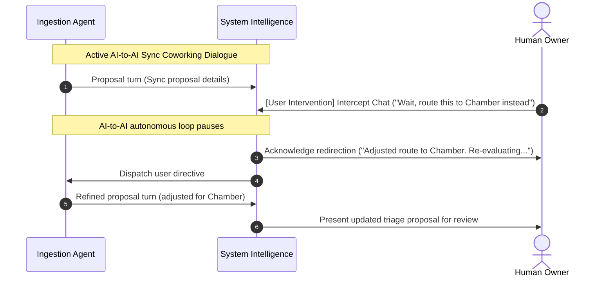
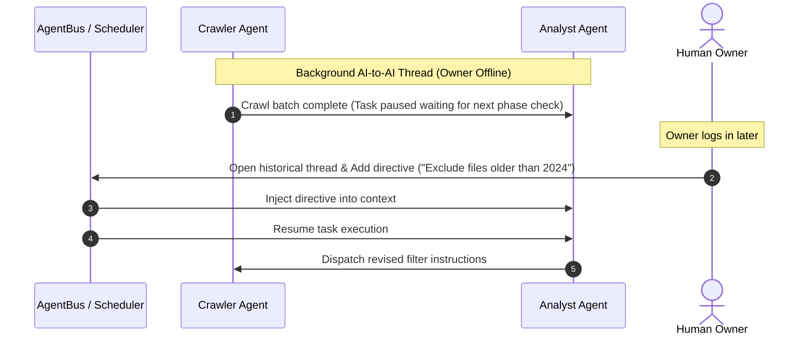
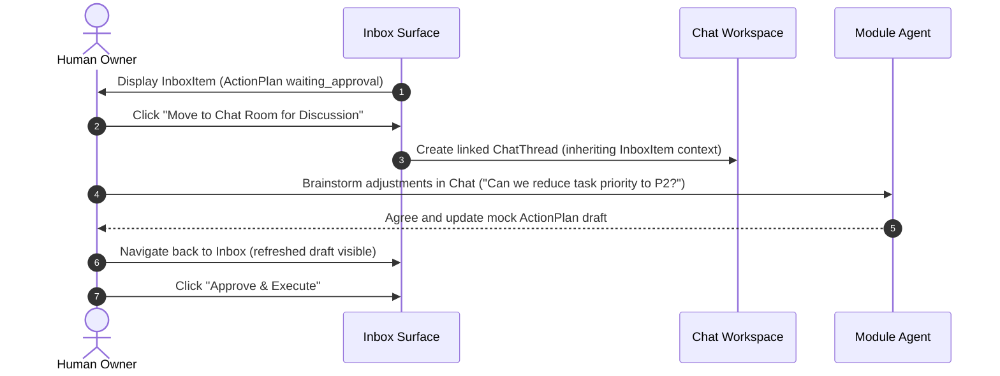
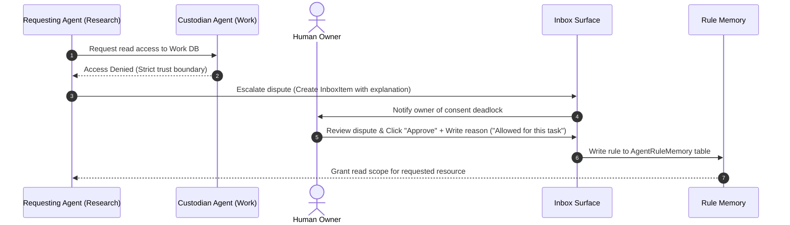

# Human-AI Chat and Inbox Collaboration Scenarios Research

**Document ID:** `RES-017`
**Last updated:** 2026-07-16
**Status:** Research / design — no runtime implementation in this loop
**Trigger:** Owner feedback requesting a follow-up to `RES-015` and `RES-016` to ensure that:
1. When AI agents are conversing with each other, the owner can at any time join/intervene in the chat to continue or asynchronously guide the topic.
2. The different scenarios of owner-AI collaboration via the Chat Room (`聊天室` / `AI 對話`) and the Inbox (`收件區`) are systematically organized and reconciled.

---

## 1. Source Basis

Local sources reviewed:
- `docs/07_research-and-design/RES-015_ai-chat-reference-context-and-cross-model-collaboration-research.md` — central in-context reference context design and A2A consent/deadlock delegation.
- `docs/07_research-and-design/RES-016_module-scoped-file-and-media-library-tab-and-classification-routing-research.md` — module-scoped files/media library tabs and classification rules.
- `docs/07_research-and-design/RES-014_ai-chat-thread-organization-rename-autotitle-and-multi-agent-display-research.md` — chat thread folders and linking `AgentBusTask` multi-agent threads read-only in the sidebar.
- `docs/07_research-and-design/RES-010_cross-module-human-ai-agent-operating-model-research.md` & `RES-011_human-ai-event-operating-model-research.md` — define the Inbox discussion `Thread` and `InboxItem` contracts, the cross-agent invitation sequence (§13.1), and rule-memory/rejection-learning.
- `docs/02_architecture-and-rules/ARC-032_internal-multi-agent-task-message-bus-contract.md` — the multi-agent task and message bus contract.

---

## 2. Interaction Surface Map: Chat Room vs. Inbox

The system separates casual/creative discussion from formal/governed triage. The table below maps how these two workspaces function and cross-link:

| Dimension | Chat Room (`AI 對話` / `/ai-input`) | Inbox (`收件區` / `/inbox`) |
|---|---|---|
| **Primary Intent** | Direct steering, exploration, casual brainstorming, multi-agent dialog intervention, and data referencing. | Structured judgment, approval of side effects, incident recovery, and consent dispute arbitration. |
| **Data Nature** | Free-form transcripts (`ChatMessage` list) with thread-specific reference context references. | Structured `AnalysisEvent` envelopes, markdown logs, version diffs, Action Plans, and question lists. |
| **Agent State** | Dynamic execution; agents run interactively in the composer loop. | Paused/Blocked execution waiting for explicit human authorization (`waiting_approval`). |
| **Human Action** | Send message, change active references, add folders, inline rename. | Approve plan, reject plan, answer question, write dispute resolution reason (Rule Memory). |
| **Linkage** | Can launch a detailed discussion thread linked to an Inbox Item (Scenario 3). | Receives automated escalations from Chat room consent deadlocks (Scenario 4). |

---

## 3. Human-AI Collaboration Scenarios

### Scenario 1: Synchronous User Intervention in AI-to-AI Chat
**Definition:** The owner opens an active multi-agent conversation thread in the sidebar (e.g., an ingestion sync coworking dialogue between a Sync Agent and System Intelligence) and types a message. The agents immediately yield to user intervention.

*Key Constraints:*
- **State Transition:** Typing a message as `authorKind: human` in a thread with multiple agents immediately pauses the autonomous agent turn scheduler.
- **Priority:** Human input is treated as a high-priority system prompt injection, overriding prior task instructions.

---

### Scenario 2: Asynchronous User Intervention in AI-to-AI Chat
**Definition:** A background multi-agent task (such as a long-running research crawl or an overnight code audit) is running. The owner is not online. The owner later reviews the thread history, adds guidance at a historical point, and restarts the flow.

*Key Constraints:*
- **Checkpointing:** Long-running multi-agent tasks must save intermediate states (`checkpoints`) at the end of each logical phase.
- **Resume with Context:** When the owner inserts a message in a paused background thread, the task bus re-evaluates the context vector and updates active directives before prompting the analyst agents to resume.

---

### Scenario 3: Discussing Inbox Items in the Chat Room
**Definition:** The owner receives a complex `AnalysisEvent` report in the Inbox (`收件區`). Instead of immediately clicking Approve/Reject, the owner wants to discuss the details with the module agent. The owner moves the topic to the Chat Room, aligns, and then returns to the Inbox to authorize.

*Key Constraints:*
- **Linkage:** The created `ChatThread` stores a `linkedInboxItemId` reference.
- **Draft Synced:** Any adjustments agreed upon in the chat conversation are saved in the temporary Action Plan draft associated with the origin `InboxItem`.

---

### Scenario 4: Inbox Dispute Resolution for Cross-Agent Consent
**Definition:** Agent A wants to read Agent B's data but encounters a boundary dispute. They cannot agree, creating a deadlock. Agent A writes a dispute letter to the owner's Inbox. The owner decides and writes a reason, which is compiled into the Rule Memory.

*Key Constraints:*
- **Inbox Form:** The Inbox dispute triage item must render: Requesting Agent, Custodian Agent, requested resource scope, purpose description, and a text input for the owner to write the decision reasoning.
- **Rule Compilation:** The reasoning text is processed to append a structured row to the `AgentRuleMemory` table.

---

## 4. Backlog Rows (Updated under Phase 10)

| Task id | Title | Module | Owner agent | Status | Priority | Risk | Dependencies | Files likely affected | Acceptance criteria | Verification | Notes |
|---|---|---|---|---|---|---|---|---|---|---|---|
| `AICHAT-010` | Implement synchronous human intervention in chat loops | AI Input / Workflow | UIUXAgent, WorkflowAgent | TODO | P2 | HIGH | AICHAT-004 | `src/app/(dashboard)/ai-input/ai-input-client.tsx`, task scheduler | Typing a message as human in a coworking thread halts agent autonomous turns, injects human message as highest priority context, and restarts agent response turn under new directives | `pnpm exec tsc --noEmit`, simulation tests | High risk of loop lockups. Requires robust turn-taking state logic. See `RES-017` §3 (Scenario 1). |
| `AICHAT-011` | Implement asynchronous guidance resume for background tasks | Agent Team OS / Workflow | WorkflowAgent | TODO | P2 | HIGH | AICHAT-010 | `/src/lib/services/agent-command-center.service.ts` | Paused background threads accept human comments, trigger context vector update, and resume agent task execution taking comments into account | `pnpm exec tsc --noEmit`, contract verification | Requires checkpointing support in the scheduler. See `RES-017` §3 (Scenario 2). |
| `AICHAT-012` | Implement Inbox-to-Chat discussion flow and draft synchronization | Inbox / AI Input | UIUXAgent, WorkflowAgent | TODO | P2 | MEDIUM | AICHAT-006, EVENTOPS-007 | `/src/app/(dashboard)/inbox/`, `/ai-input/` pages | Inbox detail view offers "Move to Chat" button; creates linked `ChatThread` referencing the `inboxItemId`; modifications discussed in chat update the active draft | `pnpm exec tsc --noEmit`, UI navigation test | Links thread-level chat to structured inbox item. See `RES-017` §3 (Scenario 3). |
| `AICHAT-013` | Add acceptance and QA gate for Reference Context and Collaboration Scenarios | Acceptance / QA | QAAgent, ProductManagerAgent | TODO | P1 | LOW | AICHAT-005 | `docs/08_acceptance-and-qa/ACC-002_module-acceptance-criteria.md` | Verification checklist covers RES-015/017 doc presence, modal designs, per-model settings, consent protocols, and user intervention flows | Docs scan, `git diff --check` | Docs-only validation. |

---

## 5. NANDA Agent Protocol Gate

This research conforms to NANDA alignment rules (`ARC-028`):
- **Human Accountability:** The human owner is the ultimate arbiter of all multi-agent deadlock states.
- **Intervention Obs:** The agent scheduler must support pause and resume states that are observable in the append-only event log.
- **Dynamic Policy:** Consent rules are dynamically updated via `AgentRuleMemory` without requiring software restarts or code deployment.
