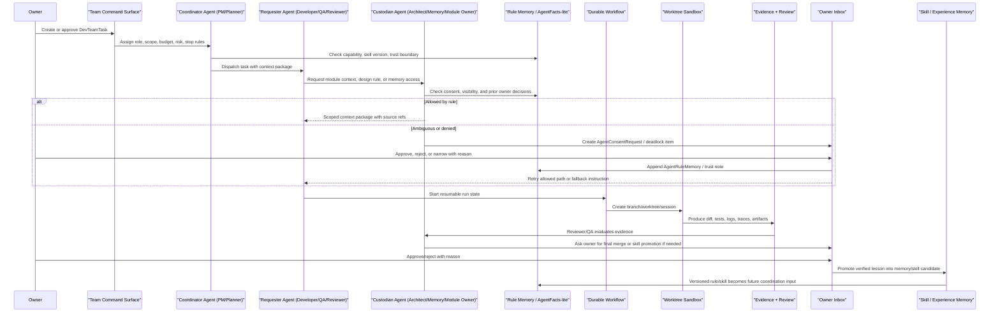

# RES-023 - AI Development Team OS Structural Research

**Document ID:** `RES-023`
**Date:** 2026-07-22
**Status:** Research-to-plan artifact, no runtime execution enabled
**Owner request:** Turn Personal OS from a personal knowledge/task/memory system into a growable AI Development Team OS.
**Primary local anchor:** `RES-015` cross-model requester/custodian/owner-inbox/rule-memory diagram, evolved from chat context into development-team coordination.

---

## 1. Research Question

Personal OS should evolve from a site that manages documents, tasks, conversations, and personal memory into an **AI Development Team OS** where long-lived agents act as product manager, architect, developer, tester, reviewer, and memory manager.

The core research question is:

> How can multiple AI agents persist, work in parallel, share project state, accumulate experience, and promote evidence into reusable skills while preventing uncontrolled agent chatter, unapproved rule changes, direct database access, and pollution of formal code?

This document does not enable an external agent runtime, public endpoint, database migration, provider call, container runner, or automatic code merge. It defines the structural research and the execution plan shape required before such runtime work is safe.

---

## 1A. Owner Direction Addendum - Shared Trust Plane And Independent Interface

Owner direction on 2026-07-22:

- The architecture should develop toward a **Shared Team OS Trust Plane**.
- `RES-015` and AI Development Team OS should share identity, trust, Owner Inbox decisions, Rule Memory, audit, evidence, and NANDA/AgentFacts-lite posture.
- AI Development Team OS should **not** be embedded in, extended from, or treated as a subview of any existing Personal OS interface.
- AI Development Team OS should become a **brand-new independent protected interface** with its own information architecture, task model, worktree/session surfaces, evidence review, memory/skill promotion, and runtime gates.
- Existing interfaces such as `/agents`, `/ai-input`, `/admin`, `/settings`, `/work`, or module pages may be used as technical/reference patterns only. They are not the product home for AI Development Team OS.

Practical implication: `AIDEVTEAM-006` must be interpreted as a new dedicated AI Development Team interface, not an extension of the existing `/agents` Agent Team OS page.

---

## 2. Source Basis

### Local source basis

- `RES-015_ai-chat-reference-context-and-cross-model-collaboration-research.md` - cross-agent consent request, deadlock escalation, owner inbox, rule memory.
- `RES-010_cross-module-human-ai-agent-operating-model-research.md` - persistent module agents, Analysis Events, action plans, memory pipeline.
- `RES-011_human-ai-event-operating-model-research.md` - event-centric collaboration, owner-approved invitations, durable state, retry/recovery.
- `ARC-023_agent-team-os-formal-governance-contract.md` - Agent Team OS governance, approval levels, risk tiers, proposal-only schemas.
- `ARC-028_nanda-agent-protocol-alignment.md` - AgentFacts-lite, NANDA-inspired identity/discovery/trust/readiness rules.
- `ARC-032_internal-multi-agent-task-message-bus.md` - internal proposal-only multi-agent bus, no external runtime.
- `src/lib/contracts/agent-task-message-bus.contract.ts` - internal-only task/message states, `externalRegisterable: false`.
- `src/lib/contracts/module-agent-command-catalog.contract.ts` - dry-run-only module command catalog.
- `src/lib/contracts/agent-operation-api.contract.ts` - protected owner-only dry-run agent operation contract.
- `src/app/(dashboard)/agents/page.tsx` - existing protected Agent Team OS readiness/control surface, used as prior-art reference only; AI Development Team OS should not be implemented as a subview of this interface.

### External source basis, fetched 2026-07-22

| Layer                                 | Sources reviewed                                                                                                                                                                                                                                                                                                                                         | Use in this research                                                                                                                                          |
| ------------------------------------- | -------------------------------------------------------------------------------------------------------------------------------------------------------------------------------------------------------------------------------------------------------------------------------------------------------------------------------------------------------- | ------------------------------------------------------------------------------------------------------------------------------------------------------------- |
| Stateful / durable agent workflows    | [LangGraph](https://github.com/langchain-ai/langgraph), [LangGraph docs](https://langchain-ai.github.io/langgraph/), [Deep Agents](https://github.com/langchain-ai/deepagents), [Deep Agents docs](https://docs.langchain.com/oss/python/deepagents/overview)                                                                                                | Workflow graph, persistence/resume, human-in-the-loop, subagents, filesystem, skill context.                                                                  |
| Agent organization / governance       | [Paperclip](https://github.com/paperclipai/paperclip), [Paperclip docs](https://docs.paperclip.xyz/)                                                                                                                                                                                                                                                       | Role, goal, task, budget, governance concepts.                                                                                                                |
| Coding agent execution                | [OpenHands](https://github.com/OpenHands/OpenHands), [OpenHands Agent Canvas](https://github.com/OpenHands/agent-canvas), [Plandex](https://github.com/plandex-ai/plandex), [OpenCode](https://github.com/anomalyco/opencode), [Goose](https://github.com/aaif-goose/goose)                                                                                   | Developer-agent execution, local/hosted agents, permission profiles, large codebase planning, local model support.                                            |
| Multi-agent workspaces / worktrees    | [Pane](https://github.com/dcouple/Pane), [Superset](https://github.com/superset-sh/superset)                                                                                                                                                                                                                                                               | One task per worktree, branch/terminal/session review surface, parallel coding agents.                                                                        |
| Long-term memory / knowledge graph    | [Letta](https://github.com/letta-ai/letta), [Letta docs](https://docs.letta.com/), [Graphiti](https://github.com/getzep/graphiti), [Neo4j](https://github.com/neo4j/neo4j)                                                                                                                                                                                   | Individual agent memory, temporal fact graph, provenance, team knowledge.                                                                                     |
| Durable workflow / event messaging    | [Temporal](https://github.com/temporalio/temporal), [NATS Server / JetStream](https://github.com/nats-io/nats-server)                                                                                                                                                                                                                                      | Long-running workflow state, durable event delivery/replay.                                                                                                   |
| Local model serving                   | [Ollama](https://github.com/ollama/ollama), [vLLM](https://github.com/vllm-project/vllm)                                                                                                                                                                                                                                                                   | Local model bootstrap, later high-concurrency OpenAI-compatible serving.                                                                                      |
| Isolation / observability / artifacts | [Podman](https://github.com/containers/podman), [Moby](https://github.com/moby/moby), [OpenTelemetry Collector](https://github.com/open-telemetry/opentelemetry-collector), [Grafana](https://github.com/grafana/grafana), [Loki](https://github.com/grafana/loki), [MinIO](https://github.com/minio/minio), [Garage](https://github.com/deuxfleurs-org/garage) | Container isolation, traces/logs/metrics, artifact storage. MinIO was archived on GitHub in April 2026 and should not be selected without replacement review. |

GitHub metadata was also checked through the GitHub API on 2026-07-22. Most named repositories were active; some have `NOASSERTION`, GPL, AGPL, or other license states that require explicit project-strategy review before adoption.

---

## 3. Strategic Review Gate

| Question                   | Answer                                                                                                                                                                                                                                                                                              |
| -------------------------- | --------------------------------------------------------------------------------------------------------------------------------------------------------------------------------------------------------------------------------------------------------------------------------------------------- |
| Current product target     | Formal launch remains`L0_LOCAL_PROTOTYPE`; conditional product maturity remains `C3_ARCHITECTURE_GATE_READY`. The owner-directed target in this loop is AI Development Team OS research maturity, not launch-level upgrade.                                                                     |
| Last three completed loops | Recent reports completed module-scoped file/media origin sync, module-scoped library classification, and human inbox/chat collaboration scenarios. They moved AI Input and collaboration planning but did not remove`AUTH-005`, `WORK-009`, or `DEPLOY-002`.                                  |
| Current blocker            | Formal launch proof still needs owner/operator evidence for auth, Work persistence proof target, and deployment proof. AI Development Team OS runtime is additionally blocked by missing execution isolation, memory versioning, durable workflow state, and evidence-to-skill promotion contracts. |
| Is this repeat work?       | It is research/planning, but it is owner-directed and closes a real architecture gap: RES-015's cross-agent consent diagram currently stops at chat context and needs a development-team operating model.                                                                                           |
| What moves?                | `RES-001` multi-agent/NANDA maturity, `RES-002` operating-surface standard, `RES-015` consent/rule-memory architecture, and `ARC-028` AgentFacts readiness.                                                                                                                                 |
| What becomes more true?    | Personal OS now has a source-backed AI Development Team OS layer model, tool-selection posture, RES-015-style evolved architecture diagram, safety policy, and executable research plan.                                                                                                            |

---

## 4. Requirement Understanding Score

**Score:** 92 / 100 - High
**Required research optimization rounds:** 3
**Reason:** The owner supplied a specific target architecture and OSS index; local Personal OS agent governance docs already exist; the risk boundary is clear enough to create research/plan artifacts but not runtime execution.

| Dimension                       |   Score | Notes                                                                                                                |
| ------------------------------- | ------: | -------------------------------------------------------------------------------------------------------------------- |
| Actor/job clarity               | 19 / 20 | Product manager, architect, developer, tester, reviewer, and memory manager agents are clear.                        |
| PRD/local evidence fit          | 19 / 20 | Strong fit to`RES-001`, `RES-002`, `RES-010`, `RES-011`, `RES-015`, `ARC-023`, `ARC-028`, `ARC-032`. |
| Data/BFF/API clarity            | 18 / 20 | Existing protected dry-run contracts exist; full DB/runtime model still needs follow-up architecture.                |
| UI/reference-pattern confidence | 14 / 15 | Existing protected surfaces provide technical reference patterns, but owner direction requires a new independent AI Development Team interface rather than extending `/agents` or another existing page. |
| Risk/auth/public-output clarity | 14 / 15 | External registration and high-risk writes remain clearly blocked; licenses need review.                             |
| Acceptance/verification clarity |  8 / 10 | This loop can verify docs/index/backlog/contracts statically; runtime proof is intentionally out of scope.           |

### Research optimization rounds

| Round | Lens                         | Selected pattern                                                                                                                                                                       | Rejected pattern                                                                                                           |
| ----- | ---------------------------- | -------------------------------------------------------------------------------------------------------------------------------------------------------------------------------------- | -------------------------------------------------------------------------------------------------------------------------- |
| 1     | Local architecture fit       | Extend`RES-015` requester/custodian/owner-inbox/rule-memory into development tasks, worktrees, evidence, and skill promotion.                                                        | Let agents freely inspect each other's memory or chat indefinitely without task, budget, owner rule, or evidence boundary. |
| 2     | OSS architecture comparison  | Compose layers: LangGraph/DeepAgents-style workflow, Pane/Superset-style worktree sessions, Letta/Graphiti-style memory, Temporal/NATS later, OpenTelemetry evidence trail.            | Adopt one all-in-one platform as the Personal OS core before internal contracts are stable.                                |
| 3     | NANDA/safety/launch boundary | Keep all agents internal/protected,`externalRegisterable: false`, proposal-first, owner-approved promotion, branch/worktree isolation, no direct DB, no core-rule self-modification. | External registry exposure, autonomous merges, autonomous governance-doc edits, or direct production writes.               |

---

## 5. RES-015 Diagram Evolution

`RES-015` describes an active chat where Agent A requests context from Agent B, Agent B checks Rule Memory, and owner intervention creates a future rule. AI Development Team OS keeps that shape, but the object being exchanged becomes a **development task context package** and the proof output becomes **test/evidence/review/memory/skill promotion**.

### Viewframe implications

| RES-015 element      | Development-team evolution                                                     | Personal OS invariant                                                                              |
| -------------------- | ------------------------------------------------------------------------------ | -------------------------------------------------------------------------------------------------- |
| Active chat thread   | `DevTeamTask` plus durable workflow run                                      | Every run has task id, owner, scope, budget, risk, and stop conditions.                            |
| Agent A requester    | Developer, QA, reviewer, or planner agent requesting context or authority      | Requester gets scoped context packages, not direct DB access.                                      |
| Agent B custodian    | Architect, module owner, memory manager, or permission agent                   | Custodian can deny, narrow, or escalate based on rules.                                            |
| Owner Inbox          | Approval, deadlock resolution, merge review, memory promotion, skill promotion | Human approval gates high-risk writes, public output, core-rule edits, and external collaboration. |
| Rule Memory          | AgentFacts-lite, BoundaryPolicy, AgentRuleMemory, skill version registry       | Rules are appended from decisions, not silently rewritten by agents.                               |
| Retry after approval | Resume workflow with narrowed permission or fallback                           | Durable state must support pause/resume and evidence-linked decisions.                             |

---

## 6. Layered Architecture

### Layer 1 - Team coordination and governance

Personal OS should model an AI development team as durable organizational state, not as an unbounded group chat.

Recommended contract concepts:

- `DevTeamTask`: owner-approved task with objective, linked backlog row, risk, budget, files likely affected, stop conditions, expected evidence.
- `DevAgentRole`: product manager, architect, developer, QA, reviewer, memory manager, permission/security reviewer.
- `DevAgentAssignment`: role-to-task assignment with scope, tools, branch/worktree, data visibility, and approval level.
- `DevTeamPolicy`: allowed modes, blocked modules, external-registration state, cost/time budget, escalation rules.

OSS references:

- Paperclip is useful for organization, goal, budget, and governance concepts.
- Existing `ARC-023` remains the local contract anchor.

Do not adopt an external organizational runtime before Personal OS defines its own internal domain vocabulary.

### Layer 2 - Agent execution and coding workspaces

Agent execution must be isolated per task.

Recommended posture:

- Use one branch/worktree/session per agent task.
- Keep formal code merge owner-reviewed.
- Separate planning/read-only mode from build/edit mode.
- Store logs, diffs, test output, terminal commands, and artifacts as evidence.

OSS references:

- Pane and Superset are strong reference patterns for multiple coding-agent sessions over isolated Git worktrees.
- OpenCode's read-only `plan` vs full-access `build` split is a useful permission profile pattern.
- OpenHands, Plandex, and Goose are useful adapter candidates, but Personal OS should first define the local adapter boundary.

### Layer 3 - Durable workflow state

Long-running agent work needs resumable state:

- assigned
- context_requested
- awaiting_owner
- running
- testing
- review_requested
- changes_requested
- completed_no_merge
- memory_candidate
- skill_candidate
- rejected

OSS references:

- LangGraph and Deep Agents are best immediate references for workflow graphs, persistence/resume, human-in-the-loop, subagents, and file/skill context.
- Temporal becomes attractive later when task volume, retries, and cross-service orchestration justify a dedicated workflow engine.

### Layer 4 - Event communication

Agents should not free-chat indefinitely. They exchange bounded events:

- `TaskAssigned`
- `ContextRequested`
- `ContextGranted`
- `ContextDenied`
- `OwnerApprovalRequested`
- `RunStarted`
- `ToolCallRecorded`
- `TestReportUploaded`
- `ReviewCompleted`
- `SkillPromotionRequested`

OSS references:

- NATS JetStream is a later candidate when durable cross-process event delivery is needed.
- Today, the repository's internal bus contract and Postgres-backed event rows should remain the first design target.

### Layer 5 - Memory and knowledge

Memory must be versioned, source-backed, and reviewable.

Recommended split:

- Individual memory: each long-lived agent can keep preferences, skill versions, tool outcomes, and recurring failure notes.
- Team memory: shared project facts, architectural decisions, current blockers, patterns that multiple agents can rely on.
- Skill memory: a verified procedure promoted from evidence, tests, and owner/reviewer approval.

OSS references:

- Letta is useful for stateful agent identity and memory.
- Graphiti is useful for temporal facts, provenance, and fact changes over time.
- Neo4j is a possible graph database foundation, but GPL licensing must be assessed against project strategy before embedded adoption.

### Layer 6 - Local and shared model serving

Recommended staged posture:

- Start with provider abstraction and local model discovery, not mandatory model hosting.
- Ollama is the simplest local-model bootstrap candidate.
- vLLM is a later shared inference-service candidate when multi-agent concurrency is high enough to justify operations cost.

### Layer 7 - Safety isolation

Baseline safety rules:

- No agent can directly access production database credentials.
- No external agent can access the database at all.
- No agent may edit `AGENTS.md`, `.codex/skills/*/SKILL.md`, or core governance docs without explicit owner approval.
- No high-risk module final writes: Finance, Life, Client Portal, Company Strategy, Auth/Permission, Public Output, External Collaboration.
- No merge to main without tests, evidence, review, and owner approval when the task is high-risk.
- Runtime execution, containers, and provider calls are blocked until adapter contracts and owner approval exist.

OSS references:

- Podman and Moby are reference candidates for container isolation.
- Worktree isolation should come first because it is simpler, visible, and already aligned with Git review.

### Layer 8 - Observability, evidence, and artifacts

Every agent action must produce traceable evidence:

- task state transitions
- prompt/context package hash
- tool call log
- diff summary
- test command and result
- review finding
- owner decision
- memory/skill promotion link

OSS references:

- OpenTelemetry Collector is the neutral trace/metric/log ingestion reference.
- Grafana and Loki are candidates for dashboards/log search after traces exist.
- Existing R2 direction is the first artifact-store path for this repo.
- MinIO is not recommended as a default new dependency because the main GitHub repo is archived as of April 2026.
- Garage is a possible self-hosted S3-compatible fallback, but AGPL/licensing and operations impact require review.

---

## 7. Tool Selection Posture

| Tool / project                    | Personal OS posture                                         | Why                                                                                                                           |
| --------------------------------- | ----------------------------------------------------------- | ----------------------------------------------------------------------------------------------------------------------------- |
| LangGraph                         | Study now; possible workflow implementation candidate       | Strong match for stateful, resumable, human-in-the-loop agent workflows.                                                      |
| Deep Agents                       | Study now; possible subagent/filesystem/skills reference    | Good conceptual fit, but should be used after local safety contracts are clear.                                               |
| Paperclip                         | Governance reference, not immediate dependency              | Useful for organization/role/budget framing; Personal OS already has Agent Team OS docs to evolve first.                      |
| OpenHands                         | Adapter candidate                                           | Strong development-agent runtime and control-center reference; must be wrapped by Personal OS permissions/evidence contracts. |
| OpenHands Agent Canvas            | UI reference                                                | Useful for self-hosted multi-agent control surface ideas.                                                                     |
| Pane                              | Worktree/session manager reference                          | Very close to Personal OS need for parallel CLI coding agents, branches, terminals, diffs, and persistence.                   |
| OpenCode                          | Permission-profile reference; adapter candidate             | The plan/build split and local model support are directly useful.                                                             |
| Goose                             | General local automation agent candidate                    | Useful broad local agent, but should not receive DB/secrets without wrapper.                                                  |
| Plandex                           | Large-codebase planning candidate                           | Useful for long, multi-file tasks; still needs evidence/approval wrapper.                                                     |
| Superset                          | Worktree orchestration reference, licensing review required | Useful pattern; GitHub license metadata was`NOASSERTION`, so legal posture must be verified first.                          |
| Letta                             | Individual agent memory candidate                           | Good fit for persistent agent identity and memory.                                                                            |
| Graphiti                          | Team temporal knowledge graph candidate                     | Strong fit for fact/version/provenance memory.                                                                                |
| Neo4j                             | Deferred graph store option                                 | Powerful graph DB; GPL licensing requires deliberate review.                                                                  |
| Temporal                          | Deferred durable workflow engine                            | Best when workflows outgrow local Postgres/job-runner state.                                                                  |
| NATS JetStream                    | Deferred event bus                                          | Good durable event delivery once multi-process agent runtime exists.                                                          |
| Ollama                            | Local model bootstrap candidate                             | Simple local model serving for early experimentation.                                                                         |
| vLLM                              | Later shared inference candidate                            | High-throughput serving only matters after many concurrent agents exist.                                                      |
| Podman / Moby                     | Later sandbox isolation candidates                          | Needed before untrusted tool execution or multi-agent runner scale-up.                                                        |
| OpenTelemetry Collector           | Observability contract reference now; runtime later         | Defines what traces/logs/metrics should look like before deploying stack.                                                     |
| Grafana / Loki                    | Deferred dashboards/log search                              | Useful once telemetry exists; AGPL licensing review required.                                                                 |
| PostgreSQL                        | Primary durable state                                       | Already the repo's DB direction.                                                                                              |
| Redis                             | Deferred ephemeral queue/cache                              | Useful later; licensing/source posture needs review.                                                                          |
| R2 / S3-compatible artifact store | Preferred near-term artifact path                           | Already selected in`RES-022`/`PLN-064`; keep artifacts private and signed.                                                |
| MinIO                             | Do not select by default                                    | Main repo archived in April 2026; treat only as historical reference.                                                         |
| Garage                            | Self-hosted S3 fallback candidate                           | Possible alternative if R2 is rejected; AGPL and ops impact must be reviewed.                                                 |

---

## 8. Proposed Personal OS Domain Model

This is proposal-only and does not imply a migration.

| Proposed object         | Purpose                                                                    | Maps to existing local concepts                              |
| ----------------------- | -------------------------------------------------------------------------- | ------------------------------------------------------------ |
| `DevTeamTask`         | One owner-approved development task, linked to backlog/acceptance/evidence | `AgentBusTask`, `AnalysisEvent`, `PLN-060` rows        |
| `DevAgentRole`        | Stable team role: PM, Architect, Developer, QA, Reviewer, Memory Manager   | `AgentProfile`, `AgentCapability`, `AgentFactsLite`    |
| `DevAgentAssignment`  | Agent-role assignment with scope, files, tools, budget, stop rules         | `AgentRun`, `ModuleAgent`, `BoundaryPolicy`            |
| `DevContextRequest`   | RES-015-style request for memory/module/task context                       | `AgentConsentRequest`, `CollaborationRequest`            |
| `DevWorktreeSession`  | Branch/worktree/terminal/process state for isolated development            | Git branch/worktree, future Pane/Superset-style session      |
| `DevRunEvidence`      | Commands, diffs, tests, logs, traces, screenshots, artifacts               | `EventReport`, `OperatingAuditEvent`, R2 artifacts       |
| `DevReviewDecision`   | Reviewer/owner decision: approve, reject, request changes, narrow scope    | `InboxItem`, `ActionPlan`, approval gates                |
| `DevExperienceMemory` | Reviewed learning from a run                                               | `MemoryCandidate`, `ApprovedMemory`, `AgentRuleMemory` |
| `DevSkillCandidate`   | Repeatable procedure promoted from evidence                                | `.codex/skills/*` only after explicit approval             |

---

## 9. Safety And Trust Policy

### Default policy

- Team status: internal governance and protected-owner readiness only.
- Runtime status: no external agent runtime enabled by this document.
- Registration status: `externalRegisterable: false`.
- Public endpoint status: none.
- Direct DB access for agents: denied.
- External agent DB access: denied.
- Core rule modification: owner approval required.
- Formal code merge: owner/reviewer approval required according to risk.

### Human approval required

- Any Auth/Permission, Client Portal, public output, Finance, Life, Company Strategy final write.
- Any schema migration touching valuable/live DB state.
- Any external agent registration or cross-organization collaboration.
- Any autonomous code merge or deployment.
- Any `.codex/skills/*/SKILL.md`, `AGENTS.md`, or core governance-doc modification initiated by an agent runtime.

### Anti-loop rule

Agent-to-agent communication must be tied to a `DevTeamTask`, state transition, explicit context request, review, or evidence artifact. Free-running inter-agent conversations without task, budget, owner-visible state, or stop condition are rejected.

---

## 10. Recommended Research Plan Summary

The companion execution plan is `PLN-065_ai-development-team-os-research-plan.md`.

Recommended sequence:

1. `AIDEVTEAM-001` - complete this structural research and plan.
2. `AIDEVTEAM-002` - write the formal domain/adapter architecture contract.
3. `AIDEVTEAM-003` - define isolated Git worktree/session manager contract.
4. `AIDEVTEAM-004` - define durable workflow state machine and human checkpoints.
5. `AIDEVTEAM-005` - define agent memory/versioning/skill promotion contract.
6. `AIDEVTEAM-006` - create a brand-new protected owner-visible AI Development Team interface, independent from all existing module/admin/settings/agent interfaces.
7. `AIDEVTEAM-007` - define coding-agent adapter permission profiles.
8. `AIDEVTEAM-008` - define observability and artifact evidence contract.
9. `AIDEVTEAM-009` - run a controlled single-task sandbox pilot only after explicit owner approval.

---

## 11. NANDA Agent Protocol Gate

**Applies:** Yes.

Affected future agents:

- `ProductManagerAgent`
- `ArchitectAgent`
- `DeveloperAgent`
- `QAAgent`
- `ReviewerAgent`
- `MemoryManagerAgent`
- `AuthPermissionAgent`
- future local-model or coding-agent adapters

Affected AgentFacts-lite fields:

- identity
- provider
- lifecycle
- endpoints
- protocols
- capabilities
- skills
- auth
- trust
- observability
- registry status

Current status:

- Governance/documentation artifact: yes.
- Internal runtime: not enabled.
- Protected-owner visible runtime: future task only.
- External-registerable: false.

Required before external registration:

- stable endpoint
- explicit auth and scopes
- trust policy
- public-safety review
- observability and rollback
- human approval
- deployment evidence
- no direct access to private DB context

This research creates a concrete NANDA-aligned artifact by translating role identity, capability, memory, workflow, evidence, and registry status into a staged AI Development Team OS contract path.

---

## 12. Rejected Alternatives

| Alternative                                                                          | Rejection reason                                                                                         |
| ------------------------------------------------------------------------------------ | -------------------------------------------------------------------------------------------------------- |
| Replace Personal OS agent architecture with one external multi-agent platform        | Too much lock-in before local authorization, memory, evidence, and review contracts are stable.          |
| Let agents directly share full memory or chat without owner-visible event boundaries | Violates`RES-015`, `RES-011`, and privacy/trust requirements.                                        |
| Give coding agents direct production DB or secret access                             | Violates`AGENTS.md`, `ARC-028`, and high-risk module boundaries.                                     |
| Treat worktree execution as equivalent to approval                                   | A branch/diff is only a proposal until tests, review, and owner approval pass.                           |
| Promote every successful run into a skill automatically                              | Skill promotion must be evidence-backed, versioned, and owner/reviewer approved.                         |
| Use MinIO as default artifact store                                                  | Main repo is archived as of April 2026; current repo already chose R2 as near-term artifact path.        |
| Start with Temporal/NATS/Grafana/vLLM infrastructure                                 | These are valuable later, but the next useful slice is local domain contracts and owner-visible control. |

---

## 13. Acceptance Criteria For This Research Track

This research track is useful only if it produces executable artifacts. Acceptance for this document:

- A RES-015-compatible architecture evolution diagram exists.
- OSS tools are grouped by architecture layer and adoption posture.
- Safety rules prevent autonomous core-rule edits, production writes, external registration, and direct DB access.
- NANDA/AgentFacts fields and registry status are explicit.
- A companion research plan exists.
- Backlog rows exist with scope, acceptance criteria, files likely affected, verification, risks, and stop conditions.
- Evidence report records sources, rejected alternatives, and verification.

Runtime execution, schema migration, external agent registration, and autonomous code merge remain out of scope.
