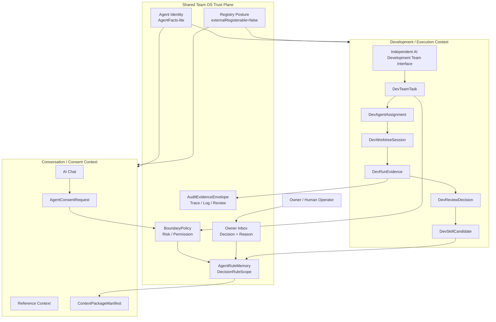
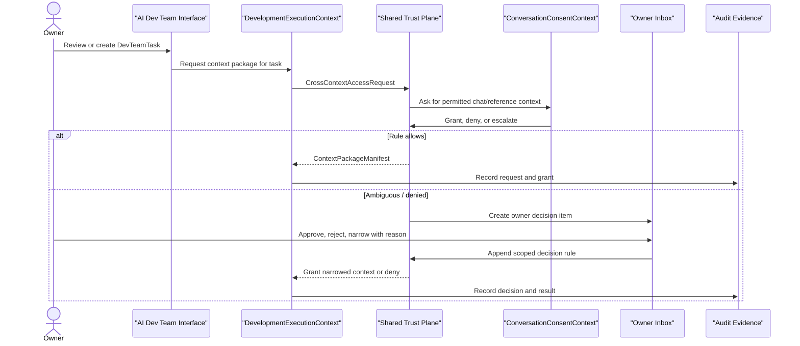

# RES-024 - Shared Team OS Trust Plane and Independent AI Development Team Interface Research

**Document ID:** `RES-024`  
**Date:** 2026-07-22  
**Status:** Research / owner-direction formalization, no runtime implementation  
**Owner decision:** Develop toward a Shared Team OS Trust Plane, while making AI Development Team OS a brand-new independent protected interface.  
**Companion documents:** `RES-015`, `RES-023`, `PLN-065`, `res015-vs-independent-ai-dev-teams-comparison-research.en.md`, `res015-vs-independent-ai-dev-teams-comparison-research.zh.md`

---

## 1. Purpose

This document formalizes the latest owner direction:

> Personal OS should develop one shared AI Team OS trust plane, but AI Development Team OS should not live inside any existing Personal OS interface. It should become a new, independent protected interface.

This research clarifies:

- what the Shared Team OS Trust Plane owns;
- what belongs to the `RES-015` Conversation/Consent context;
- what belongs to the AI Development Team Development/Execution context;
- why the AI Development Team interface should not be embedded inside `/agents`, `/ai-input`, `/admin`, `/settings`, `/work`, or any existing module page;
- what `AIDEVTEAM-002` and `AIDEVTEAM-006` should model next.

This document does not add runtime agent execution, route handlers, UI code, schema migrations, external registration, provider calls, shell execution, or automatic code merge.

---

## 2. Research Basis

### Local sources

- `RES-015_ai-chat-reference-context-and-cross-model-collaboration-research.md` - cross-agent requester/custodian consent, owner inbox escalation, rule memory.
- `RES-016_module-scoped-file-and-media-library-tab-and-classification-routing-research.md` - correction that file/media library classification is module-scoped, not per-agent/model-scoped.
- `RES-023_ai-development-team-os-structural-research.md` - AI Development Team OS structural research.
- `PLN-065_ai-development-team-os-research-plan.md` - staged AI Development Team OS plan.
- `ARC-023_agent-team-os-operating-contract.md` - Agent Team OS governance baseline.
- `ARC-028_nanda-agent-protocol-alignment.md` - AgentFacts-lite, protocol readiness, external-registration safety.
- `ARC-032_internal-multi-agent-task-message-bus-contract.md` - internal task/message bus, no external runtime.
- `src/lib/contracts/agent-task-message-bus.contract.ts` - internal bus contract.
- `src/lib/contracts/agent-operation-api.contract.ts` - protected owner-only dry-run operation API.
- `src/app/(dashboard)/agents/page.tsx` - existing Agent Team OS readiness/control surface, now treated as technical prior art only.

### External sources, refreshed 2026-07-22

| Source | Relevant lesson |
|---|---|
| [LangChain multi-agent docs](https://docs.langchain.com/oss/python/langchain/multi-agent) | Multi-agent systems are useful for context management, specialization, distributed development, and parallelization, but not every complex task needs multi-agent architecture. Context engineering is central. |
| [LangChain subagents docs](https://docs.langchain.com/oss/python/langchain/multi-agent/subagents) | A supervisor/subagent pattern keeps routing centralized and manages what context each specialist receives. |
| [Deep Agents overview](https://docs.langchain.com/oss/python/deepagents/overview) | Deep agents combine planning, subagents, filesystem use, long-term memory, context management, and human-in-the-loop approval. |
| [OpenAI Agents SDK guide](https://developers.openai.com/api/docs/guides/agents) | The SDK is a good fit when specialists need different instructions/tools/policies and when sessions, tracing, guardrails, or approval pauses matter. |
| [OpenAI guardrails / approvals](https://developers.openai.com/api/docs/guides/agents/guardrails-approvals) | Sensitive actions should pause for human or policy review before continuing. |
| [OpenAI sandbox agents](https://developers.openai.com/api/docs/guides/agents/sandboxes) | The harness/control plane should be separated from sandbox compute execution; the harness owns routing, approvals, tracing, recovery, and run state. |
| [Azure domain analysis](https://learn.microsoft.com/en-us/azure/architecture/microservices/model/domain-analysis) | A bounded context defines where a particular domain model applies. |
| [Azure microservice boundaries](https://learn.microsoft.com/en-us/azure/architecture/microservices/model/microservice-boundaries) | Start with bounded contexts; avoid one service/functionality spanning multiple domain models. |
| [Azure tactical DDD](https://learn.microsoft.com/en-us/azure/architecture/microservices/model/tactical-domain-driven-design) | A single unified model is not ideal for complex systems; divide into bounded contexts with precise domain models. |
| [MCP introduction](https://modelcontextprotocol.io/docs/getting-started/intro) | MCP standardizes AI application access to external tools, data sources, and workflows. |
| [MCP server concepts](https://modelcontextprotocol.io/docs/learn/server-concepts) | Tools can write to databases, call APIs, or modify files, while resources are passive/read-only context sources; this distinction matters for trust boundaries. |
| [Temporal durable execution](https://docs.temporal.io/temporal) | Durable workflow state matters when work spans failures, retries, or long waits. |
| [NANDA project](https://github.com/projnanda/projnanda) | Agent discovery and interoperability require identity, trust, registry, and AgentFacts-like metadata. |

---

## 3. Strategic Review Gate

| Question | Answer |
|---|---|
| Current product target | Formal launch remains `L0_LOCAL_PROTOTYPE`; this research does not claim L1/L3/L4. |
| Why this task now | Owner explicitly chose Shared Team OS Trust Plane and independent AI Development Team interface as the next direction. |
| What changed since `RES-023` | `RES-023` initially treated the existing `/agents` surface as a likely UI reference/home. Owner clarified this is incorrect: AI Development Team OS must be independent from all existing interfaces. |
| What blocker moves | The ambiguity around `AIDEVTEAM-006` is removed. Future implementation can target a new independent surface instead of overloading `/agents`. |
| What becomes more true | Personal OS now has a clear separation between shared trust infrastructure and independent development-team interface/product experience. |

---

## 4. Core Decision

### Decision

Use:

```txt
Shared Team OS Trust Plane
  + Conversation/Consent bounded context
  + Development/Execution bounded context
  + Independent AI Development Team protected interface
```

Do not use:

```txt
Existing /agents page
  + AI Development Team tab/section
```

Do not use yet:

```txt
Fully independent RES-015 runtime team
  + fully independent AI Development Team runtime team
  + duplicated identity/inbox/rules/audit
```

### Product language

Personal OS has one shared trust plane for agent identity, trust, owner decisions, audit, and rule memory. Inside that trust plane:

- `RES-015` is the Conversation/Consent bounded context.
- AI Development Team OS is the Development/Execution bounded context.
- AI Development Team OS has its own protected product interface.

---

## 5. Architecture Diagram



---

## 6. Shared Team OS Trust Plane

The trust plane is shared because duplicating these components would create inconsistent owner decisions, conflicting agent identities, and fragmented audit evidence.

| Trust-plane object | Purpose | Shared by |
|---|---|---|
| `AgentFactsLite` | Stable identity, capabilities, lifecycle, provider, registry posture | Conversation/Consent and Development/Execution |
| `BoundaryPolicy` | Risk, visibility, approval, blocked operations, high-risk modules | All agent contexts |
| `OwnerInboxDecision` | Human approval, rejection, narrowing, and reason capture | Consent requests and development reviews |
| `AgentRuleMemory` | Decision-derived reusable rules | All contexts, scoped by `DecisionRuleScope` |
| `AuditEvidenceEnvelope` | Append-only evidence reference for requests, tool calls, decisions, tests, traces | All contexts |
| `ContextPackageManifest` | Scoped context transfer without direct DB access | Cross-context requests |
| `ExternalRegistrationGate` | Keeps external registration disabled until endpoint/auth/trust/rollback/public-safety/approval exist | All agent contexts |
| `RuntimeApprovalGate` | Blocks shell/container/provider/DB/runtime actions until explicit approval | Development/Execution primarily, but visible to trust plane |

### Trust-plane invariant

The trust plane owns permission and evidence, not user workflow layout. Product interfaces consume it; they do not own it.

---

## 7. Conversation/Consent Context

This is the `RES-015` bounded context.

It owns:

- AI Chat reference context;
- thread-level context selection;
- `AgentConsentRequest`;
- requester/custodian negotiation;
- deadlock escalation to Owner Inbox;
- owner reason capture;
- scoped context grants or denials.

It does not own:

- worktree sessions;
- coding-agent execution;
- test reports;
- code review;
- skill promotion from development evidence;
- AI Development Team interface IA.

Important correction: `RES-015`'s earlier per-agent/model library idea was superseded by `RES-016`; file/media classification is module-scoped, not per-agent-library-scoped.

---

## 8. Development/Execution Context

This is the AI Development Team OS bounded context.

It owns:

- `DevTeamTask`;
- `DevAgentRole`;
- `DevAgentAssignment`;
- `DevWorktreeSession`;
- `DevRunEvidence`;
- `DevReviewDecision`;
- `DevExperienceMemory`;
- `DevSkillCandidate`;
- coding-agent adapter permission profiles;
- runtime gates and sandbox execution posture;
- independent protected interface.

It does not own:

- global owner identity;
- global rule memory;
- global inbox semantics;
- public agent registration;
- direct database access;
- existing module interfaces.

---

## 9. Independent Interface Boundary

AI Development Team OS should not be placed inside existing interfaces.

| Existing interface | Why it should not host AI Development Team OS |
|---|---|
| `/agents` | Current purpose is Agent Team OS readiness, dry-run command/protocol status, and manifest/operation visibility. AI Development Team requires a different operating model: task board, worktree sessions, evidence review, memory/skill promotion, and runtime gates. |
| `/ai-input` | Current purpose is source capture, chat, ingestion, reference context, and AI Input workflows. Development execution would confuse chat/reference context with coding tasks. |
| `/admin` | Current purpose is operator readiness, launch proof, evidence tables, and admin diagnostics. AI Development Team is a product operating surface, not an admin console. |
| `/settings` | Current purpose is preferences, account/module settings, and owner controls. AI Development Team task execution is not a setting. |
| `/work` and module pages | Current purpose is domain operation. AI Development Team works across the product/codebase and should not be scoped to one business module. |

### Independent interface first-pass concept

Route name is proposal-only, but future planning can assume a dedicated surface such as:

```txt
/ai-dev-team
```

First version should be protected, owner-only, and non-executing:

- Team board: planned / blocked / running-proposal / review-ready tasks.
- Role roster: PM, Architect, Developer, QA, Reviewer, Memory Manager, Auth/Permission.
- Worktree sessions: proposed branch/worktree state, no actual launch until approved.
- Evidence queue: diff/test/log/artifact references.
- Review queue: owner/reviewer decisions.
- Memory and skill candidates: reviewed learning, not automatic skill writes.
- Trust plane status: AgentFacts-lite, boundaries, external registration blocked.
- Runtime gates: all shell/container/provider/DB/write gates explicit and disabled until approved.

---

## 10. Page Requirement Understanding Score

This is a page/workflow issue, so the page requirement understanding gate applies.

**Score:** 86 / 100 - High  
**Required research rounds:** 3  
**Completed rounds:** 3

| Dimension | Score | Notes |
|---|---:|---|
| Actor/job clarity | 18 / 20 | Owner needs an AI development-team operating surface, not a module or admin page. |
| PRD/local evidence fit | 18 / 20 | Strong fit to `RES-001`, `RES-002`, `RES-015`, `RES-023`, `PLN-065`, `ARC-028`, `ARC-032`. |
| Data/BFF/API clarity | 16 / 20 | Objects are clear enough for architecture; runtime/BFF contract remains next task. |
| UI/reference-pattern confidence | 13 / 15 | Existing surfaces provide patterns, but owner requires a new independent IA. |
| Risk/auth/public-output clarity | 14 / 15 | Runtime, public output, DB access, and external registration remain blocked. |
| Acceptance/verification clarity | 7 / 10 | Research acceptance is clear; UI implementation needs `AIDEVTEAM-002` first. |

### Research rounds

| Round | Lens | Finding | Selected pattern |
|---|---|---|---|
| 1 | Local interface boundary audit | Existing pages each have their own job; AI Development Team crosses them and would overload any one page. | Create a new independent protected interface. |
| 2 | Bounded context / domain modeling | Official DDD/microservice guidance supports separating domain models while mapping integration points. | Shared trust plane plus separate bounded contexts. |
| 3 | Agent control-plane safety | Agent SDK/sandbox guidance supports separating harness/control plane from compute/execution. | Shared trust plane and independent non-executing interface before runtime. |

---

## 11. BFF-First Implications

Future UI work should follow:

```txt
AI Development Team UI need
  -> AI Development Team BFF contract
  -> Server Component loader / server action / route handler
  -> requireUser()
  -> service-layer authorization
  -> shared trust-plane service
  -> development-execution context service
  -> mapper / view model
  -> Client Component interaction
```

Initial implementation mode should be:

```txt
protected-owner visible
contract/readiness only
no runtime execution
no provider calls
no DB writes beyond approved BFF paths
no external registration
```

Client Components must not import Prisma models, DB clients, provider secrets, raw adapter payloads, or shell/runtime execution helpers.

---

## 12. Cross-Context Request Flow



The development context receives scoped packages, not direct chat database access.

---

## 13. NANDA Agent Protocol Gate

**Applies:** Yes.

Affected AgentFacts-lite fields:

- identity
- provider
- lifecycle
- endpoints
- protocols
- capabilities
- skills
- auth
- trust
- observability
- registry status

Current status:

- Governance/research artifact only.
- Internal runtime not enabled.
- Protected owner-visible future surface only.
- External registration remains `false`.

NANDA alignment:

- Shared trust plane becomes the local source of AgentFacts-lite identity and trust posture.
- Independent AI Development Team interface must display registry posture without enabling registration.
- Cross-context requests must be scoped, audited, and owner-escalatable.
- External A2A/MCP/NANDA-style exposure remains `HUMAN_APPROVAL_REQUIRED`.

---

## 14. Rejected Alternatives

| Alternative | Rejection reason |
|---|---|
| Put AI Development Team inside `/agents` | Reuses an existing page too literally and confuses protocol/readiness visibility with development-team operations. |
| Put AI Development Team inside `/ai-input` | Blurs chat/reference context with code execution and worktree evidence. |
| Put AI Development Team inside `/admin` | Admin is for operator readiness and evidence, not daily AI development work. |
| Put AI Development Team inside `/work` | Development-team work spans the codebase/product, not only Work domain data. |
| Create two fully independent agent teams now | Duplicates identity, inbox, rule memory, and audit too early; Personal OS lacks runtime scale that justifies the split. |
| Use one undifferentiated agent model | Loses bounded-context clarity and increases risk when runtime execution arrives. |
| Add runtime execution before interface contract | Violates BFF-first, NANDA gate, and high-risk execution boundaries. |

---

## 15. Backlog Implications

### Completed by this research

Add or mark:

```txt
AIDEVTEAM-010 - Shared Team OS Trust Plane and independent interface boundary research - DONE
```

### Update next architecture task

`AIDEVTEAM-002` should explicitly model:

- `SharedAgentTrustPlane`
- `ConversationConsentContext`
- `DevelopmentExecutionContext`
- `IndependentAIDevelopmentTeamInterface`
- `CrossContextAccessRequest`
- `ContextPackageManifest`
- `DecisionRuleScope`
- `AuditEvidenceEnvelope`
- `ExternalRegistrationGate`
- `RuntimeApprovalGate`

### Update UI task

`AIDEVTEAM-006` should remain a later task, but it must target a new dedicated protected interface, likely under a route such as `/ai-dev-team` after the architecture contract lands.

---

## 16. Acceptance Criteria

This research is complete when:

- the Shared Team OS Trust Plane is named and scoped;
- `RES-015` is scoped as Conversation/Consent context;
- AI Development Team is scoped as Development/Execution context;
- independent interface requirement is explicit;
- existing interfaces are explicitly rejected as the product home;
- trust-plane objects and cross-context request flow are defined;
- NANDA/AgentFacts and external-registration boundaries remain explicit;
- backlog and sprint state point `AIDEVTEAM-002` and `AIDEVTEAM-006` at the corrected direction.

Runtime execution remains out of scope.
