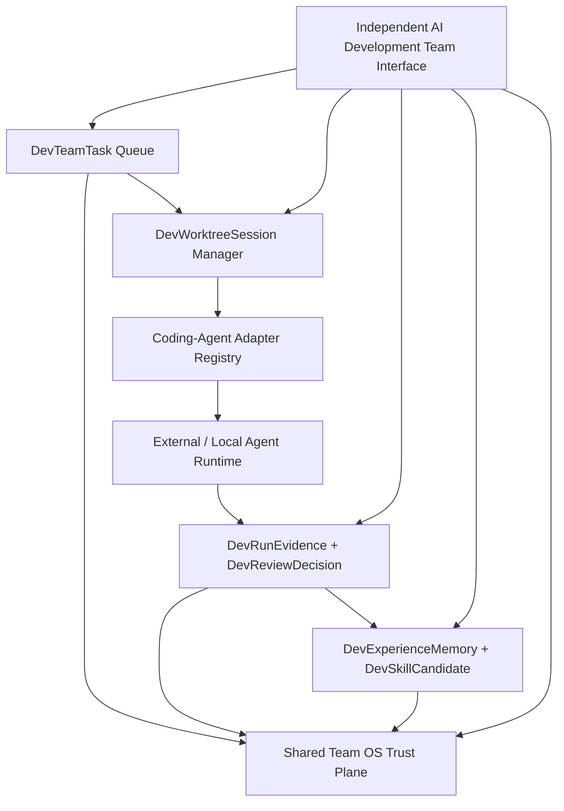

# RES-025 - GitHub Reference Repositories For AI Development Team OS Research

**Document ID:** `RES-025`  
**Date:** 2026-07-22  
**Status:** Research / reference selection, no runtime implementation  
**Owner question:** Are there GitHub repositories that can be used as references for the current AI development team direction?  
**Companion documents:** `RES-015`, `RES-023`, `RES-024`, `PLN-065`, `github-reference-repositories-for-ai-development-team-os.zh.md`

---

## 1. Purpose

This document researches open GitHub repositories that can inform the current Personal OS evolution:

```txt
Shared Team OS Trust Plane
  + Conversation/Consent context from RES-015
  + Development/Execution context for AI Development Team OS
  + New independent protected AI Development Team interface
```

The goal is not to choose one repository to import. The goal is to identify which existing open-source projects can be used as reference patterns for:

- an independent AI development team interface;
- multiple coding-agent sessions;
- Git branch/worktree isolation;
- agent roles, tasks, budgets, and governance;
- adapter permission profiles;
- review, test, evidence, and memory promotion.

This document does not add route/UI code, runtime agent execution, provider calls, schema migrations, external registration, direct database access, or automatic code merge.

---

## 2. Research Method

External research was refreshed on 2026-07-22 using:

- GitHub repository pages and project documentation.
- GitHub REST API metadata for star count, archived status, license SPDX id, latest push time, primary language, and repository description.
- Primary project sources where available.

Repository metadata changes quickly. Treat counts, archived status, and license metadata as a decision input, not as a permanent fact.

### Primary external sources

| Source | Why it matters |
|---|---|
| [OpenHands](https://github.com/OpenHands/openhands) | Mature AI software-development agent platform; useful for execution harness and sandbox thinking. |
| [OpenHands Agent Canvas](https://github.com/OpenHands/agent-canvas) | Direct reference for a self-hosted web control center for coding agents. |
| [Paperclip](https://github.com/paperclipai/paperclip) | Direct reference for organization/team governance, tasks, budgets, projects, human-in-the-loop, and agent work management. |
| [Pane](https://github.com/dcouple/Pane) | Direct reference for terminal-first multi-agent manager, sessions, branches, worktrees, and agent-agnostic CLI orchestration. |
| [Superset](https://github.com/superset-sh/superset) | Direct UI/worktree reference for running many coding agents locally; license requires review before dependency use. |
| [Agent Deck](https://github.com/asheshgoplani/agent-deck) | Smaller terminal-session manager for several coding agents; useful as a lightweight reference. |
| [Parallel Code](https://github.com/johannesjo/parallel-code) | Focused reference for running Claude/Codex/Gemini side by side in independent worktrees. |
| [Agent of Empires](https://github.com/agent-of-empires/agent-of-empires) | Web/TUI multi-agent manager with sandbox-oriented ideas. |
| [OpenCode](https://github.com/anomalyco/opencode) | Active open-source coding agent; useful for adapter and permission-profile research. |
| [OpenCode agents docs](https://opencode.ai/docs/agents/) | Relevant to mode/agent configuration and permission boundaries. |
| [Goose](https://github.com/aaif-goose/goose) | Local/general agent runtime reference with extensibility and model/provider portability. |
| [Plandex](https://github.com/plandex-ai/plandex) | Planning-oriented coding agent for large codebases and long-running tasks. |
| [Aider](https://github.com/aider-ai/aider) | Pair-programming CLI reference with Git workflow discipline. |
| [SWE-agent](https://github.com/swe-agent/SWE-agent) | Issue-solving agent reference for task loop, environment, and evaluation style. |
| [Open SWE](https://github.com/langchain-ai/open-swe) | Asynchronous coding-agent architecture; relevant to durable task execution and review. |
| [PR-Agent](https://github.com/The-PR-Agent/pr-agent) | Focused PR review and improvement agent reference. |
| [Agent Client Protocol](https://github.com/agentclientprotocol/agent-client-protocol) | Adapter/protocol reference for connecting editors or clients to agents. |
| [ACP UI](https://github.com/formulahendry/acp-ui) | Cross-platform client idea for ACP-compatible agents. |
| [Zeroshot](https://github.com/the-open-engine/zeroshot) | Autonomous engineering team CLI with verifier loop; useful for evaluation and review patterns. |
| [Agyn v1](https://github.com/agynio/v1) and [Agyn paper](https://arxiv.org/abs/2602.01465) | Strong conceptual match for specialized SWE teams, but archived/license-unclear repo makes it research-only. |
| [Harness Engineering paper](https://arxiv.org/abs/2606.24429) | Useful framing for agent harnesses, execution control, and verification economics. |

---

## 3. Strategic Review Gate

| Question | Answer |
|---|---|
| Current product target | Formal launch remains `L0_LOCAL_PROTOTYPE`; this research does not upgrade launch level. |
| Why this task now | Owner asked whether there are GitHub repositories that can inform the current AI Development Team OS direction. |
| What changed since `RES-024` | `RES-024` clarified the product boundary. This research now adds concrete repository references for interface, worktree/session, adapter, review, and governance patterns. |
| What blocker moves | Reduces ambiguity before `AIDEVTEAM-002`, `AIDEVTEAM-003`, `AIDEVTEAM-006`, and `AIDEVTEAM-007`. |
| What becomes more true | The next AI Development Team OS architecture contract can cite specific reference patterns without treating any external repo as the source of truth. |

---

## 4. Selection Criteria

Repositories were scored qualitatively against the Personal OS direction:

| Criterion | Meaning for Personal OS |
|---|---|
| Independent interface fit | Can it inform a new `/ai-dev-team`-like protected surface instead of a tab inside `/agents`? |
| Multi-agent/session fit | Does it manage several agents, sessions, terminals, tasks, or roles? |
| Worktree/branch isolation | Does it model parallel code work without polluting the main tree? |
| Permission and approval fit | Does it support review, allowlists, approval, plan mode, or blocked operations? |
| Evidence and review fit | Does it produce diffs, logs, tests, PR comments, reports, or verifier output? |
| Adapter fit | Can Personal OS use it as a future adapter target behind a strict policy boundary? |
| License and maintenance risk | Is the repo active, non-archived, and license-clear enough to use beyond reference reading? |

---

## 5. Recommended Reference Tiers

### Tier 1 - Direct design references for the independent interface

These should shape `AIDEVTEAM-006` and parts of `AIDEVTEAM-002`.

| Repository | Reference value | Personal OS adoption posture |
|---|---|---|
| [OpenHands Agent Canvas](https://github.com/OpenHands/agent-canvas) | Self-hosted web control center for coding-agent workflows. Strong reference for the independent AI Development Team interface: task list, connected tools, agent sessions, run state, and workflow automation. | Use as interface/control-plane reference. Do not inherit runtime authority. |
| [Paperclip](https://github.com/paperclipai/paperclip) | Organization-level agent management: goals, tasks, budgets, projects, human-in-the-loop, inbox, and governance language. | Use as governance and team-operating-model reference. Good fit for `DevTeamTask`, `DevAgentRole`, budget, approval, and audit views. |
| [Pane](https://github.com/dcouple/Pane) | Agent-agnostic manager for many CLI agents, Git branches/worktrees, terminal state, and session switching. | Use as worktree/session IA reference. License metadata is `NOASSERTION`; do not vendor without review. |
| [Superset](https://github.com/superset-sh/superset) | Code editor for the AI-agents era, focused on running many Claude Code/Codex-like agents locally. Strong inspiration for split-pane session control, task queue, agent status, worktree views, and review before merge. | Use as UI/workflow reference only until license strategy is confirmed. |
| [Agent Deck](https://github.com/asheshgoplani/agent-deck) | Lightweight TUI session manager for several coding agents. | Use as simple interaction-pattern reference for session switching and terminal control. |
| [Parallel Code](https://github.com/johannesjo/parallel-code) | Narrow reference for side-by-side coding agents, each in an independent Git worktree. | Use as a focused reference for `DevWorktreeSession` constraints. |
| [Agent of Empires](https://github.com/agent-of-empires/agent-of-empires) | Multi-agent TUI/Web manager, including remote/mobile operation patterns and sandbox-oriented execution ideas. | Use as secondary UI/runtime reference, not a near-term dependency. |

### Tier 2 - Future adapter runtime references

These should shape `AIDEVTEAM-007` more than the core Personal OS interface.

| Repository | Reference value | Personal OS adoption posture |
|---|---|---|
| [OpenHands](https://github.com/OpenHands/openhands) | Mature agent runtime and sandbox/control architecture for software development tasks. | Good candidate for later adapter research, but no direct adoption until permission, sandbox, license, and evidence policy are defined. |
| [OpenCode](https://github.com/anomalyco/opencode) | Active coding agent with configurable agents/modes and permission ideas. `sst/opencode` redirects to `anomalyco/opencode`; legacy `opencode-ai/opencode` is archived. | Strong adapter reference. `AIDEVTEAM-007` should model read-only, plan, edit proposal, and execute profiles around this style. |
| [Goose](https://github.com/aaif-goose/goose) | General local agent runtime that can go beyond code suggestions and use multiple providers/tools. | Good local-runtime reference; future adapter must still deny direct DB/secrets by default. |
| [Plandex](https://github.com/plandex-ai/plandex) | Long-step planning and large-codebase task management. | Use for planning, context pack, and diff-review ideas. Maintenance cadence should be rechecked before dependency use. |
| [Aider](https://github.com/aider-ai/aider) | Git-centered pair-programming CLI. | Useful as a simple future adapter for proposal-only coding sessions. |
| [SWE-agent](https://github.com/swe-agent/SWE-agent) | GitHub-issue-to-fix loop, environment setup, and evaluation-oriented design. | Use as task-loop and test/evaluation reference. |
| [Open SWE](https://github.com/langchain-ai/open-swe) | Asynchronous coding agent, task execution, and human review loop. | Strong reference for durable workflow states, but Personal OS should keep Temporal/LangGraph runtime adoption deferred. |
| [PR-Agent](https://github.com/The-PR-Agent/pr-agent) | Dedicated PR review, description, improvement, and reviewer-assistant flow. | Good reference for `ReviewerAgent` and `DevReviewDecision`; not a general team OS. |

### Tier 3 - Protocol, harness, and conceptual references

These should inform contracts, not near-term runtime.

| Repository / paper | Reference value | Personal OS adoption posture |
|---|---|---|
| [Agent Client Protocol](https://github.com/agentclientprotocol/agent-client-protocol) | Protocol boundary between clients and agents. Useful for designing adapter contracts without locking to one agent UI. | Add to `AIDEVTEAM-002` and `AIDEVTEAM-007` as an optional future protocol target. |
| [ACP UI](https://github.com/formulahendry/acp-ui) | Client surface for ACP-compatible agents across desktop, mobile, and web. | Secondary interface reference only. |
| [LangGraph](https://github.com/langchain-ai/langgraph) and [Deep Agents](https://github.com/langchain-ai/deepagents) | Durable/stateful agent orchestration, planning, subagents, long-term memory, and human-in-the-loop. | Use to design workflow state machine in `AIDEVTEAM-004`; do not deploy runtime yet. |
| [Zeroshot](https://github.com/the-open-engine/zeroshot) | Autonomous engineering-team CLI, verifier loop, PR-style evidence, and delegation mechanics. | Useful for verifier and "trusted output" design. Keep runtime out of scope for now. |
| [Agyn v1](https://github.com/agynio/v1) and [Agyn paper](https://arxiv.org/abs/2602.01465) | Explicit specialized software-engineering team architecture. Conceptually close to Product/Architect/Developer/Tester/Reviewer roles. | Research-only because repo is archived and license metadata is unclear. |
| [Harness Engineering paper](https://arxiv.org/abs/2606.24429) | Treats agent systems as harnesses with task setup, tool exposure, review, and cost/accuracy tradeoffs. | Use as architecture framing for control plane vs execution plane. |

---

## 6. GitHub Metadata Snapshot

Sampled via unauthenticated GitHub REST API on 2026-07-22.

| Repository | Stars | Archived | License SPDX | Latest push sampled | Primary language | Recommendation |
|---|---:|---|---|---|---|---|
| `anomalyco/opencode` | 188465 | false | MIT | 2026-07-22 | TypeScript | Strong adapter reference. |
| `paperclipai/paperclip` | 74427 | false | MIT | 2026-07-22 | TypeScript | Strong governance/team reference. |
| `OpenHands/openhands` | 81667 | false | NOASSERTION | 2026-07-22 | Python | Strong runtime reference; license review before dependency. |
| `aaif-goose/goose` | 51441 | false | Apache-2.0 | 2026-07-22 | Rust | Strong local-runtime reference. |
| `aider-ai/aider` | 47611 | false | Apache-2.0 | 2026-05-22 | Python | Good CLI adapter reference. |
| `langchain-ai/langgraph` | 37838 | false | MIT | 2026-07-21 | Python | Workflow/orchestration reference. |
| `langchain-ai/deepagents` | 26652 | false | MIT | 2026-07-22 | Python | Deep-agent harness reference. |
| `swe-agent/swe-agent` | 19882 | false | MIT | 2026-07-20 | Python | Task-loop/evaluation reference. |
| `plandex-ai/plandex` | 15541 | false | MIT | 2025-10-03 | Go | Long-plan coding reference; recheck maintenance before dependency. |
| `superset-sh/superset` | 12546 | false | NOASSERTION | 2026-07-22 | TypeScript | Strong UI/worktree reference; license review required. |
| `langchain-ai/open-swe` | 10381 | false | MIT | 2026-07-22 | Python | Strong async coding-agent reference. |
| `The-PR-Agent/pr-agent` | 12202 | false | MIT | 2026-07-20 | Python | ReviewerAgent reference. |
| `swe-agent/mini-swe-agent` | 5956 | false | MIT | 2026-07-20 | Python | Minimal loop reference. |
| `agentclientprotocol/agent-client-protocol` | 3726 | false | Apache-2.0 | 2026-07-22 | Rust | Adapter protocol reference. |
| `agent-of-empires/agent-of-empires` | 2858 | false | MIT | 2026-07-22 | Rust | Secondary multi-agent manager reference. |
| `the-open-engine/zeroshot` | 1661 | false | MIT | 2026-07-21 | JavaScript | Verifier/team-loop reference. |
| `johannesjo/parallel-code` | 883 | false | MIT | 2026-07-21 | TypeScript | Focused worktree reference. |
| `asheshgoplani/agent-deck` | 574 | false | MIT | 2026-07-20 | Go | Lightweight TUI/session reference. |
| `OpenHands/agent-canvas` | 212 | false | MIT | 2026-07-22 | TypeScript | Direct independent web-control reference despite small repo. |
| `agynio/v1` | 50 | true | NOASSERTION | 2026-04-19 | TypeScript | Research-only. |
| `opencode-ai/opencode` | 13507 | true | MIT | 2025-09-18 | Go | Legacy/archived; prefer `anomalyco/opencode`. |

---

## 7. Reference Architecture Implication

The repository landscape suggests Personal OS should not copy a single "AI company" repo. The stronger architecture is:



Reference mapping:

| Personal OS component | Primary references | What to borrow |
|---|---|---|
| `IndependentAIDevelopmentTeamInterface` | Agent Canvas, Paperclip, Superset, Pane | Independent command center, task list, role roster, agent status, run/evidence panels, blocked gates. |
| `DevTeamTask` | Paperclip, Open SWE, SWE-agent, Zeroshot | Goal/task lifecycle, assigned roles, budgets, review requirements, verifier states. |
| `DevAgentRole` and `DevAgentAssignment` | Paperclip, Agyn research, Open SWE | Product/Architect/Developer/QA/Reviewer/MemoryManager role model, but with Personal OS trust-plane scoping. |
| `DevWorktreeSession` | Pane, Superset, Agent Deck, Parallel Code | One task, one branch, one worktree/session, explicit cleanup, diff summary, terminal/process status. |
| `CodingAgentAdapterPolicy` | OpenCode, Goose, OpenHands, Aider, Plandex, ACP | Adapter registry with permission profiles; never grant direct DB/secrets by default. |
| `DevRunEvidence` | SWE-agent, PR-Agent, Zeroshot, Harness Engineering | Diffs, logs, tests, screenshots, cost/time, reviewer output, trace ids. |
| `DevReviewDecision` | PR-Agent, Open SWE, GitHub PR workflows | Accept, request changes, reject, needs owner, no auto-merge. |
| `DevExperienceMemory` and `DevSkillCandidate` | Deep Agents, LangGraph, Paperclip | Promote repeated lessons only after source-linked evidence and owner/reviewer approval. |
| Future external protocol | ACP, MCP, NANDA/AgentFacts-lite | Keep adapters discoverable internally, `externalRegisterable: false` until endpoint/auth/trust/rollback approval exists. |

---

## 8. What To Borrow

### From Agent Canvas

Borrow:

- independent web control surface for agent runs;
- connected tools and workflow execution status;
- self-hosted local-first orientation;
- separation between the control interface and agent runtime.

Do not borrow:

- automatic runtime authority;
- any assumption that the UI can directly launch agents against Personal OS without `RuntimeApprovalGate`.

### From Paperclip

Borrow:

- organization/team metaphors;
- tasks, budgets, projects, goals, inbox, and human-in-the-loop governance;
- the concept that agents at work need management surfaces, not only chat windows.

Do not borrow:

- broad corporate/team collaboration semantics before Personal OS has explicit owner-controlled scope;
- any external organization sharing by default.

### From Pane / Superset / Agent Deck / Parallel Code

Borrow:

- worktree-per-agent or worktree-per-task mental model;
- terminal/session management;
- branch status, diff status, and cleanup status;
- side-by-side comparison of several agent attempts.

Do not borrow:

- unbounded local shell execution;
- automatic application of agent diffs;
- dependency adoption before license review for `NOASSERTION` projects.

### From OpenCode / Goose / Aider / Plandex / OpenHands

Borrow:

- adapter boundary vocabulary;
- plan vs edit vs execute modes;
- local model and provider portability;
- task planning and context packaging;
- command allowlist and approval hooks where available.

Do not borrow:

- direct DB access;
- full repository write access by default;
- default permissions that bypass Personal OS high-risk module rules.

### From Open SWE / SWE-agent / PR-Agent / Zeroshot

Borrow:

- issue/task loop as a repeatable development unit;
- verifier/reviewer stages;
- test/evidence requirements;
- PR-style review decisions;
- no-merge-until-reviewed posture.

Do not borrow:

- autonomous merge;
- claim of correctness without local test/evidence attachment;
- external CI/API access without owner-approved secrets and scopes.

---

## 9. Rejected Near-Term Patterns

| Pattern | Why rejected for now |
|---|---|
| One repo becomes the AI Development Team OS | Personal OS already has domain rules, trust plane, module boundaries, auth, evidence, and NANDA constraints. External repos should inform, not replace, these contracts. |
| Embed team UI into `/agents` | Owner explicitly rejected this in favor of a new independent interface. |
| Launch coding agents before contracts | Worktree, adapter permission, runtime approval, evidence, and review contracts are not yet formalized. |
| Direct DB/secrets access for external/local coding agents | Violates current Personal OS data and high-risk module rules. |
| Adopt archived or license-unclear repos as dependencies | `agynio/v1`, `opencode-ai/opencode`, `OpenHands/openhands`, `Pane`, and `Superset` require different kinds of caution before dependency use. They can still be research references. |
| Public/external agent registration | Still blocked by `ARC-028`; `externalRegisterable: false`. |

---

## 10. Interface Implications For `AIDEVTEAM-006`

The first independent protected interface should be a control room, not a chat page.

Recommended top-level information architecture:

| Area | Purpose | Reference inspiration |
|---|---|---|
| Team Queue | Active, blocked, review-needed, completed tasks. | Paperclip, Open SWE, SWE-agent |
| Agent Roster | Product, Architect, Developer, QA, Reviewer, Memory Manager role readiness. | Paperclip, Agyn research |
| Worktree Sessions | Branch/worktree/session state, terminal process placeholder, diff summary, cleanup state. | Pane, Superset, Agent Deck, Parallel Code |
| Run Evidence | Logs, test reports, screenshots, traces, cost/time, reviewer output, no-secret artifacts. | PR-Agent, SWE-agent, Zeroshot |
| Adapter Registry | OpenCode, Goose, OpenHands, Aider, Plandex, Codex CLI, ACP-compatible future agents, each with permission profile. | OpenCode, Goose, ACP |
| Memory & Skills | Experience memories and skill candidates awaiting review/promotion. | Deep Agents, LangGraph, Paperclip |
| Trust Plane | RuntimeApprovalGate, BoundaryPolicy, Owner Inbox decisions, AgentFacts-lite readiness, external registration disabled. | RES-024, ARC-028 |

The first UI should clearly mark runtime launch, shell execution, external registration, live provider calls, public output, and high-risk module writes as unavailable until later contracts are complete.

---

## 11. Adapter Implications For `AIDEVTEAM-007`

The adapter policy should classify tools by capability, not by brand.

| Adapter class | Example repos | Allowed initial mode | Blocked by default |
|---|---|---|---|
| Planner-only CLI | Plandex, Aider, OpenCode plan mode | Read-only context package, plan output, no file write. | Shell execution, DB/secrets, direct merge. |
| Proposal editor | Aider, OpenCode, Goose | Isolated worktree edits, diff output, no merge. | Main branch writes, high-risk modules, public output. |
| Sandbox executor | OpenHands, Goose, Open SWE, SWE-agent | Future owner-approved sandbox run with command allowlist and evidence capture. | Network/secrets/database unless explicitly scoped. |
| Reviewer | PR-Agent, Zeroshot verifier, SWE-agent evaluation | Review diff/test/evidence and produce decision proposal. | Approving own work without independent review. |
| Protocol endpoint | ACP-compatible agents, future MCP/NANDA bridges | Discoverable internal adapter profile only. | External registration, public endpoint, cross-org access. |

---

## 12. NANDA Agent Protocol Gate

This task touches AI agent capability research, so the NANDA gate applies.

| AgentFacts-lite field | Current result |
|---|---|
| Identity | No new runtime identity added. Future `DevAgentRole` identities should map to AgentFacts-lite. |
| Provider | No provider selected. Repos are references only. |
| Lifecycle | Governance/research only. |
| Endpoints | No internal or external endpoint added. |
| Protocols | ACP, MCP, and NANDA remain future adapter/protocol references only. |
| Capabilities | Future capabilities will be planner, proposal editor, sandbox executor, reviewer, memory promoter. None are enabled here. |
| Skills | No skill created or modified. Future `DevSkillCandidate` must require evidence and approval. |
| Auth | No auth change. Future interface remains protected owner/admin only. |
| Trust | Shared Team OS Trust Plane remains the decision owner. Runtime gates stay blocked. |
| Observability | Evidence-report-only. Future runs need artifact refs and traces. |
| Registry | `externalRegisterable: false`; no external registration. |

Concrete artifact produced: this `RES-025` reference matrix and backlog updates for `AIDEVTEAM-011`, feeding `AIDEVTEAM-002`, `AIDEVTEAM-006`, and `AIDEVTEAM-007`.

---

## 13. Backlog Implications

Add one completed research row:

```txt
AIDEVTEAM-011 - Research GitHub reference repositories for AI Development Team OS
Status: DONE
```

Update dependency guidance:

- `AIDEVTEAM-002` should cite `RES-025` when defining `IndependentAIDevelopmentTeamInterface`, `DevWorktreeSession`, `CodingAgentAdapterPolicy`, `DevRunEvidence`, and `DevReviewDecision`.
- `AIDEVTEAM-003` should treat Pane, Superset, Agent Deck, and Parallel Code as worktree/session references.
- `AIDEVTEAM-006` should treat Agent Canvas, Paperclip, Superset, and Pane as interface references.
- `AIDEVTEAM-007` should treat OpenCode, Goose, OpenHands, Aider, Plandex, ACP, Open SWE, SWE-agent, and PR-Agent as adapter/reviewer references.

---

## 14. Next Recommended Task

The next AI Development Team OS task remains:

```txt
AIDEVTEAM-002 - Create AI Development Team OS domain and adapter architecture contract
```

`AIDEVTEAM-002` should now include a "Reference Repository Mapping" section with the tiers from this document. It should still remain contract-only and should not launch any coding agent.

