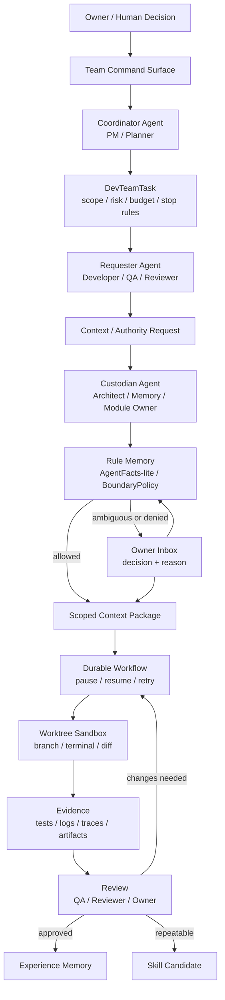

# AI Development Team OS 中文討論稿

**日期:** 2026-07-22  
**狀態:** 討論稿，不是已定案規格  
**來源:** `RES-023_ai-development-team-os-structural-research.md` + `PLN-065_ai-development-team-os-research-plan.md`  
**目的:** 把目前 Personal OS 從「個人知識/任務/記憶系統」演化成「可成長的 AI 開發團隊作業系統」這件事，用中文整理成可以跟 owner 討論的版本。

---

## 1. 現在的演化是什麼？

目前的演化不是「加幾個 AI 聊天室」，也不是馬上接一堆 coding agent 讓它們自動寫 code。

現在的演化是：

> Personal OS 正在從一個管理個人資料、任務、對話與記憶的網站，演化成一個 **AI Development Team OS 控制平面**。

也就是說，AI 不再只是某個頁面裡的聊天助手，而是會逐步變成一組有固定角色、任務邊界、工作記憶、技能版本、審查流程與安全權限的長期 Agent Team。

這個 AI Team 暫時還不是 runtime。現在先定義「團隊如何存在、如何工作、如何被限制、如何累積經驗」。

---

## 2. 從 RES-015 到 AI Development Team OS

`RES-015` 原本處理的是 AI Chat 裡的跨模型協作：

```txt
Agent A 想讀 Agent B 的上下文
  -> Agent B 檢查 Rule Memory
  -> 可以就給 scoped context
  -> 不可以或不確定就丟到 Owner Inbox
  -> Owner 決定
  -> 決定理由變成未來 Rule Memory
```

現在這個模式被放大成開發團隊工作流：

```txt
Owner 的產品/開發意圖
  -> Team Command Surface
  -> Coordinator Agent 拆任務與分派角色
  -> Requester Agent 要求上下文、記憶或權限
  -> Custodian Agent 檢查 Rule Memory / AgentFacts-lite
  -> 允許：給 scoped context package
  -> 不確定或拒絕：進 Owner Inbox
  -> Owner 批准、拒絕或縮小範圍
  -> Durable Workflow 繼續
  -> Worktree Sandbox 執行
  -> 測試、diff、log、trace、artifact 形成 Evidence
  -> Reviewer / QA / Owner 審查
  -> 合格經驗才升級成 Memory 或 Skill Candidate
```

所以 RES-015 的核心沒有被丟掉，而是變成整個 AI 開發團隊的安全協作骨架。

---

## 3. 一張目前的演化圖



---

## 4. 這次演化的 8 個層次

### 4.1 團隊協調層

Personal OS 需要先知道「AI 開發團隊」是什麼。

目前建議的核心物件：

- `DevTeamTask`: 一個 owner-approved 開發任務。
- `DevAgentRole`: PM、Architect、Developer、QA、Reviewer、Memory Manager 等角色。
- `DevAgentAssignment`: 哪個 Agent 以什麼權限做哪個任務。
- `DevTeamPolicy`: 預算、風險、停止條件、可用工具、不能碰的模組。

這一層先定義清楚，才不會變成 Agent 們自由聊天、自由決定要做什麼。

### 4.2 Agent 執行層

Agent 以後可以寫 code，但不能直接污染正式程式碼。

目前方向：

- 一個任務一個 branch / worktree。
- Agent 的輸出先是 proposal/diff，不是自動 merge。
- read-only planning 與 edit/build mode 要分開。
- 所有 terminal、diff、test、log 都要變成 evidence。

這裡參考 Pane、Superset、OpenHands、OpenCode、Goose、Plandex，但還沒有選定要直接採用哪一個。

### 4.3 Durable Workflow 層

AI 任務可能跑很久，也可能需要等 owner 審批。

所以任務要能：

- pause
- resume
- retry
- cancel
- wait for owner
- request review
- preserve evidence

這裡目前參考 LangGraph、Deep Agents，Temporal 放在後期。

### 4.4 Event 通訊層

Agent 之間不要無限制互聊。

它們應該交換明確事件，例如：

- `TaskAssigned`
- `ContextRequested`
- `ContextGranted`
- `ContextDenied`
- `OwnerApprovalRequested`
- `RunStarted`
- `ToolCallRecorded`
- `TestReportUploaded`
- `ReviewCompleted`
- `SkillPromotionRequested`

這代表未來的 AI Team 更像 event-driven workflow，不是聊天室。

### 4.5 長期記憶層

記憶要分層：

- 個別 Agent Memory: 這個 Agent 的偏好、常犯錯、技能版本。
- Team Knowledge Memory: 專案事實、架構決策、目前 blocker。
- Rule Memory: Owner 曾經做過的權限/信任/拒絕決策。
- Experience Memory: 某次任務跑完留下來的學習。
- Skill Candidate: 經過測試與審查後，可能升級成可重複使用技能。

這裡參考 Letta 和 Graphiti，但目前不急著導入 runtime。

### 4.6 本地模型與推理層

這一層目前只是研究方向。

- Ollama 適合早期單機本地模型。
- vLLM 適合後期多 Agent 高併發共用推理服務。

但現在的重點不是先架模型，而是先定義 Agent 權限、任務、記憶與 evidence。

### 4.7 安全隔離層

這是整個設計最重要的邊界。

目前明確禁止：

- Agent 直接讀 production DB。
- External agent 直接碰資料庫。
- Agent 自己改 `AGENTS.md`、核心治理文件或 `.codex/skills/*/SKILL.md`。
- Agent 自動 merge 到 main。
- Agent 對 Finance、Life、Client Portal、Company Strategy、Auth/Permission、Public Output 做 final write。
- 沒有 owner approval 就開 external registration。

所以目前是「AI Team OS 的治理設計」，不是「放任 AI 自動開發」。

### 4.8 Observability / Evidence 層

每個 Agent 工作都要留下可審查證據：

- 它拿到什麼任務。
- 它用了什麼上下文。
- 它呼叫了什麼工具。
- 它改了哪些檔案。
- 它跑了哪些測試。
- 誰審查。
- Owner 怎麼決定。
- 什麼經驗被升級成記憶或技能。

這裡參考 OpenTelemetry、Grafana、Loki；artifact 儲存短期應該接目前 R2 方向。MinIO 因為主 repo 2026 年 4 月封存，不建議當新預設選項。

---

## 5. 現在還沒有做的是什麼？

目前還沒有：

- 沒有啟動任何 external coding agent。
- 沒有讓 Agent 寫正式 code。
- 沒有新增 public endpoint。
- 沒有新增 schema migration。
- 沒有部署 Temporal / NATS / Grafana / vLLM。
- 沒有讓 Agent 讀 production DB。
- 沒有 external registration。
- 沒有自動 merge。

這些都被刻意擋住。

---

## 6. 現在已經完成的是什麼？

已完成：

- `RES-023`: AI Development Team OS structural research。
- `PLN-065`: AI Development Team OS research plan。
- `PLN-060` Phase 18: `AIDEVTEAM-001..009` backlog。
- NANDA gate: `externalRegisterable: false`。
- 驗證通過：
  - `pnpm agent:registry:check`
  - `pnpm agent:bus:check`
  - `pnpm exec tsc --noEmit --pretty false`
  - `git diff --check`

---

## 7. 下一步最合理的是什麼？

下一步不是立刻接 OpenHands、Pane、Goose 或 LangGraph。

下一步應該是：

> `AIDEVTEAM-002`: 建立 AI Development Team OS 的正式 architecture contract。

也就是先寫清楚這些物件：

- `DevTeamTask`
- `DevAgentRole`
- `DevAgentAssignment`
- `DevContextRequest`
- `DevWorktreeSession`
- `DevRunEvidence`
- `DevReviewDecision`
- `DevExperienceMemory`
- `DevSkillCandidate`

並且把它們接到 Personal OS 既有概念：

- Agent Team OS
- `AgentBusTask`
- `AnalysisEvent`
- `InboxItem`
- `MemoryCandidate`
- AgentFacts-lite
- dry-run agent operation contract

這一步完成後，才有資格往 worktree manager、durable workflow、memory engine、adapter permission profile 或 UI control surface 前進。

---

## 8. 需要跟你討論的決策

### 決策 1：AI 開發團隊的第一組固定角色是什麼？

目前假設是：

- Product Manager Agent
- Architect Agent
- Developer Agent
- QA Agent
- Reviewer Agent
- Memory Manager Agent
- Auth / Permission Agent

要討論：這些角色是否太多？是否要先用 3 個角色開始，例如 Planner / Builder / Reviewer？

### 決策 2：第一個可見 UI 是什麼？

Owner 已補充方向：AI Development Team 應該是全新的獨立介面，原則上不應該跟現有所有介面混在一起，也不應該只是 `/agents`、`/ai-input`、`/admin`、`/settings` 或任何 module page 裡的一個 section。

因此這裡不再是「放在既有介面哪裡」的問題，而是新介面的第一個版本要長什麼樣。

兩種仍可討論的方向：

- Team Command Surface: owner 建立任務、分派 Agent、看工作狀態。
- Agent Readiness Surface: owner 先看哪些 agent 能做什麼、哪些能力被 blocked。

目前比較安全的是：在全新的 AI Development Team interface 裡，先做 readiness/control surface，不先做 execution command。也就是「獨立介面」和「不啟動 runtime」可以同時成立。

### 決策 3：第一個 sandbox pilot 要做哪種任務？

可選方向：

- docs-only 任務
- UI-only low-risk 任務
- static contract/checker 任務
- 一個小 bugfix

目前建議第一個 pilot 不碰 DB、不碰 auth、不碰 public output、不碰 high-risk module。

### 決策 4：記憶先做成「文件/事件」還是直接接 graph memory？

兩種方向：

- 先用 Postgres/doc/event/report 做可審查記憶。
- 直接研究 Letta / Graphiti / Neo4j。

目前建議先做 Personal OS 自己的 `MemoryCandidate -> ApprovedMemory -> SkillCandidate` 合約，再考慮外部 memory engine。

### 決策 5：本地模型是近期必需，還是先保持 provider abstraction？

Ollama / vLLM 很有吸引力，但如果現在先做，可能會把重點拉向 infra。

目前建議：近期只定義 model provider boundary，不把本地模型架設當作 AI Dev Team OS 的第一步。

---

## 9. 一句話版本

Personal OS 目前的演化方向是：

> 從「我和 AI 在一個系統裡管理知識與任務」，進化成「我管理一個有角色、記憶、權限、工作區、證據與技能升級機制的 AI 開發團隊」。

而現在最重要的不是讓 Agent 馬上自動開發，而是先把 **任務邊界、權限邊界、工作區隔離、審查證據、記憶升級與 owner decision loop** 定義好。
