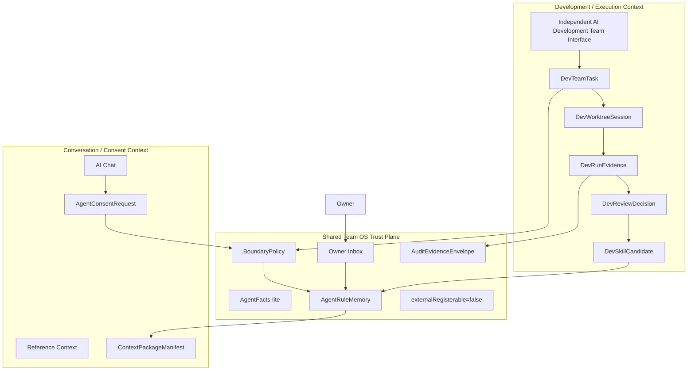

# Shared Team OS Trust Plane 與 AI Development Team 獨立介面研究稿

**日期:** 2026-07-22  
**狀態:** 中文討論稿，對應正式研究 `RES-024`  
**核心決策:** 往 Shared Team OS Trust Plane 發展；AI Development Team OS 是全新獨立 protected interface，不放在任何既有介面裡。

---

## 1. 一句話結論

目前的方向不是把 AI Development Team 塞進 `/agents`，也不是把 `RES-015` 和 AI Development Team 做成兩套完全獨立 runtime team。

目前的方向是：

> Personal OS 有一個共享的 AI Team OS Trust Plane；`RES-015` 是 Conversation/Consent context，AI Development Team OS 是 Development/Execution context；兩者共享身份、規則、Owner Inbox、audit 與 evidence，但 AI Development Team 有自己的全新獨立介面。

---

## 2. Shared Team OS Trust Plane 是什麼？

它不是一個頁面，而是底層信任與治理平面。

它負責：

- Agent 身份與 AgentFacts-lite。
- BoundaryPolicy、權限、風險與高風險停止條件。
- Owner Inbox 決策與理由。
- AgentRuleMemory。
- Audit / Evidence envelope。
- Context package manifest。
- External registration posture。
- Runtime approval gates。

簡單說：

```txt
介面可以分開
任務模型可以分開
runtime 可以未來再分開

但信任、身份、規則、審批、audit、evidence 不能各自長出兩套
```

---

## 3. 兩個 bounded contexts

### Conversation / Consent Context

這是 `RES-015` 的領域。

它處理：

- AI Chat。
- Reference Context。
- AgentConsentRequest。
- Requester / Custodian negotiation。
- Owner Inbox escalation。
- Rule Memory。
- Scoped context grant / deny。

它不處理：

- worktree。
- coding agent execution。
- test report。
- code review。
- skill promotion。
- AI Development Team interface IA。

### Development / Execution Context

這是 AI Development Team OS 的領域。

它處理：

- DevTeamTask。
- DevAgentRole。
- DevAgentAssignment。
- DevWorktreeSession。
- DevRunEvidence。
- DevReviewDecision。
- DevExperienceMemory。
- DevSkillCandidate。
- coding-agent adapter permission profile。
- runtime gates。
- 獨立 protected interface。

它不擁有：

- 全域身份。
- 全域 Rule Memory。
- 全域 Owner Inbox 語意。
- public agent registration。
- direct database access。
- 既有 module interface。

---

## 4. 為什麼不能放進既有介面？

| 既有介面 | 為什麼不適合 |
|---|---|
| `/agents` | 目前偏向 Agent Team OS readiness、dry-run command、protocol/manifest status。AI Development Team 需要的是任務板、worktree sessions、evidence review、memory/skill promotion、runtime gates。 |
| `/ai-input` | 這裡是 source capture、chat、ingestion、reference context。把 coding/development execution 放進來會混淆 AI Chat 與開發任務。 |
| `/admin` | admin 是 operator readiness、launch proof、evidence table，不是日常 AI development work。 |
| `/settings` | settings 是偏好、帳號、模組設定，不是 agent task execution surface。 |
| `/work` 或其他 module pages | AI Development Team 跨整個產品與 codebase，不屬於單一業務模組。 |

所以 AI Development Team OS 應該是新的 protected interface。

暫定 route 可以是：

```txt
/ai-dev-team
```

但 route 名稱仍是提案，實作前可以再定。

---

## 5. 新獨立介面第一版應該包含什麼？

第一版應該是 owner-only、protected、non-executing。

它可以包含：

- Team board: planned / blocked / proposal-running / review-ready tasks。
- Role roster: PM、Architect、Developer、QA、Reviewer、Memory Manager、Auth/Permission。
- Worktree sessions: branch/worktree 狀態，但不直接啟動 agent。
- Evidence queue: diff、test、log、artifact references。
- Review queue: owner/reviewer decisions。
- Memory & skill candidates: 經審查的學習，不自動改 skill。
- Trust plane status: AgentFacts-lite、BoundaryPolicy、external registration blocked。
- Runtime gates: shell/container/provider/DB/write gates 全部明確顯示 disabled，直到 owner approval。

這不是 landing page。它應該是一個密集、可掃描、可操作但先不執行 runtime 的開發團隊控制台。

---

## 6. 目前架構圖



---

## 7. 下一步要做什麼？

下一個正式架構任務是 `AIDEVTEAM-002`。

它應該建立一份 `ARC-*`，明確定義：

- `SharedAgentTrustPlane`
- `ConversationConsentContext`
- `DevelopmentExecutionContext`
- `IndependentAIDevelopmentTeamInterface`
- `CrossContextAccessRequest`
- `ContextPackageManifest`
- `DecisionRuleScope`
- `AuditEvidenceEnvelope`
- `ExternalRegistrationGate`
- `RuntimeApprovalGate`

再下一步的 UI 任務 `AIDEVTEAM-006`，才可以開始規劃全新的 AI Development Team protected interface。

---

## 8. 目前仍然禁止什麼？

仍然禁止：

- runtime agent execution。
- shell/container execution。
- provider call。
- schema migration。
- direct DB access。
- external registration。
- public endpoint。
- automatic merge。
- high-risk module final write。
- 把 AI Development Team 直接塞進既有介面。

---

## 9. 最後一句

Shared Team OS Trust Plane 是「共同信任與治理底座」。

AI Development Team OS 是「新的獨立開發團隊工作介面」。

兩者要共享信任，但不要共享介面歸屬。
